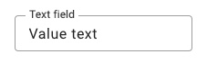
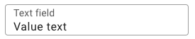

# Forge 2.0 Upgrade

How to upgrade applications & libraries from TCW (1.x) to Forge 2.x.

## Overview

Welcome to the TCW/Forge upgrade guide! If you're looking for information about how to upgrade from TCW v1.x to Forge 2.0, you've
come to the right place.

With the next generation version of Tyler Components Web (TCW) now being generally available, you probably have a lot of
questions about how to upgrade, what is happening with the previous version, what has changed... etc. This guide is intended
to walk you through the process of upgrading your applications and libraries, and answer all of the questions above and much more.

:::info
Yes, there are **breaking changes** that come with this upgrade, but we can assure you the process is not as daunting
as it may seem.

Please let us know if you run into any problems that are not documented in this guide!
:::

Let's get started!

<!-- truncate -->

---

## Rebranding

The most important part of this upgrade is to understand that the TCW project is being **rebranded** as "Forge" components! (aka Forge 2.0)

TCW as it stands today is being **deprecated** and **replaced** with a new Forge-branded version of the library. You can think of Forge 2.0
as the next generation evolution of the TCW library.

:::info
Essentially `@tylertech/tyler-components-web` is being replaced with an equivalent package called `@tylertech/forge`
:::

This likely doesn't come as a surprise to most, given that's how many have referred to the project over the years anyway. But,
the main reason for this rebrand is to better align ourselves with our open source goals, and ensure that the library is more
tightly coupled with our Forge design system. This coupling will help ensure that we can these projects are more closely related,
and make it feel more cohesive going forward.

:::note
The functionality and design of the components has been largely left **unchanged** during this migration.
:::

As you may have guessed, this means that our naming convention across the library is changing from anything `tcw` or `tyl`-related,
to be just `forge`. More information about that below.

---

## Why the need for a new version?

This is an excellent question, and one we went back and forth on for quite some time before deciding a proper path forward.

Let's start with a little history about TCW. The project started in May of 2017. It has taken on various forms over that
period of time, and **a lot** has been changed and been learned. Not only did we need to support legacy browsers like IE 11
at the time, we also had to compile our code to ES5 and make use of legacy polyfills for Web Component browser support.

Fast-forward 5 years and we have now found ourselves maintaining a library that was built for the past, has inconsistencies
in naming conventions and APIs, poorly structured components, and is unable to upgrade important internal dependencies for a
number of reasons. We also do not need to support ES5 or require the use of slow polyfills as Web Components are widely
supported in all modern browsers.

At a high level, the items below are the most important reasons for this new version:

<details>
  <summary><b>View details</b></summary>


  - Drop support for IE 11. We now support all latest versions of modern browsers.
    <details>
      <summary>Minimum browser support</summary>

      - Google Chrome: `Version 54+`
      - Firefox: `Version 63+`
      - Safari: `Version 10.1+`
      - Opera: `Version 64+`
      - Edge (Chromium): `Version 79+`
      - Internet Explorer: `Not supported without downleveling JavaScript to ES5 and using polyfills`

    </details>
  - Drop support for ES5. Our minimum build target is now ES8 (ES2017).
    - This helps improve performance and bundle sizes in downstream applications, and allows us to use newer, more modern browser APIs.
  - Remove the need for slow polyfills. No more `@webcomponents/webcomponentsjs` dependencies in your apps!
  - Upgrade our internal version of MDC from version 4 to version 13 (yes, we were that far behind) to support Sass modules.
    - The upgrade to support Sass modules requires a breaking change (this was actually reason #1 for the new version initially).
    - This also allows for us to take advantage of new features and designs that have been released since version 4.
  - Introduce consistent naming conventions and APIs across the library.
  - Refactor various components (that previously encapsulated multiple variants) into separate components to allow for easier maintenance and more obvious usage.
  - Prepare ourselves for the release of the Forge component library to the public open source community!
  - Improve our theming system to make theme customizations easier and more straightforward.


</details>

<br/>

As you can see, there are many benefits to this upgrade, but what is going to happen to the existing version of TCW?

---

## What is happening to TCW 1.x?

The TCW 1.x version is going to continue to receive patch updates going forward as needed, but is essentially going into maintenance
mode with the goal to move **everyone** to the new Forge component library over time, and archive the 1.x version/repository. The new
version provides many bug fixes, features, improved performance and is where all new features will be added going forward. It is a
more modern implementation, with a lot of changes based on what we learned over the years from teams using TCW 1.x.

We plan to keep maintaining the 1.x version for a period of time to give teams a chance to upgrade to the new version, but it is now
officially considered **deprecated** at this time. You should perform this upgrade at your earliest convenience.

If your team is facing issues with defining a timeline for upgrading, or if you have questions about the upgrade process, please reach
out to the Forge team for assistance!

---

## What is changing?

There are always breaking changes that come with major version upgrades. It's an unfortunate, but beneficial side-effect. It's
the only way to innovate and keep up with the ever-changing web development ecosystem. That time has come.

You're probably thinking: "So what you're saying is I need to rewrite a lot of my code that I just wrote to start using Forge/TCW?"

We want to be very clear that this is **not** the case. This guide is intended to help you through this process, and after upgrading
several complex applications, we can assure you that it's actually quite a simple process, but it does require some attention. You
should not need to adjust any of your application logic aside from just renaming a few APIs that are related to Forge.

At a high level, here is what is changing: 🙈

<details>
  <summary><b>View changes</b></summary>


  - Replace `node-sass` dependency with the API-compatible `sass` (Dart implementation) package.
    - This dependency change is what enables us to use Sass modules, and you should too! See [below](#sass-modules) for more information on this subject.
  - Replace TCW-branded packages with Forge-branded packages:
    - Replace `@tylertech/tyler-components-web` dependency with `@tylertech/forge`
    - Replace `@tylertech/tyler-components-web-angular` dependency with `@tylertech/forge-angular`
    - Replace `@tylertech/tyler-components-web-react` dependency with `@tylertech/forge-react`
    - Replace `@tyler-components-web/core` dependency with `@tylertech/forge-core`
    - Replace `@tyler-components-web/cli` dependency with `@tylertech/forge-cli`
  - Rename TCW-related code to Forge-branded naming conventions:
    - Rename all `<tcw-*>` HTML element names to `<forge-*>`
    - Rename all `tcw-*` event element names to `forge-*`
    - Rename all `tyl-*` CSS class names to `forge-*`
    - Rename all `--tyl-*` CSS custom properties to `--forge-*`
  - Generic core components and Tyler-specific components have been separated into two libraries.
    - Generic components live in `@tylertech/forge`
    - Tyler-specific components live in `@tylertech/forge-internal`. See [below](#step-6-public-vs-tyler-specific-components) for details.
    - Similar naming convention for adapter libraries, such as `@tylertech/forge-react-internal`... etc.
  - Review list of component and API breaking changes and apply corresponding fixes where necessary.

The vast majority of the changes can be handled with some good ol' fashioned find & replace.

</details>

<br/>
Let's get into the details!

:::note
Expand the various sections below to view the detailed list of changes. There are checkboxes next to each item to help you ensure you have evaluate
everything as you make progress. Some of the items themselves have more information that can be further expanded to view extra details about a specific change.
:::

### Breaking changes 💥

The breaking changes listed below are separated out into high-level groupings by type. While the most common/important changes are listed in "Highlights",
please remember to review the other sections to ensure you don't miss anything. Some of the changes listed will silently cause issues at runtime and it's
important that you validate whether you are using the changed features or not.

:::tip
Reference your application/library to see which TCW/Forge components you have defined and are using. This can help you pare down the breaking
changes to only the components you know you're using.

Please let us know if you have any questions!
:::

<details>
  <summary><b>Highlights</b></summary>

:::note
Make sure to expand certain items below to view more details!
:::

  <CheckboxListItem heading="Busy indicator" description="The usage expectation for this component has changed. The APIs have been adjusted, and the implementation no longer ensures a single instance of the component anymore and it will no longer handle multiple messages automatically. It is up to you to manage your instances and message updates, much like you do with the dialog component (as this is a derivative of the dialog pattern).">
    
The following properties/methods have been removed:

  - `delay`
  - `autoEllipsis`
  - `minimumVisibleLifetime`
  - `isDestroyed`
  - `addMessage()`
  - `removeMessage()`

The `hide()` method has been refactored to remove the `messageId` parameter. Busy indicators no longer support managing multiple messages, ellipsis, or auto-delay.
This responsibility has been moved to developers to ensure flexibility, familiarity, and consistency with the usage of other Forge components such as the dialog.

:::note
If you need to ensure one instance of the busy-indicator is visible across multiple components but you only need to update the message or progress, you may want
to wrap that up into a reusable service for your application. This can allow you to essentially replicate the previous functionality by housing it in a central
location that your components can communicate with instead of interacting with the component directly.
:::

  </CheckboxListItem>
  
  <CheckboxListItem heading="Drawer" description="Separated from a single component into 3 separate components for improved development experience and to ease maintainability on our end.">

Previously if you were using the drawer to toggle between the `dismissible` type and the `modal` type, you will now need to swap out the underlying components
that are being used instead of adjusting the `type` property/attribute.

**Old:**

```html
<tcw-drawer></tcw-drawer> <!-- "permanent" type was default -->
<tcw-drawer type="dismissible"></tcw-drawer>
<tcw-drawer type="modal"></tcw-drawer>
<tcw-drawer type="mini"></tcw-drawer>
<tcw-drawer type="mini-hover"></tcw-drawer>
```

**New:**

```html
<forge-drawer></forge-drawer> <!-- This is both "permanent" and "dismissible" now -->
<forge-modal-drawer></forge-modal-drawer>
<forge-mini-drawer></forge-mini-drawer>
<forge-mini-drawer hover></forge-mini-drawer>
```

  </CheckboxListItem>

  <CheckboxListItem heading="Card">


- removed all internal slots (except for the default slot) and the internal CSS grid layout. If you need to retain previous layouts, use a nested `<forge-scaffold>` for that.
- removed built-in `margin-bottom`.
- removed the `has-padding` property/attribute. Use the `--forge-card-padding` CSS custom property to control this via CSS now.


  </CheckboxListItem>

  <CheckboxListItem heading="Date picker" description="Renamed the `<tcw-datepicker>` to `<forge-date-picker>` for naming convention consistency." />
  <CheckboxListItem heading="Dialog" description="This component used to get auto-defined for you if you were using the select, menu, time-picker, date-picker, date-range-picker. This will no longer happen, and you will need to manually define the dialog going forward if you weren't already. If you see any issues with dialog, please first check that you have it defined in your app." />
  <CheckboxListItem heading="Icon" description="Renamed the `TylerIconRegistry` to just `IconRegistry`." />
  <CheckboxListItem heading="List item" description="Removed all global `tyl-list-item*` CSS classes in favor of using slots in the component (added new `title`, `subtitle`, `tertiary-title` slots).">

**Old:**

```html
<tcw-list-item three-line="true">
  <span class="tyl-list-item__title">List Item</span>
  <span class="tyl-list-item__subtitle">Secondary Text</span>
  <span class="tyl-list-item__tertiary-title">Tertiary Text</span>
</tcw-list-item>
```

**New:**

```html
<forge-list-item three-line>
  <span slot="title">List Item</span>
  <span slot="subtitle">Secondary Text</span>
  <span slot="tertiary-title">Tertiary Text</span>
</forge-list-item>
```

  </CheckboxListItem>
  <CheckboxListItem heading="omnibar">


- rename to `<forge-app-bar>` (including all sub-components). The app-launcher component has been moved to the `@tylertech/forge-internal` components package.
- See the [omnibar upgrade section](#omnibar-aka-app-bar) below for more detailed information about upgrading this component.


  </CheckboxListItem>
  <CheckboxListItem heading="popup" description="The `PopupPlacement` enum has been converted to a custom TypeScript `type`. Please see build errors and/or typings for information on what `string` values are allowed." />
  <CheckboxListItem heading="Progress spinner" description="Replaced with a new `<forge-circular-progress>` component with more flexibility, but offers equivalent functionality." />
  <CheckboxListItem heading="Switch" description="Refactored to remove `<input>` and `<label>` element within slotted content. Use just `<forge-switch>` element by itself with optional text content as a slotted child now.">

The semantics of the component have changed to use `<button>` with `role="switch"` so there is no need to treat is as an `<input>` anymore.

**Old:**

```html
<tcw-switch>
  <input type="checkbox" id="switch" />
  <label for="switch">off/on</label>
</tcw-switch>
```

**New:**

```html
<forge-switch>
  <span>off/on</span>
</forge-switch>
```

If you're using this component with Angular, you will want to ensure that you update your bindings to go on the `<forge-switch>` element now that there is no `<input>`
element anymore. There is a `ControlValueAccessor` directive in the Angular adapter library `@tylertech/forge-angular` that will automatically enable the use of
`ngModel` and `formControl`/`formControlName` on the `<forge-switch>` element now.

:::info
Additionally, we added a new `label-position` property/attribute that you can set to `"start"` if you want the label positioned in front of the switch.
:::

  </CheckboxListItem>

  <CheckboxListItem heading="Table" description="When using the `allow-row-click` functionality along with custom cell template content, the `click` events that dispatch from within the custom cell templates will **no longer** be automatically ignored. You will need to either stop propagation manually, or use the built-in `stopCellTemplateClickPropagation` property on the column configuration." />
  <CheckboxListItem heading="Text field | Select | Chip field" description="Updated design to use the new inset style. The notched outline style has been removed.">


**Old (notched-outline):**



**New (inset):**




  </CheckboxListItem>
  <CheckboxListItem heading="Text field | Select | Chip field" description="The built-in top & bottom `margin` has been removed from the internal component styles. You will need to handle spacing with this component on your end now (this is how it should have been from the beginning)" />
  <CheckboxListItem heading="Theme" description="We renamed and organized the Sass files. Please check for any references to `@tylertech/tyler-components-web/styles/theme/*` and evaluate the proper files are referenced." />
  <CheckboxListItem heading="Typography" description="Renamed and organized the Sass files. Please check for any references to `@tylertech/tyler-components-web/styles/typography/*` and evaluate the proper files are referenced." />
  <CheckboxListItem heading="Global StyleSheets" description="Renamed `tcw-material-design.css` to `forge.css` and `tcw-core.css` to `forge-core.css`" />
  <CheckboxListItem heading="Component Delegates" description="APIs have changed slightly. This is mostly commonly been used with the table `filterDelegate` property.">

**Old:**

```typescript
new TextFieldComponentDelegate({ placeholder: 'Filter workspace', density: 'roomy' })
```

**New:**

```typescript
new TextFieldComponentDelegate({
  options: { placeholder: 'Filter workspace' },
  props: { density: 'roomy' }
})
```

:::info
The configuration object has been updated to an object that has two properties `options` and `props`:
- `options` contains configuration for the delegate itself which may vary.
- `props` are properties that will be passed to the underlying Forge component
:::

  </CheckboxListItem>

</details>

<details>
  <summary><b>Components</b></summary>

  <CheckboxListItem heading="Autocomplete" description="Removed the `selectOnBlur` property. The component will now automatically select the highlighted option when the tab key is pressed while the dropdown is open, and this is no longer configurable. The first option in the dropdown will now automatically get highlighted when pressing down arrow to open the dropdown and when filtering by typing text in the `<input>`. Clicking outside of the dropdown to close it/blur the field will not select the highlighted option." />
  <CheckboxListItem heading="Autocomplete" description="The deprecated `onBeforeValueChange` property has been removed. Use the equivalent `beforeValueChange` property instead." />
  <CheckboxListItem heading="Avatar" description="The `autoColor` property has been changed to `false` by default, and a better default is background color (tertiary) is used for both surface and omnibar contexts." />
  <CheckboxListItem heading="Busy indicator" description="Remove the `delay`, `autoEllipsis`, `minimumVisibleLifetime`, `isDestroyed` properties, as well as the `addMessage()` and `removeMessage()` methods. Also, refactored the `hide()` method to remove the `messageId` parameter. Busy indicators no longer support managing multiple messages, ellipsis, or auto-delay. This responsibility has been moved to developers to ensure flexibility, familiarity, and consistency with the usage of other Forge components such as the dialog." />
  <CheckboxListItem heading="Button toggle group" description="When listening for the `forge-button-toggle-select` (emitted from the `<forge-button-toggle>` toggle element) event on the `<forge-button-toggle-group>` (group) element, this event has been renamed to `forge-button-toggle-group-change` to avoid confusion. If you desire to continue to use the `forge-button-toggle-select` event on the group, the `detail` property will contain an object of type `IButtonToggleSelectEventData` from the toggle that emitted it (not the current value of the group as a whole any longer). Use the type `CustomEvent<IButtonToggleGroupChangeEventData>` for the `forge-button-toggle-group-change` event now." />
  <CheckboxListItem heading="Calendar" description="This component has been rewritten from the ground up. Many APIs have changed. See below for detailed information, but refer to the component docs for new usage information.">


- Renamed events to use element name in prefix (`tcw-calendar-*` instead of `tcw-*`)
- Renamed the `ICalendarDateSelectEvent` interface to `ICalendarDateSelectEventData`
- The `tcw-date-range-select` event has been removed and its functionality included in the `tcw-calendar-date-select` event, which now has `range` and `rangeSelectionState` properties
- Renamed the `tcw-active-change` event to `tcw-calendar-focus-change`
- The `mode` property is now used to set the date selection behavior
- The `multiselect` property is replaced by setting the `mode` property to `'multiple'`
- The `range` property is replaced by setting the `mode` property to `'range'`
- The "display" `mode` property setting is replaced by a new `readonly` property
- Renamed the `viewIndex` property to `view`
- Renamed the `blockedDates` property to `disabledDates`
- Renamed the `minDate` and `maxDate` properties to `min` and `max`
- The `minYear` and `maxYear` properties are replaced by a single `yearRange` property which only affects the year picker
- The `viewIndex` property has been removed
- The `autoSwitch` property has been removed, the `goToDate()` method can be used to move any date into view
- Renamed `renderDateCallback` to `dateBuilder`, which now must return an `HTMLElement`
- Renamed `disabledDayCallback` to `disabledDateBuilder`
- Renamed `eventsCallback` to `eventBuilder`
- Renamed the `removeDate()` method to `deselectDate()`
- The `handleKey()` method now accepts a `KeyboardEvent` as an argument
- Selecting a month or year from the picker no longer updates the selected date to match by default, the new `selectionFollowsMonth` property enables this


  </CheckboxListItem>
  <CheckboxListItem heading="Card" description="Refactor to remove internal grid layout, `header`, and `footer` slots. Will just act as a single slot going forward (use a nested `<forge-scaffold>` if structure is desired)." />
  <CheckboxListItem heading="Card" description="Removed built-in `margin-bottom` style on the host element" />
  <CheckboxListItem heading="Card" description="`outlined` attribute value is based on existence rather than coercing boolean value from string" />
  <CheckboxListItem heading="Date picker" description="The `masked` property is now `true` by default" />
  <CheckboxListItem heading="Date picker" description="Removed the `startView` property" />
  <CheckboxListItem heading="Date picker" description="Renamed the `blockedDates` property to `disabledDates`" />
  <CheckboxListItem heading="Date picker" description="Refactored to use a base class abstraction (internal-only, but noted in case of importing the foundation/adapter in your own library)" />
  <CheckboxListItem heading="Date picker" description="The deprecated `useCharMask` property attribute has been removed." />
  <CheckboxListItem heading="DatepickerComponentDelegate" description="Renamed to `DatePickerComponentDelegate` (upper-case 'P' in 'picker'), as well as adjusted the `onChange()` listener to return the value as a `Date` object instead of the `<input>` value string." />
  <CheckboxListItem heading="Date range picker" description="Removed the `startView` property" />
  <CheckboxListItem heading="Date range picker" description="Refactored to use a base class abstraction (internal-only, but noted in case of importing the foundation/adapter in your own library)" />
  <CheckboxListItem heading="Date range picker" description="The `masked` property is now `true` by default" />
  <CheckboxListItem heading="Date range picker" description="The deprecated `useCharMask` property attribute has been removed." />
  <CheckboxListItem heading="DateRangePickerComponentDelegate" description="Updated component delegate to use range picker instead of two separate date pickers. The public API has changed on this delegate." />
  <CheckboxListItem heading="DateRangePickerComponentDelegate" description="Adjusted the `onChange()` listener to return the value as a `Date` object instead of the `<input>` value string." />
  <CheckboxListItem heading="Drawer" description="Created separate components per-type (drawer, modal, mini) instead of a single component that handles all types.">


- `<forge-drawer>`: this is essentially a combination of the old "permanent" and "dismissible" types
- `<forge-mini-drawer>`: this is a combo of the old "mini" and "mini-hover" types
- `<forge-modal-drawer>`: this is just the "modal" type on its own


  </CheckboxListItem>
  <CheckboxListItem heading="Drawer" description="The `tcw-drawer-close` event has been renamed to `forge-modal-drawer-close` since it only pertains to the `<forge-modal-drawer>` variant." />
  <CheckboxListItem heading="Expansion panel" description="Removed the `tcw-expansion-panel-open` and `tcw-expansion-panel-close` events and replaced with `forge-expansion-panel-toggle` which returns a boolean of whether the expansion panel is open or closed." />
  <CheckboxListItem heading="File picker" description="Remove the `value` property as it was unused. Use the change event to retrieve and store the selected files." />
  <CheckboxListItem heading="Icon button" description="`dense` attribute value is based on existence rather than coercing boolean value from string" />
  <CheckboxListItem heading="Icon button" description="Renamed the `change` event to `forge-icon-button-change`" />
  <CheckboxListItem heading="List dropdown" description="Removed built-in dialog functionality where the dropdown would render in a dialog on mobile devices automatically. The expectation going forward is that native platform components/pickers will be used on mobile where necessary. This change also means all APIs related to this functionality, such as the common `dialogWidthThreshold` property on various components that utilize the list-dropdown internally will have removed this property." />
  <CheckboxListItem heading="List item" description="Removed all global `tyl-list-item*` CSS classes in favor of using slots in the component (added new `title`, `subtitle`, `tertiary-title` slots).">

**Old:**

```html
<tcw-list-item three-line="true">
  <span class="tyl-list-item__title">List Item</span>
  <span class="tyl-list-item__subtitle">Secondary Text</span>
  <span class="tyl-list-item__tertiary-title">Tertiary Text</span>
</tcw-list-item>
```

**New:**

```html
<forge-list-item three-line>
  <span slot="title">List Item</span>
  <span slot="subtitle">Secondary Text</span>
  <span slot="tertiary-title">Tertiary Text</span>
</forge-list-item>
```

</CheckboxListItem>

  <CheckboxListItem heading="List item" description="Removed the `no-wrap` attribute in favor of using the `wrap` attribute only." />
  <CheckboxListItem heading="List item" description="Renamed the `IListItemSelectedEventData` interface to `IListItemSelectEventData`" />
  <CheckboxListItem heading="List item" description="Removed `!important` on `leading`, `trailing`, and `avatar` slotted styles to allow for overriding. This comes with the caveat that it won't properly style any elements that are placed in these slots that have a `font-size` style applied that doesn't match the guidance. If you use font-based icons with the `tyler-icons` class where there is a `font-size` style applied, you may need to set a proper `font-size` manually OR switch to using the `<forge-icon>` component which inherits the `font-size` properly." />
  <CheckboxListItem heading="Omnibar" description="Renamed the `tcw-omnibar-search-search` event to `forge-app-bar-search-input`" />
  <CheckboxListItem heading="Omnibar search" description="Removed the deprecated built-in `light-green`, `teal`, `blue`, `orange`, `red`, `blue-grey` themes. Only default and `white`themes are supported by default now." />
  <CheckboxListItem heading="Paginator" description="Renamed the `change` event to `forge-paginator-change`" />
  <CheckboxListItem heading="Popup" description="The deprecated `IPosition` interface has been removed in favor of using the `IPopupPosition` interface." />
  <CheckboxListItem heading="Popup" description="For all components that utilize the `<forge-popup>`: renamed `popupPositionAdjustment` and `positionAdjustment` properties to `popupOffset` and `offset` respectively." />
  <CheckboxListItem heading="Popup" description="Converted `PopupPlacement` enum to a standard custom type, as well as changed the `*-left` and `*-right` values to use logical alignment `*-start` and `*-end` (ex. `'bottom-start'` instead of `'bottom-left'` and `'bottom-end'` instead of `'bottom-right'`)." />
  <CheckboxListItem heading="Progress spinner" description="Removed and replaced with new `circular-progress` component. Note: the `progress` property on `circular-progress` changed to accept values from 0 to 1 instead of 0 to 100." />
  <CheckboxListItem heading="Scaffold" description="The internal container now uses a `position: relative` style by default to better support content within the slots, but can be overridden via the `--forge-scaffold-body-position` CSS custom property if desired." />
  <CheckboxListItem heading="Scaffold" description="`overflow` on the internal scaffold container element has been set to `hidden` by default, but can be overridden via the `—-forge-scaffold-overflow` CSS custom property" />
  <CheckboxListItem heading="Select" description="Removed the `selectOnBlur` property. The component will now automatically select the highlighted option when the tab key is pressed while the dropdown is open, and this is no longer configurable. The first option in the dropdown will now automatically get highlighted when pressing down arrow to open the dropdown. Clicking outside of the dropdown to close it/blur the field will not select the highlighted option." />
  <CheckboxListItem heading="Select" description="Removed the 'notched outline' variant in favor for the 'inset' design" />
  <CheckboxListItem heading="Slider" description="UI design has changed, as well as public API adjustments to account for new features. See Storybook docs for usage information." />
  <CheckboxListItem heading="Switch" description="Refactored to remove `<input>` and `<label>` element within slotted content. Use just `<tcw-switch>` element by itself with optional text content as a slotted child now." />
  <CheckboxListItem heading="Text field" description="Removed the 'notched outline' variant in favor for the 'inset' design" />
  <CheckboxListItem heading="Tab bar" description="Removed `focusOnActivate` property and adjusted default functionality to **not** automatically set focus to child toggles when activated via code." />
  <CheckboxListItem heading="Table" description="Renamed the `ITableSortedEventData` interface to `ITableSortEventData`" />
  <CheckboxListItem heading="Table" description="Renamed the `ITableSortedMultipleEventData` interface to `ITableSortMultipleEventData`" />
  <CheckboxListItem heading="Table" description="When using the `allow-row-click` functionality along with custom cell template content, the `click` events that dispatch from within the custom cell templates will **no longer** be automatically ignored. You will need to either stop propagation manually, or use the built-in `stopCellTemplateClickPropagation` property on the column configuration." />
  <CheckboxListItem heading="Time picker" description="The deprecated `useCharMask` property attribute has been removed." />
  <CheckboxListItem heading="Toast" description="Converted `placement` property to `ToastPlacement` type, as well as changed the `*-left` and `*-right` values to use logical alignment `*-start` and `*-end` (ex. `'bottom-start'` instead of `'bottom-left'`)." />
  <CheckboxListItem heading="All component delegates" description="All existing component delegate classes have been refactored to use new APIs. The biggest change here is that the configuration object provided to the constructor now contains a uniform generic API for separating properties related to component API vs supplemental component options.">


- The `getValue()` and `setValue()` methods have been converted to a `value` property getter/setter.
- The `setDisabled()` and `setValidity()` methods have been converted to `disabled` and `invalid` getter/setter properties respectively.
- The `validate()` method has been removed.


  </CheckboxListItem>

</details>

<details>
  <summary><b>CSS Custom Properties</b></summary>

:::note
All component-specific theme CSS custom properties (any properties related to color) have been renamed using the following convention: `--forge-<component name>-theme-<style name>`.
:::

  <CheckboxListItem heading="Tyler-specific theme CSS custom properties" description="Separated from MDC and renamed. MDC variables will use `--mdc-*` prefixes and Tyler (formerly `--tyl-*`) variables will use `--forge-*` prefixes." />
  <CheckboxListItem heading="Avatar" description="Renamed `--tyl-avatar-background-color` CSS custom property to `--forge-avatar-theme-background` and `--tyl-avatar-foreground-color` to `--forge-avatar-theme-on-background`" />
  <CheckboxListItem heading="Backdrop" description="Removed usage of `--mdc-theme-text-secondary-on-light` variable for `background-color` and now using `--forge-backdrop-theme-background` instead." />
  <CheckboxListItem heading="Badge" description="Replaced `$themes` Sass variable (including individual theme map variables) with single `$theme-values` map variable." />
  <CheckboxListItem heading="Banner" description="Replaced `$themes` Sass variable (including individual theme map variables) with single `$theme-values` map variable." />
  <CheckboxListItem heading="Banner" description="Renamed `--tyl-banner-background-color` to `--forge-banner-theme-background`, `--tyl-banner-color` to `--forge-banner-theme-on-background`, and `--tyl-banner-icon-color` to `--forge-banner-theme-icon`" />
  <CheckboxListItem heading="Calendar" description="Renamed all `--tyl-calendar-event-*` CSS custom properties to use the following naming convention: `--forge-calendar-theme-event-*`." />
  <CheckboxListItem heading="Calendar" description="Using `text-disabled-on-light` variable instead of `text-hint-on-background` for disabled theme" />
  <CheckboxListItem heading="Calendar" description="Removed the `--tyl-calendar-width` and `--tyl-calendar-cell-size` custom properties - the calendar can now be assigned a width in CSS and responsively resizes" />
  <CheckboxListItem heading="Footer" description="Renamed `--tyl-footer-background-color` to `--forge-footer-theme-background` and `--tyl-footer-color` to `--forge-footer-theme-on-background`." />
  <CheckboxListItem heading="Icon" description="Renamed `--tyl-icon-color` to `--forge-icon-theme-color`" />
  <CheckboxListItem heading="Inline message" description="Replaced `$themes` Sass variable (including individual theme map variables) with single `$theme-values` map variable." />
  <CheckboxListItem heading="Inline message" description="Renamed `--tyl-inline-message-background-color` to `--forge-inline-message-theme-background`, `--tyl-inline-message-color` to `--forge-inline-message-theme-on-background`, and `--tyl-inline-message-icon-color` to `--forge-inline-message-theme-icon`" />
  <CheckboxListItem heading="Linear progress" description="Renamed `--tyl-linear-progress-buffer-color` to `--forge-linear-progress-theme-buffer` and `--tyl-linear-progress-buffer-dots-filter` to `--forge-linear-progress-theme-buffer-dots`." />
  <CheckboxListItem heading="Omnibar" description="Removed `on-primary` theme color in favor of `--forge-app-bar-theme-on-background` custom property. Renamed `--tyl-omnibar-background-color` custom property to `--forge-app-bar-theme-background`" />
  <CheckboxListItem heading="Omnibar search" description="Renamed `--tyl-omnibar-search-background-color-hover` to `--forge-app-bar-search-theme-background-focused`, `--tyl-omnibar-search-disabled-opacity` to `--forge-app-bar-search-theme-disabled-opacity`, and `--tyl-omnibar-search-background-color` to `--forge-app-bar-search-theme-background`." />
  <CheckboxListItem heading="Popup" description="Replace `surface` theme with `elevated-surface`." />
  <CheckboxListItem heading="Select" description="Renamed `--tyl-select-background-color` to `--forge-select-theme-background`." />
  <CheckboxListItem heading="Select" description="Replace `text-hint-on-background` with `label-disabled-on-background` for disabled label color" />
  <CheckboxListItem heading="Select" description="Replace `--mdc-theme-form-field-invalid-on-background` with `--forge-select-theme-background` for invalid background color" />
  <CheckboxListItem heading="Skeleton" description="Renamed `--tyl-skeleton-background-color` to `--forge-skeleton-theme-background`, `--tyl-skeleton-animation-color` to `--forge-skeleton-theme-gradient`." />
  <CheckboxListItem heading="Table" description="Replace `enabled-hover-background` with `row-hover-background`." />
  <CheckboxListItem heading="Table" description="Replace `enabled-active-hover-background` with `row-active-background`." />
  <CheckboxListItem heading="Table" description="Replace `selected-background` with `row-selected-background`." />
  <CheckboxListItem heading="Table" description="Replace `selected-hover-background` with `row-selected-hover-background`." />
  <CheckboxListItem heading="Table" description="Replace `selected-active-hover-background` with `row-selected-active-background`." />
  <CheckboxListItem heading="Toast" description="Removed `text-primary-on-elevated-surface` and `on-elevated-surface` theme to use `--forge-toast-theme-on-background` instead." />
  <CheckboxListItem heading="Toast" description="Remove `elevated-surface` theme to use `--forge-toast-theme-background` instead." />
  <CheckboxListItem heading="Tooltip" description="Renamed `--tyl-tooltip-background-color` to `--forge-tooltip-theme-background`, `--tyl-tooltip-color` to `--forge-tooltip-theme-on-background`." />
  <CheckboxListItem heading="Text field" description="Renamed `--tyl-text-field-background-color` to `--forge-text-field-theme-background`." />
  <CheckboxListItem heading="Text field" description="Replace `text-hint-on-background` with `label-disabled-on-background` for disabled label color" />
  <CheckboxListItem heading="Text field" description="Replace `--mdc-theme-form-field-invalid-on-background` with `--forge-text-field-theme-background` for invalid background color" />
  <CheckboxListItem heading="Theme" description="Replace `--mdc-theme-error-hover` with `--forge-theme-error-hover`" />

</details>

---

## How to upgrade?

The upgrade process can be broken down into several well-defined steps.

:::note
Please note that in [step 2](#step-2-find--replace-automated) we have created an automated upgrade utility that you can use on your projects to do most of the heavy lifting!
:::

### Step 1: dependencies

The first thing we want to take care of is to fix our dependencies. This will immediately break a lot of things in our app.

Below is a mapping table of old vs new package names. Your application(s) will not make use of all of these, but please
evaluate and replace the dependencies within your `package.json` (where applicable) with the corresponding equivalent
package noted in the "New Package Name" column.

| Old Package Name                            | New Package Name
| ------------------------------------------- | ------------------
| `@tylertech/tyler-components-web`           | `@tylertech/forge`
| `@tylertech/tyler-components-web-angular`   | `@tylertech/forge-angular`
| `@tylertech/tyler-components-web-react`     | `@tylertech/forge-react`
| `@tyler-components-web/core`                | `@tylertech/forge-core`
| `@tyler-components-web/cli`                 | `@tylertech/forge-cli`
| `@tylertech/build-tools`                    | `@tylertech/forge-build-tools`
| `@tyler-components-web/testing`             | `@tylertech/forge-testing`
| `node-sass`                                 | `sass`

<br/>

Next if you have the `@tylertech/tyler-icons` package installed, make sure it is at least version `^1.12.0`. We will need this version of
the package to access a new icon that will be used in the app-bar later on. If you don't have it explicitly installed then you can ignore
this because this version is already installed as a dependency of `@tylertech/forge` with the correct minimum version for you.

:::info
It's worth noting that all of the new Forge-branded packages will be starting at version 2.0 to keep consistent with being an
evolution of the TCW library, we're just using new packages for better organization per the branding requirements.
:::

### Step 2: find & replace (automated)

This step is the core of the upgrade process. We need to fix TCW references to the use the new Forge naming convention, and
upgrade any renamed APIs that we can without manually assessing each usage (we'll save that step for the end).

You're in luck! This process has been taken care of for you, if you choose to use it that is. We have gone ahead and created a utility
that you can run on your project(s), and it will handle as many of the updates as it can. There are still some manual adjustments
that you will need to evaluate after this utility is run, but it should get you _most_ of the way there.

<details>
  <summary>View instructions</summary>

:::info Important
Before continuing with the automated utility, please ensure that you have source control configured or a backup created
as this is a one-way street...
:::

  Please run the following to install the utility globally on your machine:

  ```bash
  npx @tylertech/forge-upgrade --configuration forge-2.0
  ```

:::info
If you receive an error during installation, it is likely due to you not having a global `.npmrc` file on set up on your system
OR you're not logged in to the registry from the command line.

to fix this, either configure an `.npmrc` in your user-level directory on your system, or log in to the registry with
npm login --registry https://tylertech.jfrog.io/tylertech/api/npm/npm/` using your Artifactory credentials.
:::

  The `forge-upgrade` utility will take `--path` as an argument and find all files in your project and attempt to replace the usages with the new APIs.

  ```bash
  npx @tylertech/forge-upgrade --configuration forge-2.0 --path <relative/path/to/source/directory>
  ```

  The utility will accept the following arguments:

  - `--path <path>` **(required)**
    - Accepts a relative path from the current directory to the source directory where the upgrade should begin from.
  - `--configuration <name>` (optional, defaults to latest)
    - The name of the upgrade configuration to use. **Defaults to most recent configuration, so we need to specify `forge-2.0` when upgrading from TCW 1.x.**
  - `--dry-run` (optional, recommend on initial execution)
    - Runs the utility without modifying any files and prints out what it would do if ran without this flag.
  - `--ignore` (optional)
    - Paths or globs of files to ignore. (ex. `--ignore "**/*/my-directory/**/*"`).
    - Note: separate multiple values with a comma.

  :::info Important
  It is recommended that you run the utility initially with the `--dry-run` argument to evaluate which files will be adjusted to get an idea
  about whether the `--ignore` argument should be used.
  
  The utility will automatically ignore `node_modules` directories.
  :::

  To get a better idea of what it is doing, or if you need to manually upgrade, see below.

  For example, element names are changing:

  ```html
  <tcw-avatar>

  // Now becomes

  <forge-avatar>
  ```

  and CSS custom properties and classes follow suit as well:

  ```html
  <body class="tyl-typography" style="--mdc-theme-tertiary: red;">

  // Now becomes

  <body class="forge-typography" style="--forge-theme-tertiary: red;">
  ```

:::info
All MDC-related CSS custom properties have been left unchanged (for now). In a future update, we will be
abstracting those items and renaming them as well!
:::

  Finally, wherever we can, various interfaces, APIs, component names... etc. will be updated as well. There are many changes
  that cannot be made automatically on your behalf, and those will be up to you to assess and upgrade manually. Please see the next step to 
  start that process.

  To view an exhaustive list of replacements, see the upgrade utility source code [here](https://github.com/tyler-technologies-oss/forge-upgrade/blob/main/configurations/forge-2.0.json).

</details>

### Step 3: manual evaluation

As noted above, the automated utility cannot handle everything without making assumptions on your behalf. This is where you must read the
breaking change details and determine if they affect your application or library. We wanted to make sure to note every possible change
that could affect your application, but we expect that most applications will only require updates to a subset of the following.

[View breaking changes](#breaking-changes-)

:::info
The breaking changes list includes changes that the automated utility handles, but please validate that the changes were made successfully
and accurately during your evaluation.
:::

### Step 4: build and test application/library

Now is the time to cross your fingers and attempt to build and run your application. At this point you probably feel as if you just completely broke everything, but
I can assure you that you are very close! Any build errors you get at this point will either be things the automated utility couldn't handle for you, or that you
didn't realize you were using from the list of breaking changes above.

:::info Important
If you come across any problems that are not noted in the breaking changes list, please let us know ASAP so we can help you get it fixed and update
this guide for others that may also come across it.
:::

Once you get your application building and running locally, it's time to manually validate everything by testing it out from a user's perspective. Navigate around your
app and look for any inconsistencies, broken features, or anything that may be out of place. Expand the section below for common visual inconsistencies you may run into:

<details>
  <summary>View features</summary>

  <CheckboxListItem heading="Form fields" description="You will likely notice a difference in spacing between your form fields (text-field, select, autocomplete, date-picker, ...etc.). This is due to the internal top/bottom `margin` being removed on the text-field and select components (supporting the older notched outline style). It is expected that you will update your layouts to add your own `margin`, or even better use the `gap` property with flex/grid layouts!" />
  <CheckboxListItem heading="Circular progress" description="The new circular-progress component (replacing the old progress-spinner) removes `stroke-width` and `diameter` attributes in favor of CSS custom properties. See component docs for details." />
  <CheckboxListItem heading="Card" description="The `<forge-card>` no longer has any default `margin-bottom`. This is intended to be left up to application developers." />
  <CheckboxListItem heading="Card" description="The `<forge-card>` no longer has an internal grid layout with header and footer slots. Use an internal `<forge-scaffold>` if you need to retain those layouts." />
  <CheckboxListItem heading="Card" description="The `<forge-card>` no longer has a `has-padding` property/attribute. Use the `--forge-card-padding` CSS custom property to control that now from CSS." />

</details>

### Step 5: evaluate new features

Since we've made it this far, we might as well introduce the good part. While we were introducing breaking changes across the library, we also took that time
look at the feedback we've received about various components and introduce some new features! Please review the list of new features below!

<details>
  <summary>View features</summary>

  <CheckboxListItem heading="Popup" description="All popup positioning logic has been rewritten and improved to fix many of the outstanding bugs related to these elements not being positioned correctly." />
  <CheckboxListItem heading="Scaffold" description="Added new `left` and `right` slots that allow for full-height content to be placed next to all other content within the scaffold." />
  <CheckboxListItem heading="Theme" description="Fixed various theming issues across the library in regards to the wrong variables being used, and incompatibility with our built-in dark theme." />
  <CheckboxListItem heading="Theme" description="Scrollbar styles have been adjusted to be less intrusive, but offer CSS custom properties for customization." />
  <CheckboxListItem heading="Slider" description="Added new 'range' functionality for specifying a start and end value in the same slider." />
  <CheckboxListItem heading="Component delegates" description="Component delegate classes have been created for most interactive components across the library. This helps encapsulate the DOM creation and configuration process for a more streamlined development experience when instantiating new component instances imperatively." />

</details>

### Step 6: public vs Tyler-specific components

As noted earlier, part of the Forge 2.0 process is to release the core/generic components to the open source community. While _most_ components are already 
generic enough, there are a few components that are still specific to Tyler, and we need to keep those internal and distribute them within a different package.
This will also provide us a library to share more domain specific components as we need them in the future!

:::info
We converted the omnibar component to app-bar to make it generic enough for public consumption.
:::

The Forge 2.0 internal components can be installed via the `@tylertech/forge-internal` package, and is used exactly the same way the standard Forge components are.

The following are the only components available in the internal package (as of May 2022):

- `<forge-app-launcher-button>`
- `<forge-footer>`
- `<forge-landing-page-layout>`

:::info
For those of you that are using React, we also created a corresponding `@tylertech/forge-react-internal` package that you can install to access the
React wrapper components for these internal components.

There is no need for an Angular adapter library for the internal components at this time!
:::

---

## Sass modules

The conversion from the Sass `@import` statement to Sass modules (`@use`) is fairly straightforward, but does introduce a shift in how CSS is generated, as well as how Sass mixins,
variables, functions... etc. are shared across files. While not required, it is highly recommended that you update your own Sass files to use the new syntax.

Here are some details that you may find helpful during this process:

<details>
  <summary><b>Automated</b></summary>

  The Sass team provides an migrator utility that can be used to automate the conversion of your Sass files to the latest and greatest features of the language (including the
  conversion to Sass modules). You can find information about the migrator utility [here](https://sass-lang.com/documentation/cli/migrator).

</details>

<details>
  <summary><b>Manual</b></summary>

  If you prefer to migrate your code manually, you can find more information about the new `@use` syntax [here](https://sass-lang.com/documentation/at-rules/use). This guide will
  walk you through what a module is, and how to convert from the `@import` syntax.

</details>

:::info
There is another great article regarding Sass modules on CSS-Tricks [here](https://css-tricks.com/introducing-sass-modules/) that you may find helpful.
:::

Please reach out to the Forge team if you need assistance!

---

## Omnibar (aka App bar)

As you've likely seen by now, the `<tcw-omnibar>` has been renamed to `<forge-app-bar>` (including all related sub-components). Before moving on I wanted to draw attention to this change, as 
some of the `slot` names have changed, and the default logo has been removed.

If you used the automated utility to upgrade, then the naming of the element(s) _should_ have been updated for you. You will still want to evaluate your usage of the `slot` names though.
Expand the example below to see how the app-bar is expected to be used now:

<details>
  <summary>View example</summary>

  The slot names have been renamed to be more logical, rather than named after the content they were intended to hold.

  - `menu` slot renamed to `start`
  - `user-action` slot **removed**. Use `end` slot.
  - `action` slot **removed**. Use `end` slot.
  - `profile` slot renamed to `end`

  Additionally, the default Tyler logo that was built-in to the omnibar before has been removed. It's expected that each application will render this icon manually now
  in the `logo` slot.

  ```html expanded
  <forge-app-bar id="forge-app-bar-example" title-text="App bar">
    <!-- "start" slot -->
    <forge-app-bar-menu-button slot="start"></forge-app-bar-menu-button>

    <!-- "logo" slot -->
    <forge-icon slot="logo" name="tyler_talking_t_logo"></forge-icon>

    <!-- "center" slot -->
    <forge-app-bar-search id="app-bar-search" slot="center"></forge-app-bar-search>

    <!-- "end" slot -->
    <forge-app-bar-help-button slot="end"></forge-app-bar-help-button>
    <forge-app-bar-notification-button slot="end"></forge-app-bar-notification-button>
    <forge-app-launcher-button slot="end"></forge-app-launcher-button>
    <forge-app-bar-profile-button slot="end"></forge-app-bar-profile-button>
  </forge-app-bar>
  ```

:::info
When setting up the icon for the logo. We have added the same Tyler Talking T logo that was built-in before to the `@tylertech/tyler-icons` package. You will
need at least version `1.12.0` of this package to have access to that icon. The only other requirement on top of the snippet above is to ensure you define
the icon within the `IconRegistry`. Note: This version is set as a dependency of `@tylertech/forge` package for you.
:::

</details>

---

## VS Code Extension

For those of you that have been using the TCW Snippet extension for VS Code, you'll be happy to know that we have also created a new version of the extension for 
the Forge 2.0 components!

To install the new extension, please click [here](/assets/cdn/files).

---

## Open source

As we continue to prepare repositories and packages for release to the open source community, we will eventually be exposing them to the public. This means that
the npm packages will soon be published to the public [npm](https://npmjs.com) registry. We'll post another announcement when that time comes because it will require
that you reinstall the packages in your application(s) to ensure that the `package-lock.json` and SHA hashes are updated properly to point to the new packages.

The packages will still be installed through Artifactory, but we'll need to purge the previously installed versions and re-cache them in JFrog as they will be coming
through the public npm registry as if it was any other third-party package.

This process _should_ be seamless, but we wanted to give you a heads up that it will be coming at some point soon.

---

## What's next for Forge components?

TCW has been a successful project for many years internally within Tyler. We are happy to announce that we are sharing Forge (previously TCW) with the public open source community!
This is exciting as it will help Forge improve via external contributions, and allow Tyler to give back to the open source community.

<details>
  <summary><b>Long term goals</b></summary>


  - Abstract MDC-related code, styles, classes, and custom properties into a Forge-owned style abstraction library with its own Forge-specific naming conventions.
    - We want to more easily allow for swapping out internals and not rely so heavily on MDC and utilize it more like a hidden dependency.
  - Refactor the component architecture to more easily allow for functionally extending components via JavaScript with desired features or overriding existing functionality.
    - We want to allow for component library authors to build their own components on top of Forge more easily as a library itself with customized functionality.
  - Allow for more easily theming the library to match any design system.
    - This is already underway, and will be part of the style abstraction layer mentioned in the first bullet, but this is a separate goal in itself as part of that larger undertaking.
  - Continue to build new components as they are needed.
  - Continue to improve the underlying build pipeline to take advantage of modern tools that increase performance.
  - Update dynamic elements to use stay static in the layout instead of being constructed on-the-fly. This will greatly improve developer usage and experience.


</details>

---

## Upgrade complete 🚀

This upgrade has been in the works for a long time, and we're very happy to finally release it! We hope you like the changes, and hopefully the upgrade process went as smoothly
as it could given all of the breaking changes. This _should_ set us up very nicely for the future to avoid having to make such a large change as we continue to maintain Forge.

### Important links

Below are some important links that you will want to make note of:

- [Forge 2.0 repository](https://github.com/tyler-technologies/forge)
- [Forge 2.0 Storybook documentation](https://forge.tylerdev.io/)
- [Forge 2.0 internal repository](https://github.com/tyler-technologies/forge-internal/)
- [Forge 2.0 Core repository](https://github.com/tyler-technologies/forge-core/)
- [Forge 2.0 Angular adapter repository](https://github.com/tyler-technologies/forge-angular/)
- [Forge 2.0 React adapter repository](https://github.com/tyler-technologies/forge-react/)
- [Forge 2.0 internal React adapter repository](https://github.com/tyler-technologies/forge-react-internal/)
- [TCW v1.x repository](https://github.com/tyler-technologies/tyler-components-web)
- [TCW v1.x Storybook documentation](https://tyler-technologies.github.io/tyler-components-web/)

Please let us know if you have any questions, concerns, or if you run into any issues at all and we'll be glad to help 🍻
