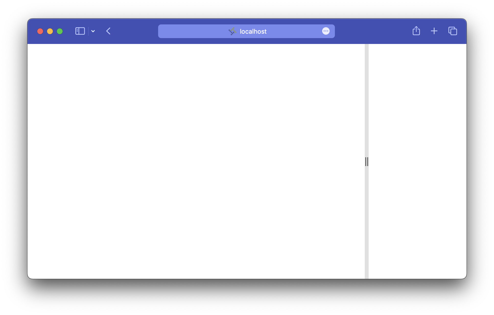
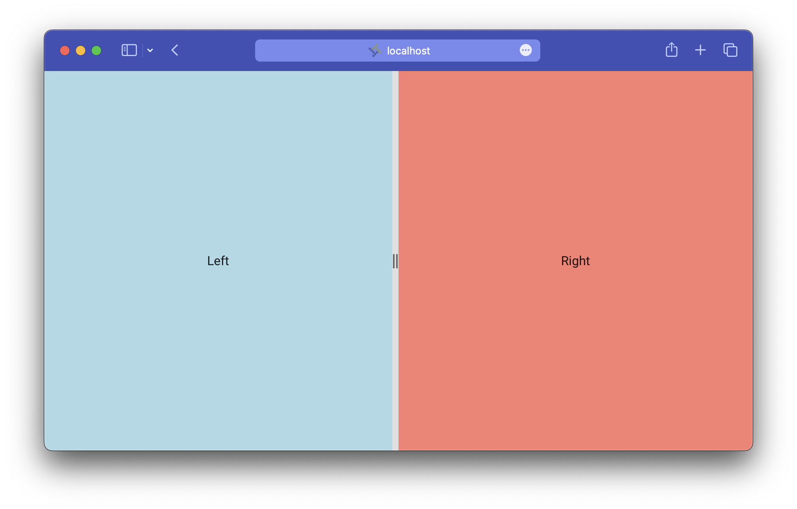
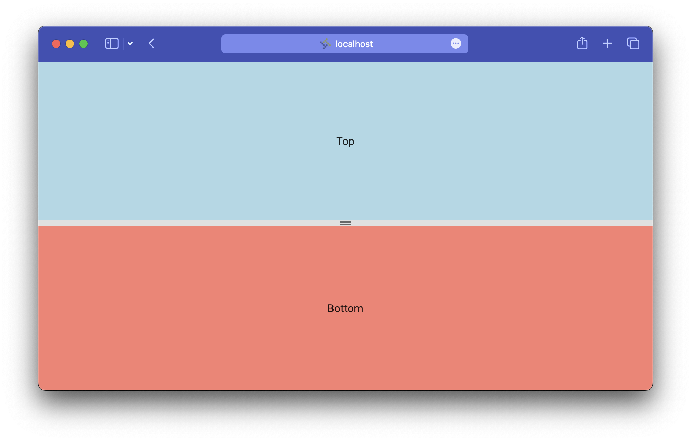
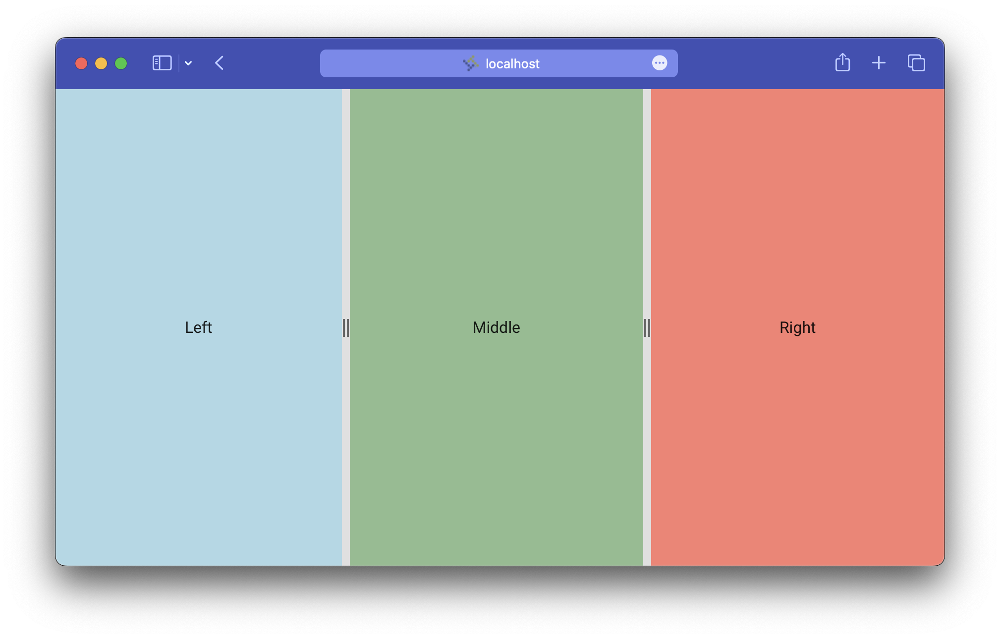
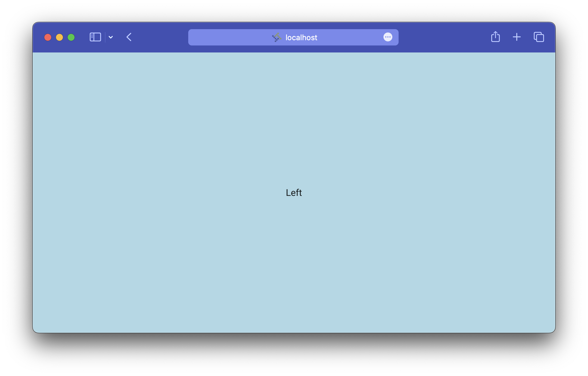

The split view component arrived with Forge 2.9.0 a few months ago, finally giving us a way to develop resizable layouts without relying on third party libraries. This is a powerful tool that's been a long time in the making. It also has the potential to be a little confusing to use up front. This post will be an introduction to the split view, showing how you can use it and some of the thought that went into its development.

<!-- truncate -->

## Basics

You can get a split view on the screen with as little code as this:

```html
<forge-split-view>
    <forge-split-view-panel></forge-split-view-panel>
    <forge-split-view-panel></forge-split-view-panel>
</forge-split-view>
```

This creates the default view — a two panel layout arranged horizontally.



This already looks promising. Just like that you get two content areas and a handle dividing them. Click on the handle (notice the slick ripple animation) and drag it around to change the relative size of the panels.

It's pretty hard to differentiate the panels like this, though, so let's add in some content. While we're at it let's also make the right panel take up half the available space, up from the default 200 pixels.

```html
<forge-split-view>
    <forge-split-view-panel>
        <div>Left</div>
    </forge-split-view-panel>
    <forge-view-panel size="50%">
        <div>Right</div>
    </forge-split-view-panel>
</forge-split-view>
```



:::warning Responsive content
You obviously can't rely on split view panel content to remain one size, so be extra careful to design anything you put in there to be responsive. Use flexible styling and always test it at different sizes.
:::

It's important to note that in this example only the right panel should be thought of as resizable. We'll get more into this later on, but for now know that by default the first panel automatically expands to fill the space left by its explicitly-sized siblings. If you need the left panel to resize instead you can use the `resizable` attribute to manually configure this.

```html
<forge-split-view>
    <forge-split-view-panel resizable="end" size="50%">
        <div>Left</div>
    </forge-split-view-panel>
    <forge-view-panel resizable="off">
        <div>Right</div>
    </forge-split-view-panel>
</forge-split-view>
```

Without `resizable` set the split view assumes that the first panel isn't resizable and sets it for you. You may not have to mess with this very often, but when you do remember that at least one panel in any split view layout *must* have `resizable` set to off.

:::tip Resizable
When you set `resizable` to `end` the handle gets added after the content. Set it to `start` to get the reverse, or `off` if you don't want a handle at all.

If your content can normally be resized but you want to conditionally prevent it, you can add a `disabled` attribute to the panel.
:::

### Vertical split view

All you need to do for a vertical split view layout is set the `orientation` attribute on the component:

```html
<forge-split-view orientation="vertical">
    <forge-split-view-panel>
        <div>Left</div>
    </forge-split-view-panel>
    <forge-view-panel size="50%">
        <div>Right</div>
    </forge-split-view-panel>
</forge-split-view>
```



This is a nice layout to use when you're designing for a screen that's taller than it is wide, e.g. a phone. Get responsive and use a [media query](https://css-tricks.com/working-with-javascript-media-queries/) to track the browser's viewport size, switching between horizontal and vertical orientations on the fly to deliver the best experience.

:::warning Pay attention to context
Make sure the container you put the split view in is a block element with height! The component expands to fill its container by default and may not work if it's unable to.
:::

### Multiple panels

What if you need more than two panels of content? The split view component can handle that. Add any number of panels to your view and they'll render just as you'd expect.

```html
<forge-split-view>
    <forge-split-view-panel>
        <div>Left</div>
    </forge-split-view-panel>
    <forge-view-panel size="33%">
        <div>Middle</div>
    </forge-split-view-panel>
    <forge-view-panel size="33%">
        <div>Right</div>
    </forge-split-view-panel>
</forge-split-view>
```



When you resize a panel in a setup like this it can only expand up to the point where the neighboring panel is as small as possible. So if you were to drag the right panel's handle in this example, the middle panel could shrink down to a width of zero pixels or expand to fill both panel's space but the left panel won't ever change size. 

This also works in a vertical layout, of course.

### Constraining sizes

Sometimes you don't want to give the user complete control over the size of your content. Maybe, as responsive as you were able to make your design, something just breaks when it gets too big or too small.

For cases like that we have the `min` and `max` attributes. Each takes a pixel amount or percentage and ensures that the panel it's set on will never resize past that boundary.

This code constrains the right panel to a width between 100 pixels and two thirds the width of the split view:

```html
<forge-split-view>
    <forge-split-view-panel>
        <div>Left</div>
    </forge-split-view-panel>
    <forge-view-panel size="50%" min="100" max="67%">
        <div>Right</div>
    </forge-split-view-panel>
</forge-split-view>
```

And this makes sure *neither* panel can get smaller than 180 pixels:

```html
<forge-split-view>
    <forge-split-view-panel min=180>
        <div>Left</div>
    </forge-split-view-panel>
    <forge-view-panel size="50%" min="180">
        <div>Right</div>
    </forge-split-view-panel>
</forge-split-view>
```

### Hiding panels

It's not always enough to simply minimize content. You may also want to give users the ability to completely hide a panel from view. Imagine you have something like a document viewer beside your other content. It's nice to be able to scale the viewer to your preferred size, but it doesn't make sense to have it up at all when nothing's open in it.

The `open` attribute is there to solve this problem. Set it to `true` to keep a panel visible, or `false` to hide it away with a quick animation (just like the Forge drawer component).

```html
<forge-split-view>
    <forge-split-view-panel>
        <div>Left</div>
    </forge-split-view-panel>
    <forge-view-panel open=false>
        <div>Right</div>
    </forge-split-view-panel>
</forge-split-view>
```



The right panel here has its `open` attribute set to `false` and so is hidden from the view and assistive technology.

Panels can also be configured to close automatically when they reach a certain size. Set `auto-close` to `true` to enable this at zero pixels, and `auto-close-threshold` to your desired pixel threshold if it differs.

:::warning Opening panels
Because the entire panel, along with its handle, goes away when closed, there's no built in way to open a closed panel. You must provide your own UI to control this.
:::

## How it works

At its heart the split view component is a [flex](https://developer.mozilla.org/en-US/docs/Learn/CSS/CSS_layout/Flexbox) container with some extra logic to manage communication between its children. Panels with `resizable` set to `off` grow and shrink to fill space simply because they have their CSS [`flex`](https://developer.mozilla.org/en-US/docs/Web/CSS/flex) property set to `1`.

Other panels have their widths explicitly set via JavaScript. When a user begins resizing, the panel get its size and the initial pointer location. As the pointer moves the initial and updated locations are continually compared to produce a delta value which is then added to the starting size to produce the new size.

Typically computations involving rapid reads and write to the DOM are expensive because they trigger reflows affecting every element on the page. The split view attempts to improve performance by doing the necessary reads at the beginning of the process and delaying other calculations until the resize has ended. It also makes use of the [`contain`](https://developer.mozilla.org/en-US/docs/Web/CSS/contain) CSS property to restrict how much of the page is involved in reflows that do happen.

When a resize has ended, the affected panel signals its siblings to recalculate their properties via their parent split view.

## Accessibility

The single point of interaction for each split view panel is its handle. This is the element that, aside from being draggable via mouse, receives keyboard focus and provides the panel's semantic information.

The semantics piece is why it's important to understand which handle controls each panel and by extension which panels are resizable (calling back to the beginning of the post). Each panel **must** be labelled to properly expose it to assistive technology. We do that with the `accessible-label` attribute, which sets the interior `aria-label` property of the handle:

```html
<forge-split-view>
    <forge-split-view-panel>
        <div>Left</div>
    </forge-split-view-panel>
    <forge-view-panel accessible-label="Right">
        <div>Right</div>
    </forge-split-view-panel>
</forge-split-view>
```

:::info Labels
Each of the previous examples in this post should have had labels set. The only reason they were omitted up until this point was for readability.
:::

The label should be a short and simple description of the panel's content. Think of it as another heading on the page. In one of the previous examples we might have set it to "Document viewer". Note that there's no need to include the word "panel", "handle" or anything like that.

Also note that the left panel doesn't have a label. This is because it is not resizable, which means it doesn't have a handle and therefore doesn't provide any semantic information. Even if you did set a label, it would never make it to the DOM anyway.

With this in mind you might see why we'd choose one panel to be resizable over another. It's often the secondary, "aside" or "detail" content that makes more sense as resizing. Whether that ends up on the left, right, top, or bottom is up to you.

There are other accessible attributes set on the handle as well, though most developers will never have much need the think about them here. These include:
- `role=separator`
- `aria-orientation`, either `vertical` or `horizontal`
- `aria-valuemin`, `aria-valuemax`, and `aria-valuenow`
- `aria-grabbed`, reflecting whether it's currently being dragged
- `aria-controls` pointing to the content element

These attributes, and more interesting things about this sort of component, are detailed in [MDN's docs on the separator role](https://developer.mozilla.org/en-US/docs/Web/Accessibility/ARIA/Roles/separator_role). 

### Keyboard interaction

To empower screen reader users and anyone who prefers to navigate with their keyboard, all the functionality of the split view component is available through keyboard shortcuts.

When a panel's handle is focused the arrow keys will expand or collapse it (faster if combined with the shift key) and the home and end keys minimize and maximize it, respectively. This is all pretty straightforward so far.

There's one more shortcut available but you'll have to enable it manually — set the `allow-close` property and a press of the enter/return key will close the panel. As noted before, if a panel closes there's no built-in UI to reopen it, so don't forget to account for that in your design.

## Customization

Most of the split view component's appearance is defined by the content you place in it. Its only obvious UI element is the handle between panels. That said, each internal element has a [part selector](https://developer.mozilla.org/en-US/docs/Web/CSS/::part) to allow you to style it however you want.

The split view itself only exposes one part, `root`.

The panel has a few more:
- `root`: The container element.
- `handle`: The handle element.
- `icon`: The icon *inside* the handle element.
- `ripple`: The ripple that activates when the handle is interacted with.
- `content`: The container around the content you slot in.

The other day I was working on an app and wanted to switch up how my split view looked. I ended up writing this bit of SCSS:

```scss
forge-split-view {
  &[orientation=vertical] {
    --app-split-view-handle-icon-width: 32px;
    --app-split-view-handle-icon-height: 4px;
  }

  &[orientation=horizontal] {
    --app-split-view-handle-icon-width: 4px;
    --app-split-view-handle-icon-height: 32px;
  }

  forge-split-view-panel {
    &::part(icon) {
      background-color: var(--mdc-theme-text-secondary-on-light);
      height: var(--app-split-view-handle-icon-height);
      width: var(--app-split-view-handle-icon-width);
      border-radius: 2px;
    }
  }
}
```

This snippet sets height and width variables based on the split view's orientation then uses those to turn the icon element into a little pill shape.


You don't necessarily have to dig into it like that to change up the style though. These [CSS custom properties](https://developer.mozilla.org/en-US/docs/Web/CSS/Using_CSS_custom_properties) are also available to do some simple customization:
- `--forge-split-view-handle-width`: Controls the handle width.
- `--forge-theme-border-color`: Controls the handle color.
- `--mdc-theme-text-secondary-on-light`: Controls the icon color.

## Conclusion

A lot of hard work went into developing the split view component to be as robust, accessible, and developer friendly as possible. As more teams start to use it we're looking forward to seeing what new kinds of layouts and user interactions it enables. For more in depth info and to test it out for yourself, check out our [developer documentation in Storybook](https://forge.tylerdev.io/main/?path=/story/components-split-view--default). 
