---
sidebar_custom_props:
  shortDescription: The app bar is the header for applications. It houses navigation items and tools related to the app.
  thumbnail: ./img/all-components/app-bar-mini.png
---

# App bar

<ComponentVisual storybookUrl="https://forge.tylerdev.io/main/?path=/docs/components-app-bar--docs">

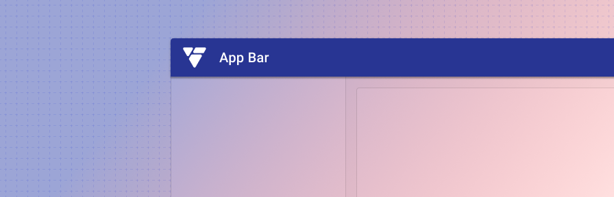

</ComponentVisual>

## Overview

The app bar is a user's personal navigation kit. It holds everything a user needs to navigate the app they're currently in, apps they typically go to, and apps they might need, as well tools to customize their navigation experience through notifications, language options, and help resources.

---

## Parts 

The app bar is composed of five sections.

<ImageBlock>

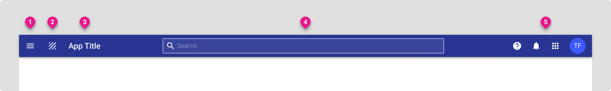

</ImageBlock>

---

## 1. Start

<ImageBlock max-width="450px">

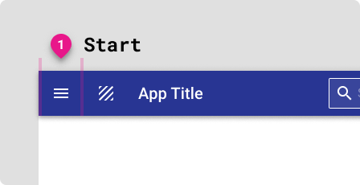

</ImageBlock>

The start slot places content at the beginning of the app bar.   

Apps using a dismissible [navigation drawer](/components/navigation/navigation-drawer) display a hamburger menu to open and close the menu. For these apps, the menu icon should always be visible, even as the screen scales to fit different device contexts.   

---

## 2. Logo

<ImageBlock max-width="450px">

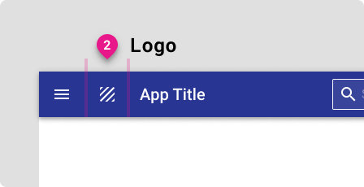

</ImageBlock>

The second slot is used to display a logo for the application.

## 3. Title

<ImageBlock max-width="450px">

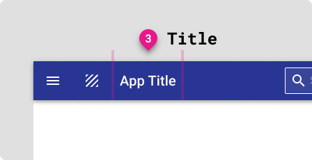

</ImageBlock>

The title slot is designed to house the title of your application. 

---

## 4. Center

<ImageBlock>

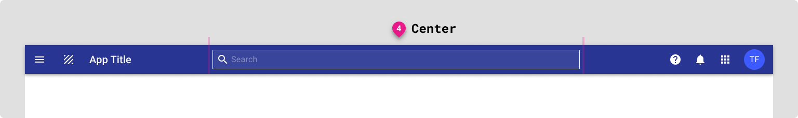

</ImageBlock>

The center slot places content in the center of the app bar and is generally used to house the search functionality of the application.   

App bar search is optional, but should be used for apps that are primarily search driven. In cases where the search may be local to a single component on the page, place the search closest to the component it’s performed on.    

The app bar provides a number of options for search depending on the scope needed, input type, and autocomplete suggestions.

For more information, check out the [app bar: search](/components/app-bar/search) guidance. 

---

## 5. End

<ImageBlock max-width="450px">

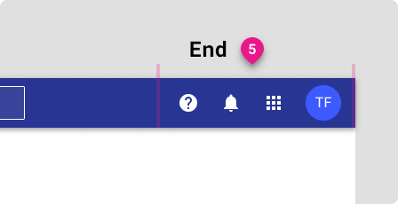

</ImageBlock>

The fifth section of the app bar is the end slot and contains actions related to the application as a whole and information pertaining to the user. 

:::note
Actions that affect a single item or a piece of the application should be placed in context, close to the part they affect, rather than in the app bar.
:::

User information consists of sections: 1. Help & About, 2. Notifications, 3. App launcher, 4. Avatar & profile card.

<ImageBlock maxWidth="350px">

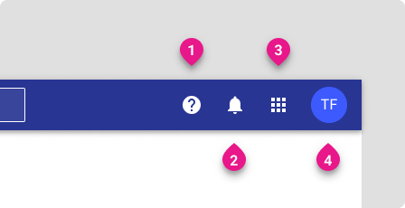

</ImageBlock>

### 1. Help

The help menu is standard across apps and can consist of a variety of resources, ranging from help specific to the user’s current app to the broad range of resources available in a suite of apps.

**Apps should provide an “About” section** consisting of (but not limited to) versioning, system information, user information, and terms & conditions. The About section may use a simple dialog or a tabbed dialog with the appropriate sections.

In order to help clients accurately report the version number of the application when submitting support tickets, be sure the version number is easily accessible from your app’s help dialog. See more examples in our gallery examples.

### 2. Notifications

Notifications are standard across apps, and use tabs to display notifications from the current app as well as a summary of notifications from all apps.

Example notifications include: “New time off request to approve,” “New package rejected,” “Time off request approved,” “Your bill is due in 5 days.”

A badge displays the total number of unread notifications individual to the user. Notifications are considered “read” when they have been clicked.

Notifications may be clickable. Clickable notifications may deep link within an app or may link to an external resource. Read notifications should persist only for 14 days unless otherwise specified by a business requirement.

### 3. App launcher

The app launcher is used to switch between context or between different applications in an ecosystem.

See our guidance on the [app launcher page](/components/app-bar/app-launcher).

### 4. Avatar and profile card 

The profile card features a user's personalized avatar if they've set one, their full name, and the email used to sign up with the app. Additionally, the card features a “Sign out” option as well as a link to their profile, if applicable. 

<ImageBlock maxWidth="450px">

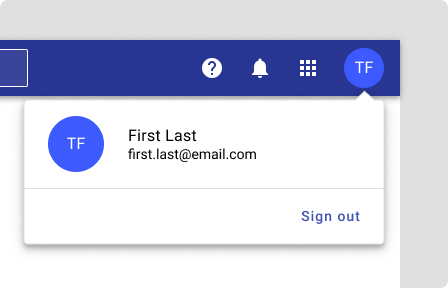

</ImageBlock>

For **unauthenticated users,** the avatar is replaced by a “sign in” button. Notifications are hidden; the help menu and app launcher remain.

<ImageBlock maxWidth="450px">

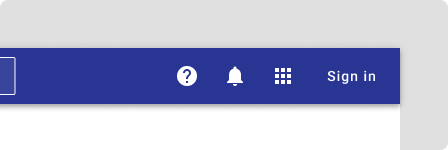

</ImageBlock>

---

## Variations 

Top tabs can be placed within the app bar as primary navigation when the navigation drawer is not being used. Use 128px height app bar, with tabs placed along the bottom edge.

<ImageBlock>

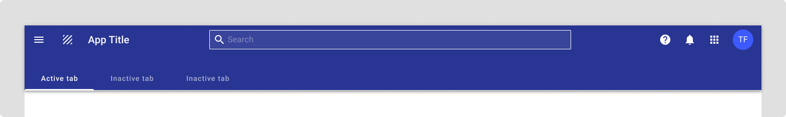

</ImageBlock>

---

## Best practices 

<DoDontGrid>
  <DoDontTextSection>
    <DoDontText type="dont">Don't place links in the app bar.</DoDontText>
    <DoDontText type="dont">Don't place tabs in a standard height app bar - use the tabs variation instead.</DoDontText>
  </DoDontTextSection>
</DoDontGrid>

---

## Related

### Components

The app bar is used with

- The [app launcher](/components/app-bar/app-launcher)
- [Navigation drawer](/components/navigation/navigation-drawer)
- The [scaffold](/components/layouts/scaffold) for page layout

### Patterns

- The app bar should resize based on the device context in which it's displayed; check out examples in our [Page layouts](/patterns/layout/introduction)

