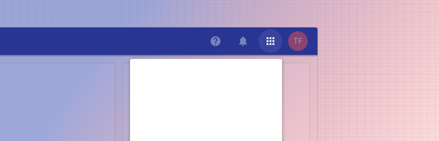
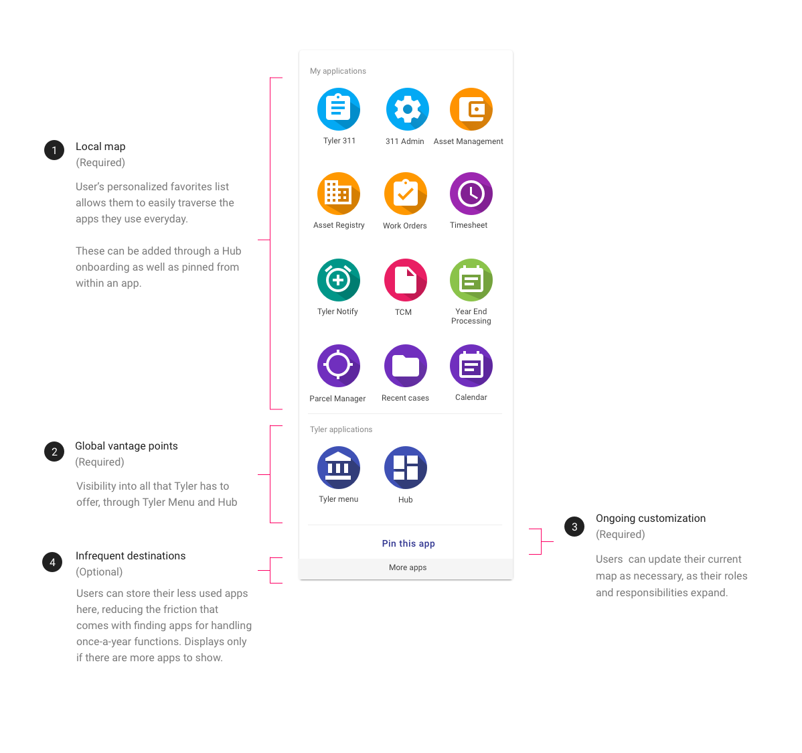

---
sidebar_custom_props:
  shortDescription: App launcher is a persistent navigation component for users to view and launch programs.
  thumbnail: ./img/all-components/app-bar-app-launcher-mini.png
---

# App launcher

<ComponentVisual storybookUrl="https://tyler-technologies.github.io/forge-internal/main/?path=/story/components-app-launcher--default">

</ComponentVisual>

## Overview

App launcher is a persistent navigation component for users to switch context. It is a personal local map to navigate a product ecosystem. It lives in the user information section of app bar and is represented by the Apps icon.

---

<ImageBlock>

</ImageBlock>

---

## Responsive
The app launcher displays on responsive mobile web apps. Native apps should not use app launcher (internal app navigation should occur in the navigation drawer; external app navigation will be handled by the user’s phone). 
On responsive web apps, the app launcher displays full screen at mobile sizes. 

---

## Related

### Components

- The app launcher is comprised of product and application icons.
- The app launcher is part of the [app bar](/components/app-bar/app-bar)
- Use a [navigation drawer](/components/navigation/drawer) to display internal destinations

### Patterns

- [Navigation](/patterns/navigation/primary)

--- 

## Related 

### Components

- [App bar](/components/app-bar/app-bar)

