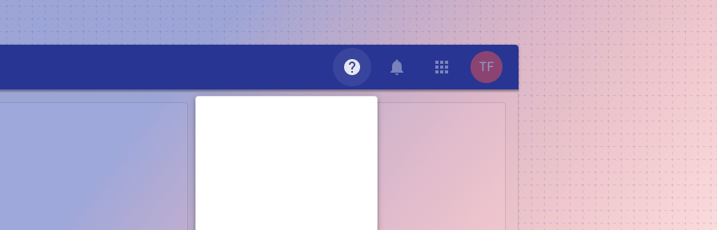

# App bar help button

<ComponentVisual storybookUrl="https://forge.tylerdev.io/main/?path=/docs/components-app-bar-help-button--docs">

</ComponentVisual>

## Overview

The help menu is standard across apps and can consist of content from a variety of resources, ranging from help specific to the user’s current app to external help articles. 

**Apps should provide an “About” section** consisting of (but not limited to) versioning, system information, user information, and terms & conditions. The About section may use a simple dialog or a tabbed dialog with the appropriate sections. 

In order to help users accurately report the version number of the application when contacting support, be sure the version number is easily accessible from your app’s help dialog. 

See the [recipes](/recipes/app-bar-about/complex) for the "About" section. 

--- 

## Related 

### Components

- [App bar](/components/app-bar/app-bar)

### Recipes

- [App bar: about recipes](/recipes/app-bar-about/complex)
