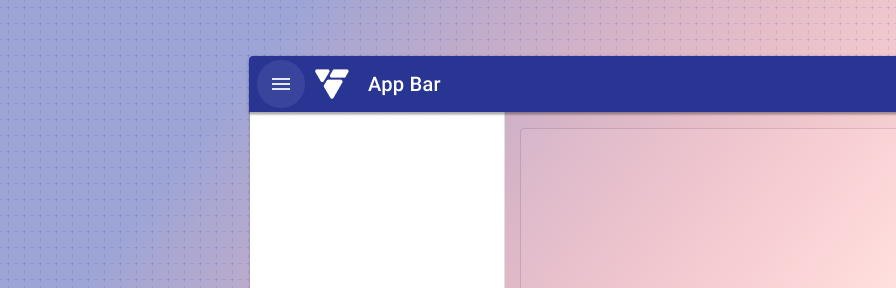

# App bar menu button

<ComponentVisual storybookUrl="https://forge.tylerdev.io/main/?path=/docs/components-app-bar-menu-button--docs">

</ComponentVisual>

## Overview

Apps using a dismissible [navigation drawer](/components/navigation/navigation-drawer) display a hamburger menu to open and close the menu. For these apps, the menu icon should always be visible, even as the screen scales to fit different device contexts. 

---

## Related 

### Components

- [App bar](/components/app-bar/app-bar)

### Patterns

- [Page layouts](/patterns/layout/page-layouts)
