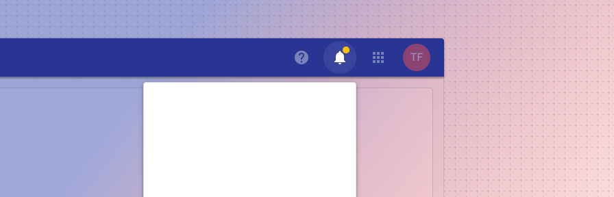

# App bar notifications

<ComponentVisual storybookUrl="https://forge.tylerdev.io/main/?path=/docs/components-app-bar-notifications--docs">

</ComponentVisual>

## Overview

Notifications are standard across apps, and this component uses an icon-button with a predefined icon to help keep consistency across applications in a suite. If your application provides system notifications, use this component to show those notifications to the user.

Example notifications include: “New time off request to approve,” “New package rejected,” “Time off request approved,” “Your bill is due in 5 days.”

A badge displays the total number of unread notifications individual to the user. Notifications are considered “read” when they have been clicked.  

Notifications may be clickable. Clickable notifications may deep link within an app or may link to an external resource. Read notifications should persist for a set time, such as 14 days, unless otherwise specified by a business requirement. 

---

## Related 

### Components

- [App bar](/components/app-bar/app-bar)

### Patterns

Coming soon...
