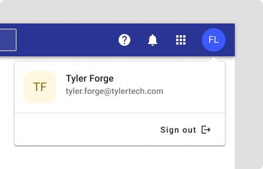
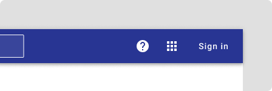

# App bar profile

<ComponentVisual storybookUrl="https://tyler-technologies-oss.github.io/forge-extended/v1/?path=/story/components-user-profile--demo">

</ComponentVisual>

## Overview

The app bar profile provides account access and user identity display. Shows user avatar, name, and email when authenticated, or a sign-in button when not.

### Authenticated users

<ImageBlock maxWidth="450px">

</ImageBlock>

Displays user avatar, full name, email address, and sign-out option.

### Unauthenticated users

<ImageBlock maxWidth="450px">

</ImageBlock>

Shows sign-in button. Notifications are hidden; help and app launcher remain visible.

---

## Usage

Use in all Tyler applications that require user authentication. Provides consistent account access across products.

**Best practices:**
- Keep sign-out easily accessible but prevent accidental clicks
- Maintain visual hierarchy between user info and actions

---

## Implementation

**Extended Component:** [Forge User Profile](https://tyler-technologies-oss.github.io/forge-extended/v1/?path=/docs/components-user-profile--docs)

The extended component includes additional features like an optional link slot for contextual links and a theme switcher to control the application's theme.

---

## Related 

- [App bar](/components/app-bar/app-bar)

