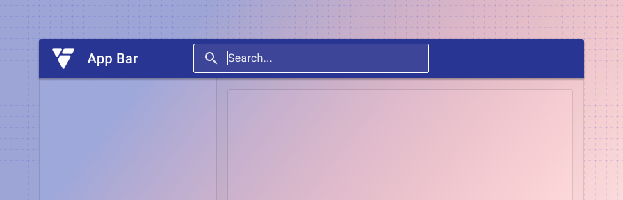
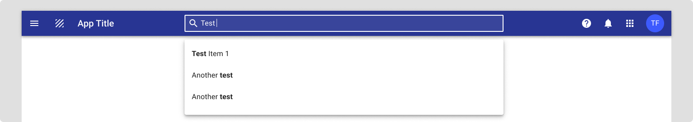
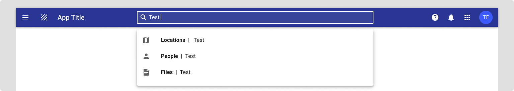

# App bar search

<ComponentVisual storybookUrl="https://forge.tylerdev.io/main/?path=/docs/components-app-bar-search--docs">

</ComponentVisual>

## Overview

App bar search is an optional feature that sits in the center slot of the app bar component. It's primarily used as the default search location for an application. In cases where the search may be local to a single component on the page, place the search closest to the component it's performed on.

It's easily customizable and depending on your needs it can provide a number of options for search depending on the scope needed, input type, and autocomplete suggestions.

---

## Search examples

### No search
Use when an app doesn't have a use case to search for data and global search doesn't need to be supported.

<ImageBlock>

</ImageBlock>    

### Default app search
This is the standard search used in the app bar. It's used for searches within a page, app, or product suite. Common examples include: searching for a user, record, incident, case, or setting. If the search is contextual within the app, be sure to use placeholder text to clearly indicate the context.

<ImageBlock>

</ImageBlock>

---

## Search input type

### Advanced search
When a more advanced search is needed, such as a large form with individual records to search on, it's recommended to add a secondary advanced search button next to the standard search. This can then launch your advanced search functionality if needed by the user.

<ImageBlock>

</ImageBlock>

---

## Pre-filtering and autocomplete

### Autocomplete
Use to suggest exact results or suggested search queries.

<ImageBlock>

</ImageBlock>

### Prefilter
Use to help users search on specific categories or to improve performance time for global searches.

<ImageBlock>

</ImageBlock>

--- 

## Related 

### Components

- [App bar](/components/app-bar/app-bar)
