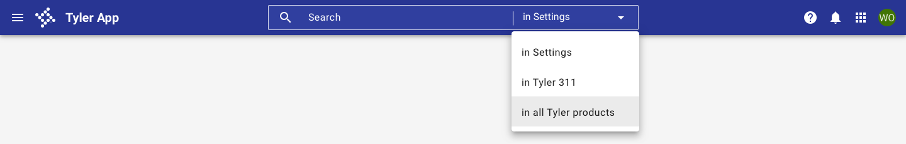
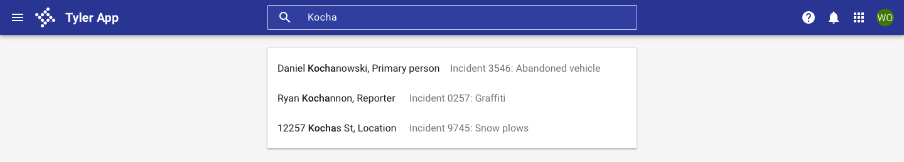
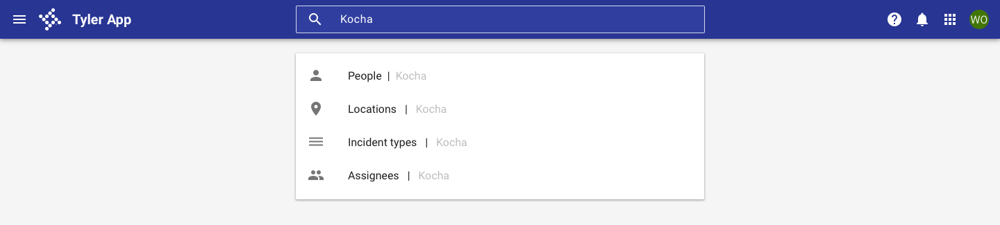

# App bar search

<ComponentVisual storybookUrl="https://forge.tylerdev.io/main/?path=/docs/components-app-bar-search--docs">

</ComponentVisual>

## Overview

App bar search is an optional feature that sits in the center slot of the app bar component. It's primarily used as the default search location for an application. In cases where the search may be local to a single component on the page, place the search closest to the component it's performed on.

It's easily customizable and depending on your needs it can provide a number of options for search depending on the scope needed, input type, and autocomplete suggestions.

---

## Search scope

**No search:** Use when an app doesn't have a use case to search for data and global search doesn't need to be supported.

<ImageBlock>

</ImageBlock>    

**Internal app search:** Use when searches within a page, app or product suite are needed. Common examples include: searching for a user, record, incident, case, or setting. Use placeholder text to indicate that the search is contextual within the app.

<ImageBlock>

</ImageBlock>

**Combined search:** Use this to allow searches at multiple levels - within a page, app, product suite, OR within an ecosystem. Use placeholder text to indicate where the search will occur.

<ImageBlock>

</ImageBlock>

---

## Search input type

**One search input:** Default search state for the app bar. Use in most cases.

<ImageBlock>

</ImageBlock>

**Advanced search:** Use when a more advanced search is required for more than 30% of searches.

<ImageBlock>

</ImageBlock>

---

## Pre-filtering and autocomplete
**Autocomplete:** Use to suggest exact results or suggested search queries.

<ImageBlock>

</ImageBlock>

**Prefilter:** Use to help users search on specific categories or to improve performance time for global searches.

<ImageBlock>

</ImageBlock>

--- 

## Related 

### Components

- [App bar](/components/app-bar/app-bar)
