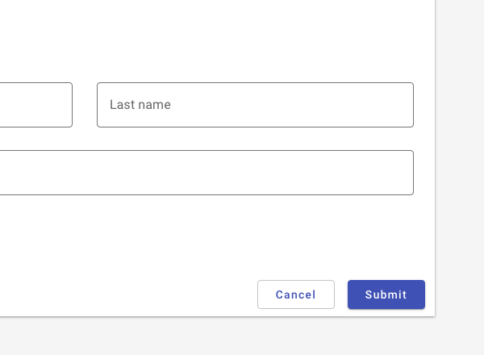
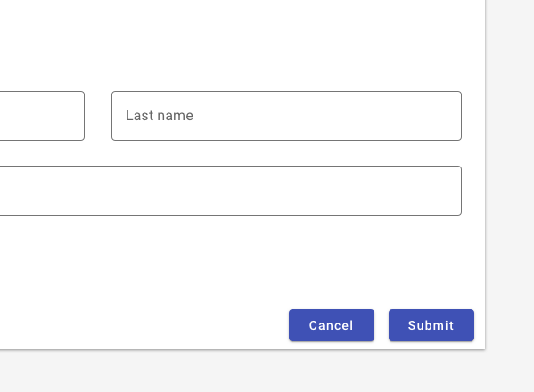

---
sidebar_custom_props:
  shortDescription: Buttons allow users to take actions, and make choices, with a single tap.
---

# Button

<ComponentVisual
  figmaUrl="https://www.figma.com/embed?embed_host=share&url=https%3A%2F%2Fwww.figma.com%2Ffile%2FVFIsI7H3lTMQMqu7pG4qjq%2FForge-Content%3Fnode-id%3D487%253A915"
  storybookUrl="https://forge.tylerdev.io/main/?path=/story/components-button--default" />

## Overview

Buttons communicate actions that users can take. They are typically placed throughout your UI, in places like: [dialogs](/components/notifications-and-messages/dialog), forms (coming soon!), [cards](/components/cards/card), [tables](/components/table-data/table), [toolbars](/components/toolbar).

---

## Types 

There are three types of text buttons: 1. Raised (high emphasis), 2. Outlined (medium emphasis), and 3. Flat (low emphasis).

Forge also includes other types of buttons: [icon buttons](/components/icon-button), [floating action buttons](/components/fab), [button toggles](/components/buttons/button-toggle). 

### Raised (High emphasis)

Raised  buttons have more emphasis, as they use a fill color and shadow. They contain actions that are primary to your application.

### Outlined (Medium emphasis)

Outlined buttons are used for more emphasis than text buttons due to the stroke. They contain actions that are important, but aren't the primary action in the app.

### Flat (Low emphasis)

Text buttons are typically used for less pronounced actions including those located in dialogs and cards. Text buttons help maintain an emphasis on card content. Use text only buttons more sparingly than outlined and raised buttons, for ADA compliance reasons.

---

## When to use: Icon vs text buttons

Both text buttons and icons used as buttons have an appropriate place in user interfaces. Text buttons are immediately recognizable and their meaning is typically clearer than icon buttons; however, repeated text buttons can clutter the UI of a screen (repeated row level text buttons in a table, for instance). 

When to use icon buttons:

- For globally familiar actions (undo, edit, save, cancel, home, print, search, menu, navigate, back, download, add).
- In collections of data where actions where repeated text buttons may overwhelm a screen. 
- For familiar toolbar actions in tables, lists, or cards.

:::note
Icon buttons should always be accompanied by a tooltip for clarity. 
:::

When to use text buttons:

- For any actions that don't have a readily familiar icon ("new list," "update", "projects," "manage" etc.)
- for domain specific actions such as accounting terms, where an icon image may not be recognizable to the user.

---

<DoDontGrid>
  <DoDontTextSection>
    <DoDontText type="do">Use sentence casing for buttons. ("Start new" intead of "Start New" or "START NEW")</DoDontText>
    <DoDontText type="do">Use flat buttons sparingly; outlined buttons are better for accessibility reasons.</DoDontText>
    <DoDontText type="do">Use succinct and actionable words ("Submit", "Close", "Cancel", "Start scheduling", instead of "Start a new instance of this week's schedule," "Wheelmaster"). </DoDontText>
    <DoDontText type="do">Use words that are familiar to your user: "Submit" instead of "Accept" or "Commit."</DoDontText>
    <DoDontText type="do">Use the default, primary color for buttons.</DoDontText>
    <DoDontText type="do">For inline actions, place buttons close to the content they act on.</DoDontText>
  </DoDontTextSection>
  <DoDontTextSection>
    <DoDontText type="dont">Don't use the Forge success or warning colors for buttons. Use the primary default instead.</DoDontText>
  </DoDontTextSection>
</DoDontGrid>

:::note
If you are using a stack of buttons and want the contents to be left-aligned for consistency (e.g., when using icons),
consider using a [list](/components/lists/list) instead.
:::

---

<DoDontGrid>
  <DoDontRow>
  <DoDontImage>

  </DoDontImage>
  <DoDontImage>

  </DoDontImage>
  <DoDontImage>

  </DoDontImage>
  </DoDontRow>
  <DoDontRow>
    <DoDont type="do">Do use a higher visual emphasis for primary actions. </DoDont>
    <DoDont type="caution">In general, provide users with the two most likely actions on forms. Avoid potentially overlapping actions (“start over” and “cancel”).</DoDont>
    <DoDont type="dont">Don't use two raised buttons next to each other in a form. It inappropriately communicates the same visual emphasis for actions that are unequally likely.</DoDont>
  </DoDontRow>
</DoDontGrid>

---

## Resources

- [Icon Usability](https://www.nngroup.com/articles/icon-usability/) (Nielsen Norman Group)
- [Visual Perception. Icons vs Copy in UI.](https://uxplanet.org/visual-perception-icons-vs-copy-in-ui-cd8e1a2f8af0) (UXPlanet)
- [Can icons harm usability and when should you use them?](https://uxdesign.cc/when-should-i-be-using-icons-63e7448202c4) (UX Collective)
- [Labels always win](http://bokardo.com/archives/labels-always-win/) (Bokardo)
- [Orbitz Can't Get A Date](https://archive.uie.com/brainsparks/2006/02/20/orbitz-cant-get-a-date/) (UIE)

---

## Related

### Components

Buttons may be used with:

- [Dialogs](/components/notifications-and-messages/dialog)
- [Lists](/components/lists/list)
- [Cards](/components/cards/card)
- [Toolbars](/components/toolbar)

### Patterns

- Forms (Coming soon!)
