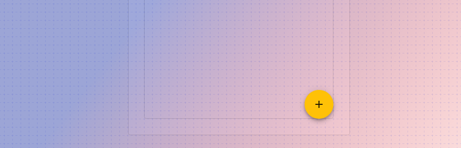
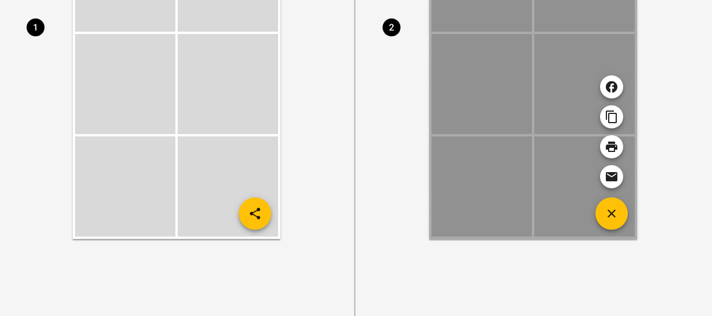
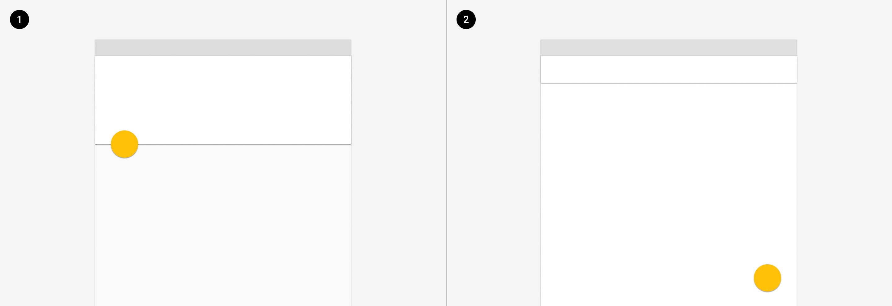
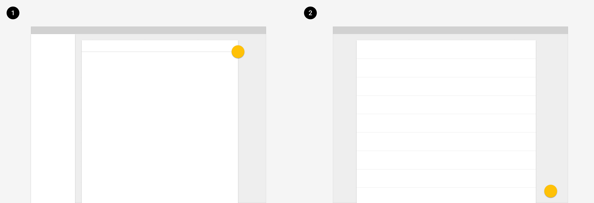
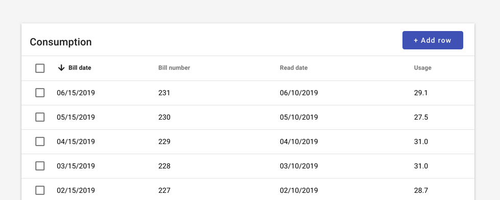

---
sidebar_custom_props:
  shortDescription: A floating action button (FAB) performs the primary, or most common, action on a screen, primarily on mobile.
  thumbnail: ./img/all-components/floating-action-button-mini.png
---

# Floating action button

<ComponentVisual storybookUrl="https://forge.tylerdev.io/main/?path=/docs/components-floating-action-button--docs">

</ComponentVisual>

## Overview

A floating action button (FAB) performs the primary, or most common, action on a screen. Primarily a mobile pattern, it appears in front of all screen content, typically as a circular shape with an icon in its center. FABs come in four types: regular, mini, extended, and speed dial.

### Use when

- A page truly has a primary action.

### Don't use when

- A page has multiple actions that are equally likely. For example, if adding a new record or editing an existing record are equally likely, a FAB should not be used to indicate "add." Use a [button](/components/buttons/button) instead. 

---

## Types 

There are four types of floating action button: 1. Default 2. Mini 3. Extended FAB 4. Speed dial.

### Default

The default FAB uses an icon only. 

### Mini FAB

A mini FAB should be used on smaller screens. When a screen width is 460dp or less, the container of a default FAB (56dp) should transform into the mini size (40dp).

### Extended FAB

The extended FAB includes a text label and optional icon. Use an extended FAB for actions that may not have a familiar icon ("Move to another folder," "Allocate," "Start workflow"). For more information on when to use text vs icon buttons, check out the [button guidance.](/components/buttons/button) 

### Speed dial

When pressed, a FAB can display three to six related actions in the form of a speed dial. This transition can occur in one of the following ways:

- Upon press, the FAB can emit related actions
- Upon press, the FAB can transform into a menu containing related actions.
- If more than six actions are needed, something other than a FAB should be used to present them.

<ImageBlock padded={false} max-width="600px" caption="A FAB displays a stack of related actions.">

</ImageBlock>

---

## Placement

On mobile (native and web responsive), a FAB may attach to a seam or may be placed in the bottom right of the screen; pinned in place even as content scrolls. A pinned fab is placed 24px from the bottom and left of the visible viewport. 

<ImageBlock padded={false} caption="1. On mobile, a FAB can attach to a seam.  2. A FAB may be placed in the bottom right of the screen.">

</ImageBlock>

On desktop, a FAB may attach to the edge of a card or may be placed in the bottom right of the screen; pinned in place even as content scrolls. A pinned fab is placed 24px from the bottom and left of the visible viewport. Consider whether the FAB will block important content or controls; if so, consider a raised button instead. 

<ImageBlock padded={false} caption="1. A FAB can attach to the edge of a card.  2. A FAB may be placed in the bottom right of the screen, pinned 24px from the right and 24px from the bottom of the screen.">

</ImageBlock>

<ImageBlock padded={false} caption="Where viewing records or adding records may be equally likely, use a raised button to indicate the action add.">

</ImageBlock>

---

## Best practices 

<DoDontGrid>
  <DoDontTextSection>
    <DoDontText type="do">Consider whether your page has a single, primary action. If so, a FAB is appropriate. Otherwise consider a raised button. </DoDontText>
    <DoDontText type="do">If an icon is used in an extended FAB, it should be placed to the left of the text.</DoDontText>
  </DoDontTextSection>
  <DoDontTextSection>
    <DoDontText type="dont">Don't use a FAB when it may obscure important content such as records or controls. </DoDontText>
    <DoDontText type="dont">Don't display more than one FAB on a page. </DoDontText>
    <DoDontText type="dont">Don't layer badges or other elements in front of a FAB.</DoDontText>
    <DoDontText type="dont">Don't place text in a regular FAB.</DoDontText>
    <DoDontText type="dont">Avoid using a FAB for minor or destructive actions, such as: archive or trash, alerts or errors.</DoDontText>
    <DoDontText type="dont">Avoid using a FAB if its position would place it too far from the content it acts on.</DoDontText>
  </DoDontTextSection>
</DoDontGrid>

--- 

## Related 

### Components

- Use a [button](/components/buttons/button) to display actions that aren't the primary action on a page. 

### Patterns

Coming soon!
