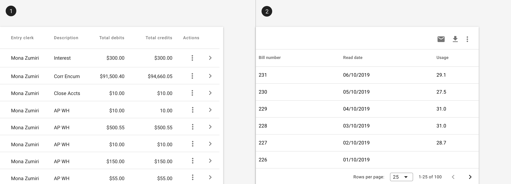

---
sidebar_custom_props:
  shortDescription: Icon buttons communicate actions that users can take using only an icon.
  thumbnail: ./img/all-components/icon-button-mini.png
---

# Icon button

<ComponentVisual storybookUrl="https://forge.tylerdev.io/main/?path=/story/components-icon-button--default">

</ComponentVisual>

## Overview

Icon buttons communicate actions that users can take. Icon buttons display a [tooltip](/components/tooltip) with the action name. Icon buttons should be placed close to the content they act on. 

### Use when

- Space is limited, such as in a toolbar, table row, or list.
- Actions have a widely familiar image (undo, edit, save, cancel, etc).

### Don't use when

- Actions are domain specific or don't have widely familiar images associated. Use a [text button](/components/buttons/button) instead.
 - Don't mix text and icon buttons in a group or table row.

---

## When to use: Icon vs text buttons
Both text buttons and icons used as buttons have an appropriate place in user interfaces. Text buttons are immediately recognizable and their meaning is typically clearer than icon buttons; however, repeated text buttons can clutter the UI of a screen (repeated row level text buttons in a table, for instance).

When to use icon buttons:

- For globally familiar actions (undo, edit, save, cancel, home, print, search, menu, navigate, back, download, add).
- In collections of data where actions where repeated text buttons may overwhelm a screen.
- For familiar toolbar actions in tables, lists, or cards. Icon buttons should always be accompanied by a tooltip for clarity.

When to use text [buttons](/components/buttons/button):

- For any actions that don't have a readily familiar icon ("new list," "update", "projects," "manage" etc.)
for domain specific actions such as accounting terms, where an icon image may not be recognizable to the user.

---
## Types

There are two types of icon buttons: 1. Default icon buttons, 2. Icon toggle buttons.

### Default 

### Icon toggle

Icons can be used as toggle buttons when they allow selection, or deselection, of a single choice, such as marking an item as a favorite or opening or closing a [drawer](/components/drawer). Icon buttons use icons from the [icon library](/assets/icon-library). 

---

## Examples

<ImageBlock padded={false} caption="1. Icon buttons may be used to indicate actions within rows in a table. 2. Icon buttons may be used as actions within a toolbar.">

</ImageBlock>

<ImageBlock padded={false} caption="3. Icon buttons may be used to indicate actions within a list.">

</ImageBlock>

---

## Related

### Components
- Use a text [button](/components/buttons/button) for unfamiliar actions.
- Use a [button toggle](/components/controls/button-toggle) to allow for selection within a set. 
- Icon buttons may be used in [tables](/components/table/table), [lists](/components/lists/list), or toolbars.
- Use a [tooltip](/components/tooltip) with icon buttons.

---

## Resources 

- [Icon Usability](https://www.nngroup.com/articles/icon-usability/) (Nielsen Norman Group)
- [Visual Perception. Icons vs Copy in UI.](https://uxplanet.org/visual-perception-icons-vs-copy-in-ui-cd8e1a2f8af0) (UXPlanet)
- [Can icons harm usability and when should you use them?](https://uxdesign.cc/when-should-i-be-using-icons-63e7448202c4) (UX Collective)
- [Labels always win](http://bokardo.com/archives/labels-always-win/) (Bokardo)
- [Orbitz Can’t Get A Date](https://archive.uie.com/brainsparks/2006/02/20/orbitz-cant-get-a-date/) (UIE)
