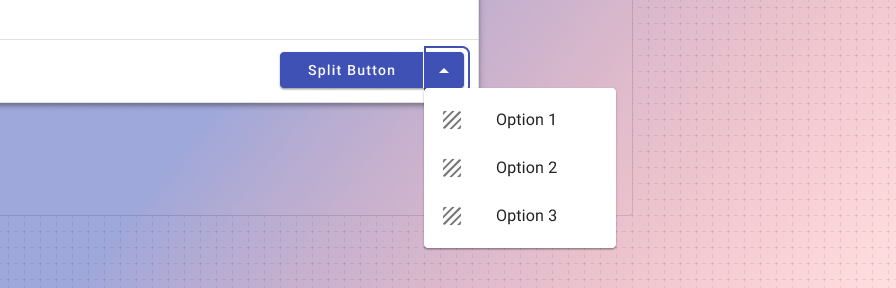
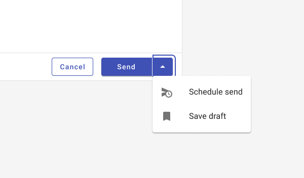
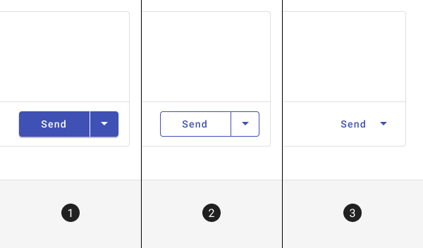

---
sidebar_custom_props:
  shortDescription: Split buttons condense several, related, actions into a single compact component.
  thumbnail: ./img/all-components/split-button-mini.png
---

# Split button

<ComponentVisual storybookUrl="https://forge.tylerdev.io/main/?path=/story/components-button--default">

</ComponentVisual>

## Overview

Split buttons communicate multiple actions that users can take. The split button provides a dedicated, suggested action while also providing an option to choose alternate related actions. 

For groups of buttons or switches to control aspects of a page, or to create a toolbar, see [button toggle](/components/controls/button-toggle). 

<ImageBlock padded={false} max-width="600px" caption="The default usage keeps secondary options in a dedicated overflow menu. The options contain actions related to the primary action.">

</ImageBlock>

### Use when

- There are multiple related choices for a single actionable item.
- Space is confined where multiple buttons will not fit in an area.

### Don’t use when

- Actions are unrelated to one another. Use individual buttons or icon buttons instead. 

---

## Types

<ImageBlock padded={false} max-width="600px" caption="The three types of button: 1. Raised, 2. Outlined, 3. Flat.">

</ImageBlock>

Like [buttons](/components/buttons/button), there are three types of the split button variant: 1. Raised (high emphasis), 2. Outlined (medium emphasis), and 3. Flat (low emphasis). These types should be used in the same way as they’re used with buttons. See [Button > Types](/components/buttons/button/#types) for more information.

## Best practices 

<DoDontGrid>
  <DoDontTextSection>
    <DoDontText type="do">Keep secondary actions similar and related to the main primary action.</DoDontText>
    <DoDontText type="do">Limit the amount of related actions to a maximum of 3, if possible, to prevent over complicating the action being taken.</DoDontText>
    <DoDontText type="do">Use sentence casing for buttons. ("Start new" instead of "Start New" or "START NEW")</DoDontText>
    <DoDontText type="do">Use flat buttons sparingly; outlined buttons are better for accessibility reasons.</DoDontText>
    <DoDontText type="do">Use succinct and actionable words ("Submit", "Close", "Cancel", "Start scheduling", instead of "Start a new instance of this week's schedule," "Wheelmaster"). </DoDontText>
    <DoDontText type="do">Use words that are familiar to your user: "Submit" instead of "Accept" or "Commit."</DoDontText>
    <DoDontText type="do">Use the default, primary color for buttons.</DoDontText>
    <DoDontText type="do">For inline actions, place buttons close to the content they act on.</DoDontText>
  </DoDontTextSection>
  <DoDontTextSection>
    <DoDontText type="dont">Don't use the Forge success or warning colors for buttons. Use the primary default instead.</DoDontText>
    <DoDontText type="dont">Use more than one primary button on a page, or more than one in a dialog.</DoDontText>
  </DoDontTextSection>
</DoDontGrid>