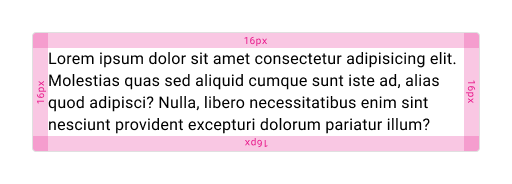

---
sidebar_custom_props:
  shortDescription: A card is intended to be used as a layout design element to help group related content together into sections.
  thumbnail: ./img/all-components/card-mini.png
---

# Card

<ComponentVisual storybookUrl="https://forge.tylerdev.io/main/?path=/docs/components-card--docs">

</ComponentVisual>

## Overview

Cards are surfaces that display content and actions on a single topic.

They should be easy to scan for relevant and actionable information. Elements, like text and images, should be placed on them in a way that clearly indicates hierarchy.

## Use when

- Organizing related information into a single container.
- Previewing summary information about a record that links to the full record.
- Displaying information that includes imagery or illustrations. 
- Displaying information with non homogenous data. 

## Don't use when

- Information contained within the card is not related. 
- Scannability is key.
- Comparing or ordering homogenous data is important. 

---

## Styling

Being containers for objects on your page, the content in cards can be styled in a multitude of ways, but the card itself generally remains consistent.

<ImageBlock>

</ImageBlock>

:::note 
Cards apply a padding of 16px to the entire internal container by default.
:::

<ImageBlock>

</ImageBlock>

### Complex

More complex cards usually follow the same content style with a header, body content, and footer for actions. These are all optional and dependant on the needs of your design and application.

<ImageBlock>

</ImageBlock>

---

## Best practices 

<DoDontGrid>
  <DoDontRow>
  <DoDontImage>

  </DoDontImage>
  <DoDontImage>

  </DoDontImage>
  <DoDontImage>

  </DoDontImage>
  </DoDontRow>
  <DoDontRow>
    <DoDont type="do">Center or left align content within a simple card.</DoDont>
    <DoDont type="dont">Don't use inconsistent alignment for content within a simple card. Center or left align it instead.</DoDont>
    <DoDont type="caution">If a card is interactive (clickable or draggable) use the appropriate interaction state on hover to indicate interactibility.</DoDont>
  </DoDontRow>
</DoDontGrid>

---

## Specs

By default, cards in workforce apps have 16px of padding. 

<ImageBlock padded={false} caption="1. Cards in workforce apps have 16px of internal padding.  2. Default grid gutter is 16px in workforce apps.">

</ImageBlock>

By default cards in community apps have 24px padding. 

<ImageBlock padded={false} caption="1. Cards in community apps have 24px of internal padding.  2. Default grid gutter is 24px in community apps.">

</ImageBlock>

---

## Related

### Components
- [Buttons](/components/buttons/button) and [icon buttons](/components/buttons/icon-button) are typically used in cards.
- Use a [list](/components/lists/list) for search results or scannable data. 
- Use a [table](/components/table/table) for records that need to be compared or filtered by a single column.

### Recipes

- [Card recipes](/recipes/card/generic)

### Patterns 

Coming soon!
