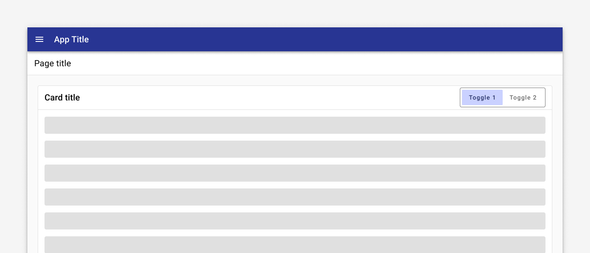
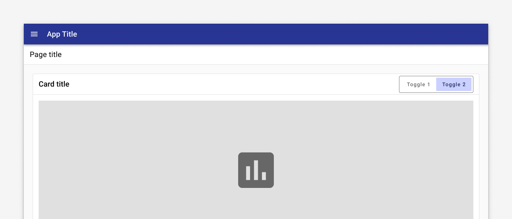

---
sidebar_custom_props:
  shortDescription: Button toggles provide a group of interactive button elements that are related to one another.
  thumbnail: ./img/all-components/button-toggle-mini.png
---

# Button toggle

<ComponentVisual storybookUrl="https://forge.tylerdev.io/main/?path=/docs/components-button-toggle--docs">

</ComponentVisual>

## Overview

A button toggle groups related options. This can be used in a variety of different ways, allowing users to select one option out of a group in a similar manner to radio buttons. Another common action is using it to swap between different views of the same information. To emphasize groups of related toggle buttons, a group should share a common container. 

In general only one option in a group of toggle buttons can be selected and active at a time. Selecting one option deselects any other.

<ImageBlock max-width="400px" padded="{false}">

</ImageBlock>

<ImageBlock caption="An example use case for the button toggle is giving the user the ability to swap between two different views of the same data." max-width="400px" padded="{false}">

</ImageBlock>

### Use when

- Users can select a single option from a group.

### Don't use when

- Users can select multiple options from a group. Use choice [chips](/components/utilities/chips) or [checkboxes](/components/controls/checkbox) instead.
- There are more than four options. Use a [select](/components/fields/select) instead.

---

## Related

### Components

- Use choice [chips](/components/utilities/chips) to display options where users can choose more than one.
- Use a [select](/components/fields/select) to display a large number of options where screen real estate is limited. 
- Use [radios](/components/controls/radio-button) to allow users to select a single option from a list. 
- Use [checkboxes](/components/controls/checkbox) to allow users to select multiple options from a list. 
- [Buttons](/components/buttons/button)
