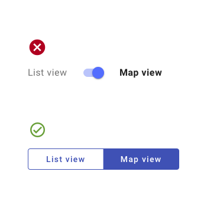

---
sidebar_custom_props:
  shortDescription: Switches toggle the state of a single item on or off.
  thumbnail: ./img/all-components/switch-mini.png
---

# Switch

<ComponentVisual storybookUrl="https://forge.tylerdev.io/main/?path=/docs/components-switch--docs">

</ComponentVisual>

## Overview 

Switches are a type of **selection control.** There are three types of selection controls: 1. Checkboxes, 2. Radio buttons, 3. Switches.

- [Radio buttons](/components/controls/radio-button): allow the selection of a single option from a set.
- [Checkboxes](/components/controls/checkbox): allow the selection of multiple options from a set.
- Switches: allow a selection to be turned on or off.

### Switches 

Switches offer binary options (on/off, true/false).

Use switches when:
- communicating that a setting will **be instantly applied** or changed (without the use of a "submit" button for example).
- a setting **requires an on/off** or show/hide function to display the results.
- a user needs to perform **instantaneous actions** that do not need a review or confirmation.
- a user is toggling **independent features or behaviors.**

---

## Best practices 

<DoDontGrid>
  <DoDontTextSection>
    <DoDontText type="do">Provide clear nonneutral labels. Labels should describe what the control will do when the switch is on. When in doubt, say the label aloud and append “on/off” to the end. If it doesn’t make sense, then rewrite the label (ie, "Show week number" instead of "Include week number?").</DoDontText>
    <DoDontText type="do">Match label text to state of the state of the switch. Turning the switch on should not turn something off, and conversely, turning a switch off should not turn something on.</DoDontText>
  </DoDontTextSection>
  <DoDontTextSection>
    <DoDontText type="dont">Don't use switches for settings that require additional user action, such as "Save," "Submit," "Cancel." Use a checkbox instead.</DoDontText>
    <DoDontText type="dont">Don't use a switch for an option that has a neutral or indeterminate state. Use a checkbox instead.</DoDontText>
    <DoDontText type="dont">Don't use switches to display multiple related options from a user must choose. Use checkboxes instead.</DoDontText>
    <DoDontText type="dont">Don't nest switches. Use checkboxes instead in order to display an indeterminate state at the parent node.</DoDontText>
    <DoDontText type="dont">Don't use switches in filters. Use checkboxes instead.</DoDontText>
  </DoDontTextSection>
</DoDontGrid>

---

<DoDontGrid>
  <DoDontRow>
  <DoDontImage>

  </DoDontImage>
  </DoDontRow>
  <DoDontRow>
    <DoDont type="dont">Don't use switches for opposing options. Switches should only be used for binary options; use a button toggle for opposing options.</DoDont>
  </DoDontRow>
</DoDontGrid>

---

## Related

### Components

- Use [radio buttons](/components/controls/radio-button) to allow for the selection of a single option from a set.
- Use [checkboxes](/components/controls/checkbox) to allow for the selection of multiple options from a set.
- Use a [button toggle](/components/controls/button-toggle) to allow for the selection of a single option from a small set. 
- Use choice [chips](/components/utilities/chips) to allow for the selection of a single option from a small set, especially in mobile contexts. 
- Use a [select](/components/fields/select) to select options when space is limited.

### Patterns 

- Forms (Coming soon!)
- Rich Text Editor (recommended: TinyMCE, Quill)

---

## Resources 

- [Checkbox vs Toggle Switch](https://uxplanet.org/checkbox-vs-toggle-switch-7fc6e83f10b8) (UX Planet)
- [When to Use a Switch or Checkbox](https://uxmovement.com/buttons/when-to-use-a-switch-or-checkbox/) (UX Movement)
- [Toggle-Switch Guidelines](https://www.nngroup.com/articles/toggle-switch-guidelines/) (NN Group)
- [Stop Misusing Toggle Switches](https://uxmovement.com/mobile/stop-misusing-toggle-switches/) (UX Movement)
