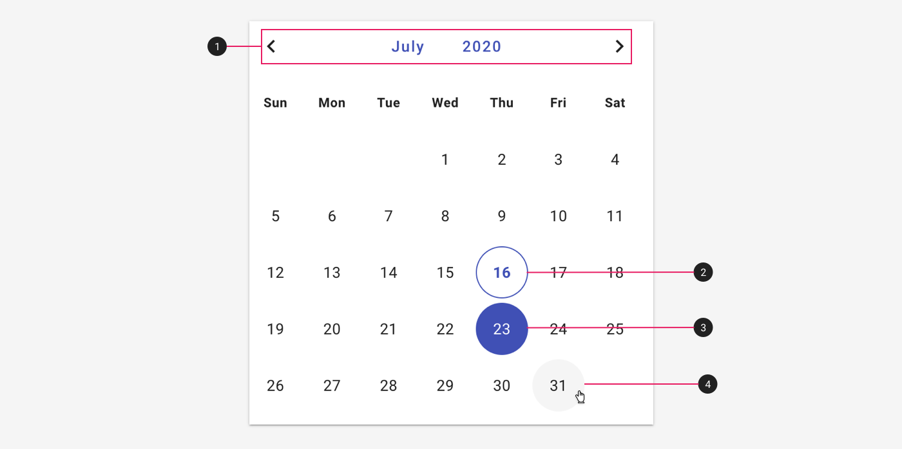

---
sidebar_custom_props:
  shortDescription: The calendar lets users select a date, or a range of dates.
---

# Calendar

<ComponentVisual storybookUrl="https://forge.tylerdev.io/main/?path=/story/components-calendar--default">

</ComponentVisual>

## Overview

The calendar component can be used as part of the [date picker](/components/date-and-time/date-picker) or on its own. 

### Use when

- The task is primarily calendar-driven and the calendar is used for reference, such as selecting dates for a time off request. 
- Users need to select multiple dates that may not be chronological.

### Don't use when

- Users are entering familiar dates such as credit card expirations, birthdays, anniversaries, etc. Use a [date picker](/components/date-and-time/date-picker) that allows for text input instead. 
- The calendar component isn't central to the task at hand. Use a [date picker](/components/date-and-time/date-picker)instead. 
- Screen real estate is limited. Use a [date picker](/components/date-and-time/date-picker) instead. 

---

## Anatomy

The calendar is comprised of the following parts:

<ImageBlock padded="false">

</ImageBlock>

1. **Month and year selector.** Users may tap the month or year to change them, or use the paginators to scroll through previous and next months. 
2. **Today's date.**
3. **Hover state.**
4. **Hover state.**

---

## Related

### Components

- [Date picker](/components/date-and-time/date-picker)
- [Date range picker](/components/date-and-time/date-range-picker)
