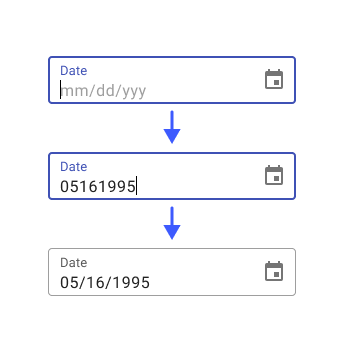
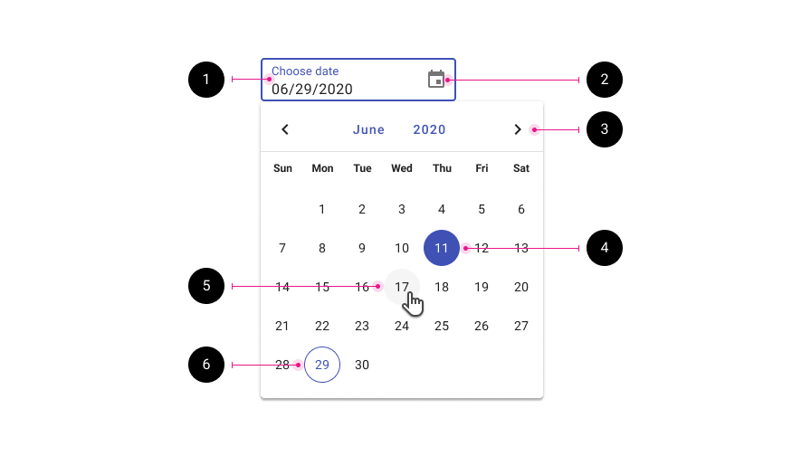
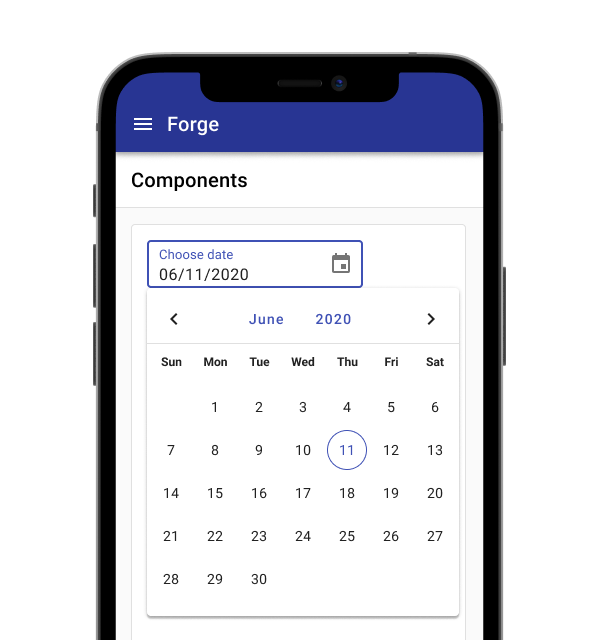

---
sidebar_custom_props:
  shortDescription: The date picker allows users to enter a date either through text input or by choosing a date from the calendar.
  thumbnail: ./img/all-components/date-picker-mini.png
---

# Date picker

<ComponentVisual storybookUrl="https://forge.tylerdev.io/main/?path=/story/components-date-picker--default">

</ComponentVisual>

## Overview

Date pickers let users select a date. Dates should be formatted using the Forge [data formatting guidance](/ux-writing/data-formats/dates-and-times).

**Use when**

- Entering a memorable date such as a birthday, anniversary, credit card expiration date, license date. 
- Entering a date in the near future or recent past. 
- Users know the day of the week or week of the month instead of the numeric date. 
- Users need to be able to see dates in relation to other dates. 

The date picker allows users to manually type in a date (useful for familiar dates) or select from a calendar dropdown (useful for scheduling). The date picker can handle formatting for manual entry on dates. 

<ImageBlock max-width="300px" caption="The date picker formats dates that are entered manually.">

</ImageBlock>

---

## Anatomy

The date picker appears as a dropdown and is comprised of the following parts:

<ImageBlock padded="false">

</ImageBlock>

1. **Text field input.** Allows for text entry or tapping the date picker icon to open the date picker dropdown.
2. **Date picker icon.** Opens and closes the date picker menu.
3. **Month and year selector.** Users may tap the month or year to change them, or use the paginators to scroll through previous and next months. 
4. **Selected date.** 
5. **Hover state.**
6. **Today's date.**

### Validation

Date pickers use the same styling for validation as [text fields](/components/fields/text-field#states). Errors may include a date that contains too many or too few digits to be understood or a required field left blank, for example.

### Internationalization

Internationalization, also referred to as globalization, refers to software adapting to different languages, regional peculiarities, and technical requirements of a target locale without additional code changes. This means that if the location is known, then formatting of a date or time can automatically change to the acceptable local format.

Use the `value` attribute to customize how a date is formatted. 

### Accessibility

The date picker is accessibility and may be fully utilized by keyboard only. 

---

## Responsive

In desktop contexts, the date picker displays as an inline dropdown. 

On mobile, and in web responsive apps displayed on mobile devices, the date picker component can be used instead of the native date pickers.

If the component is not available to be used, the native [Android date picker](https://developer.android.com/reference/android/widget/DatePicker) or native [iOS date picker](https://developer.apple.com/documentation/uikit/uidatepicker) can be used.

<ImageBlock max-width="400px" caption="The date picker displays similarly on mobile as it does on desktop.">

</ImageBlock>

---

<DoDontGrid>
  <DoDontTextSection>
    <DoDontText type="do">Use format masking to correct for formatting differences.</DoDontText>
    <DoDontText type="do">The date picker input width should match the width of the expected input.</DoDontText>
  </DoDontTextSection>
  <DoDontTextSection>
    <DoDontText type="dont">Don't stretch the width of the date picker be the full width of a form; the width of the field should match the width of the expected input.</DoDontText>
    <DoDontText type="dont">Don't use separate fields for day, month, and year.</DoDontText>
  </DoDontTextSection>
</DoDontGrid>

---

## Related 

### Components

* [Text fields](/components/fields/text-field)
* The date picker uses the [calendar](/components/calendar) under the hood
* Use a [date range picker](/components/date-range-picker) for dates that require a range 

### Patterns 

* Date pickers may be used in [forms](/patterns/forms)
