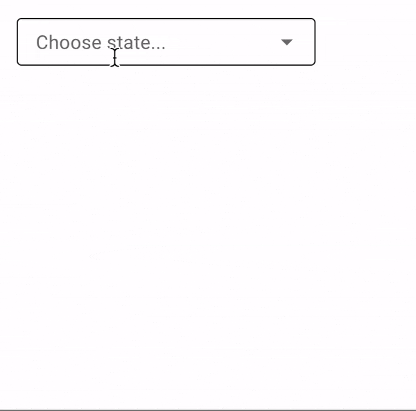
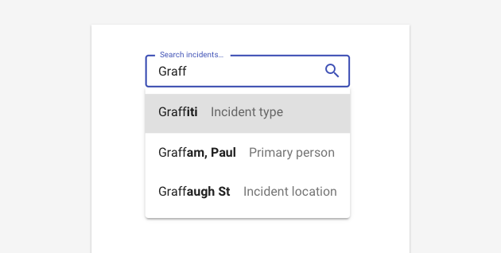
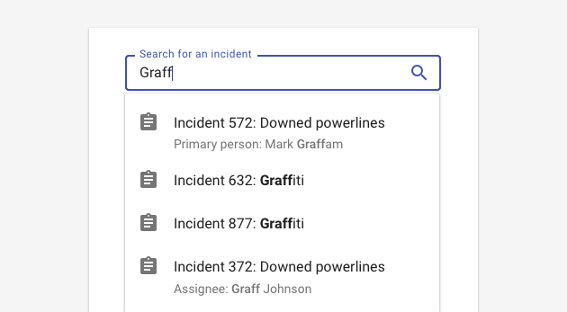
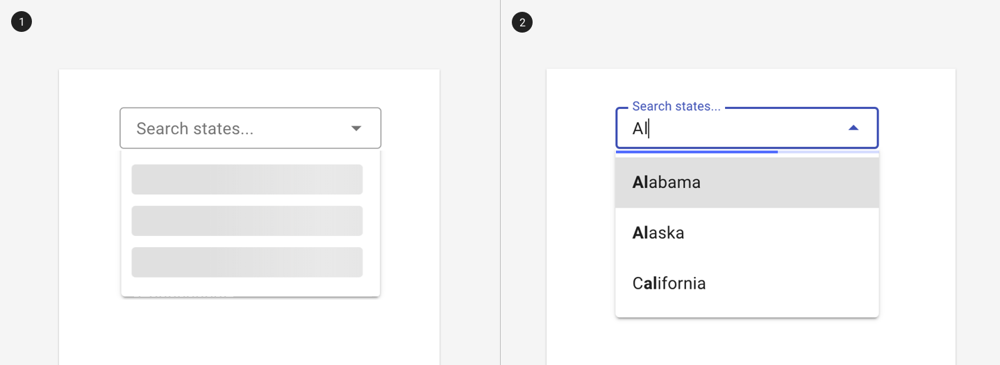
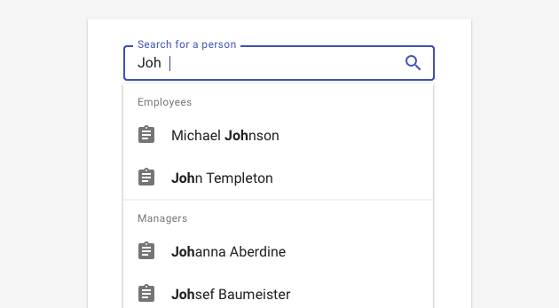
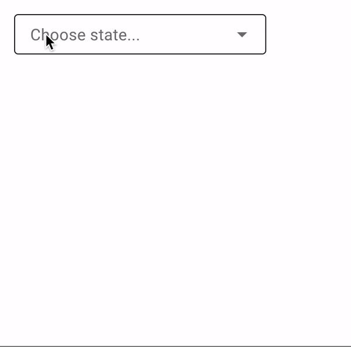
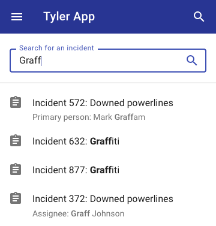

---
sidebar_custom_props:
  shortDescription: Autocomplete is an add-on component that binds to inputs and shows suggestions as the user types.
  thumbnail: ./img/all-components/autocomplete-mini.png
  
---

# Autocomplete

<ComponentVisual storybookUrl="https://forge.tylerdev.io/main/?path=/docs/components-autocomplete--docs">

</ComponentVisual>

## Overview

The autocomplete can be used within a multi-select component to select from a large collection of data or it can be used with a search pattern to provide suggestions and help users articulate better search queries.

### Use when

- There are a large number of options in a dropdown. 

### Don't use when

- There are fewer than three options in a dropdown.

---

## Types

Autocomplete suggestions can take three forms: auto-complete, auto-suggest, and instant results. 

### 1. Auto-complete

Auto-complete resolves a partial query, i.e., to search **within a finite list of records.** With a limited set of data, a basic autocomplete can help users avoid typos, save time, and make it easier to select the record they want. 

<ImageBlock maxWidth="300px">

</ImageBlock>

### 2. Auto-suggest

Auto-suggest allows users to search a **virtually unbounded list** for related keywords and phrases. This pattern actually introduces new ideas to the mix and encourages exploratory search. This pattern is better for a true [search and filter](#) pattern. 

<ImageBlock padded={false}>

</ImageBlock>

### 3. Instant results 
Instead of providing shortcuts to suggested searches, this pattern offers a shortcut directly to the known item. Because it facilitates matching a specific record instead of a search query, it it better for cases when the user knows exactly the record they’re looking to find. (Check out the Forge search to see this in action!)

<ImageBlock padded={false} >

</ImageBlock>

---

## States

The autocomplete has four states: the zero input state, loading, matching, and selected.

### 1. Zero input state

In the zero input state, data has not yet been entered. User placeholder text to describe the scope in which people are searching. “Search files”, “Search people.”  For auto-suggest, provide a hint search. “Try “Portland.’”

<ImageBlock maxWidth="300px">

 
</ImageBlock>

### 2. Change / loading

Once input has been entered into the field, the component displays skeleton loading to initially load results. Once results have been initially loaded, use a linear progress indicator to indicate additional changes. 

<ImageBlock padded={false} caption="1. Initial results are loaded with skeleton components. 2. Additional components are displayed with a linear progress indicator.">

</ImageBlock>

### 3. Matching

After a query has been entered, the autocomplete displays matching data. Bold or highlight unmatched letters to provide visual weighting on the part of the result that doesn’t match what the user entered. In general, use prefix matching (matching the leading text in each word) to aid in scannability and readability. 

Keep the list manageable ([Baymard](https://baymard.com/blog/autocomplete-design) recommends fewer than 10 options) to improve scannability and reduce cognitive load. 

Distinguish different categories with subsections or using alternate text styles. 

Use sorting strategically. Results may be sorted alphabetically, bt relevance rank, by region, or by other criteria. In general, sort results alphabetically unless there is a better sort criteria for the particular business case. 

<ImageBlock caption="An autocomplete may use sections to group logical sets of results." padded={false} >

</ImageBlock>

### 4. Selection 

Once an option has been selected, the suggestion list is closed. In a select, the selected option is displayed within the field. In a search setting, the user is brough to a search results or to a specific record, depending on the model used. 

If an autocomplete is cleared (either by an X or by manually deleting data), close the suggestion list.

<ImageBlock padded={false} maxWidth="300px">

</ImageBlock>

---

## Responsive 

- Consider using full screen for results on mobile or native mobile.
- Consider keyboard: ensure that any relevant info is in the top half of the screen where it won't be obscured by the keyboard.
- Ensure font size and hit area are large enough.
- Use text wrapping instead of ellipses to ensure that users can read all data.
- If using scroll in mobile, provide an affordance that the list is scrollable (ie, obscure last result). 

<ImageBlock maxWidth="300px" padded={false}>

</ImageBlock>

---

## Best practices 

<DoDontGrid>
  <DoDontTextSection>
    <DoDontText type="do">Show unmatched text with bolded text.</DoDontText>
    <DoDontText type="do">Generally, match leading text for words. </DoDontText>
    <DoDontText type="do">Support keyboard interactions (already included in the component).</DoDontText>
  </DoDontTextSection>
  <DoDontTextSection>
    <DoDontText type="dont">Don't leave an autocomplete blank, because it's too ambiguous. Use hint text instead.</DoDontText>
    <DoDontText type="dont">Don't use lengthy and unclear hint text. It should be used to clarify and set expectations.</DoDontText>
    <DoDontText type="dont">Don't provide too much information in the suggestions list; it's intended to be lightweight.</DoDontText>
  </DoDontTextSection>
</DoDontGrid>

---

## Resources

- [Designing Search as You Type Suggestions](https://uxmag.com/articles/designing-search-as-you-type-suggestions) (UXMag.com)
- [Autocomplete: Benefits and UX Best Practices](https://www.freshconsulting.com/autocomplete-benefits-ux-best-practices/) (Fresh Consulting)
- [Site Search Suggestions](https://www.nngroup.com/articles/site-search-suggestions/) (NN Group)
- [Autocomplete Design](https://baymard.com/blog/autocomplete-design) (Baymard Institute)

---

## Related

### Components

- For an input field without suggested options, use  [text fields](/components/fields/text-field).
- For a short list of selectable options, use the [select](/components/fields/select).
- For a short list of selectable options that optimize discoverability, use [checkboxes](/components/controls/checkbox) or [radio buttons](/components/controls/radio-button).

### Patterns

- Search (coming soon!)
- Forms (coming soon!)
- Use inline [Progress & loading](/patterns/progress-and-loading/) with the autocomplete
