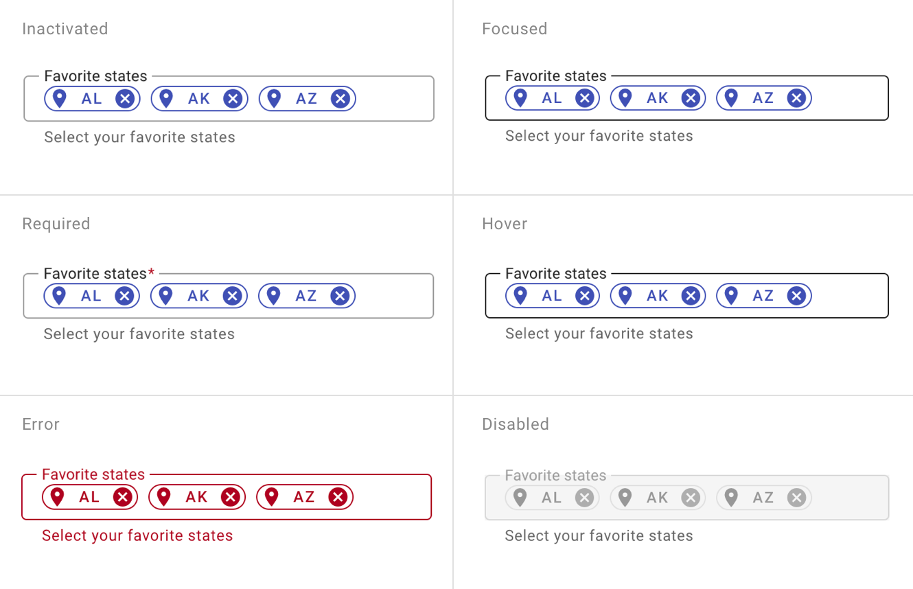
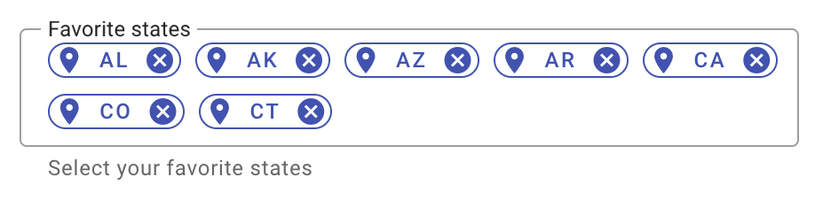
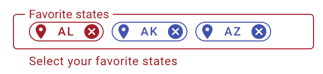

---
sidebar_custom_props:
  shortDescription: The chip field enables user input, and verifies that input, by converting text into chips.
  thumbnail: ./img/all-components/chip-field-mini.png
---

# Chip field

<ComponentVisual storybookUrl="https://forge.tylerdev.io/main/?path=/docs/components-chip-field--docs">

</ComponentVisual>

## Overview

Input chips represent a complex piece of information in compact form, such as an entity (person, place, or thing) or text. They enable user input and verify that input by converting text into chips.

### Use when

- Users are selecting from a collection of options. 
- Inputs need to be validated individually. 
- Inputs are removable and should be removed individually. 
- Entering freeform or new categories. 

### Don't use when

- Displaying static attributes. Use [badges](/components/badge) instead.
- Entering data that's more than a phrase or two. Use a  it requires more than one field to provide the context to the user, consider managing your collection through the [list](/components/lists/list) instead.

---

## States 

<ImageBlock>

</ImageBlock>

---

## Best practices 

<DoDontGrid>
  <DoDontRow>
  <DoDontImage>

  </DoDontImage>
  <DoDontImage>

  </DoDontImage>
  </DoDontRow>
  <DoDontRow>
    <DoDont type="do">Input field grows as chips are added to it.</DoDont>
    <DoDont type="caution">Some or all chips may be considered invalid.</DoDont>
  </DoDontRow>
</DoDontGrid>

---

## Related 

### Components

- Use a [badge](/components/badge) for non-interactive data.
- Use [chips](/components/utilities/chips) to displays filters and choices. 
- The chip field can be use used with an [autocomplete](/components/autocomplete) to facilitate searching.
- For an input field without suggested options, use  [text fields](/components/fields/text-field).
- For a short list of selectable options, use the [select](/components/fields/select).
- For a short list of selectable options that optimize discoverability, use [checkboxes](/components/controls/checkbox) or [radio buttons](/components/controls/radio-button).

### Patterns

- Chip fields may be used in [forms](/patterns/forms).
