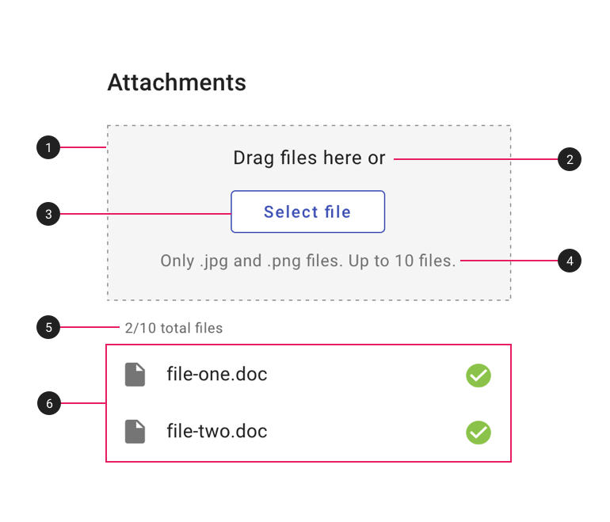
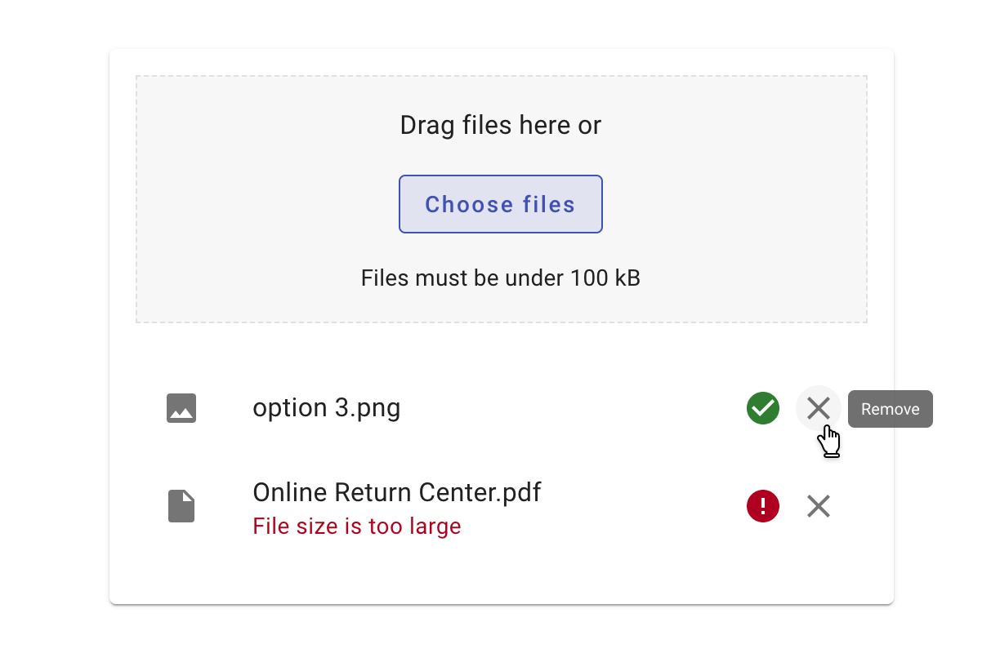
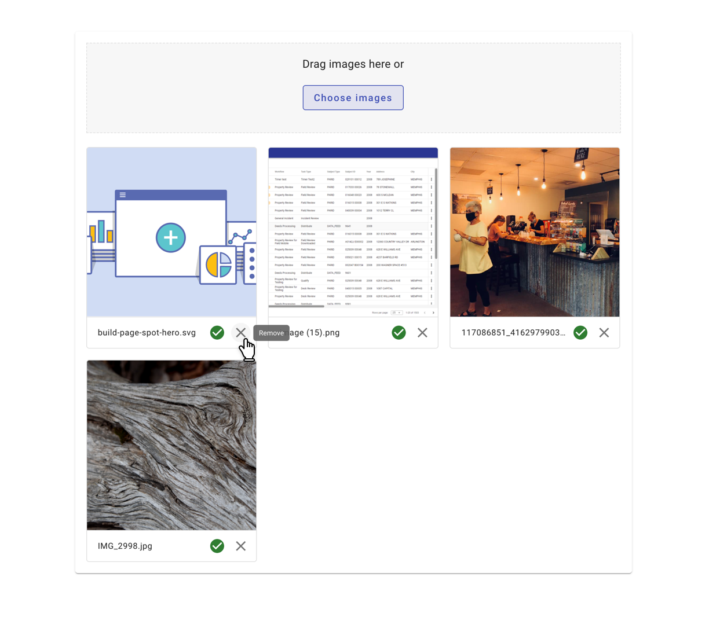

---
sidebar_custom_props:
  shortDescription: The file picker is used to upload one or more files to an application.
  thumbnail: ./img/all-components/file-picker-mini.png
---

# File picker

<ComponentVisual storybookUrl="https://forge.tylerdev.io/main/?path=/story/components-file-picker--default">

</ComponentVisual>

## Overview

File pickers are commonly founds in forms, but they can also live as stand alone elements. Users can drag files to a target area or hit a button to add from their local folder system. Default text for then button is "Select a file" (for a single file upload) or "Select files" (for multi file upload.)

The file picker supports uploading single or multiple files. Uploaded files display in a list or grid of thumbnails.

---

## Parts

The default file picker is comprised of six sections. 

<ImageBlock maxWidth="400px">

</ImageBlock>

1. **Drag & drop target area.** The target into which users can drag files. 
2. **Primary text.** "Drag files here or" by default. 
3. **Button.** "Select file" or "Select files" by default. Text and button may be customized as needed. 
4. **Secondary text.** (Optional) If needed, use this text for any constraints or parameters, such as file type or size. 
5. **File count.** (Optional) If there is a maximum number of files, use this text to display how many files have been uploaded so far. 
6. **File list.** May be displayed as a list (recommended for text or data files) or a thumbnail grid (recommended for image files).

The dense version displays only the "Select" file button and is best used when space is limited and drag & drop is not needed.  

---

## Types 

### 1. Default - list 

<ImageBlock maxWidth="600px" caption="Display text or data files in a list.">

</ImageBlock>

### 2. Thumbnail grid (images)

<ImageBlock maxWidth="600px" caption="Display images files in a grid.">

</ImageBlock>

### 3. Dense (limited space)

<ImageBlock maxWidth="550px">

  

</ImageBlock>

---

## Behavior

Uploaded files should:

- Indicate loading progress and completion.
- Display any errors, their cause, and the ability to remove the file.
- Allow users to edit filenames on double-click (if applicable)
- Allow files to be deleted.
- Truncate long file names with an ellipsis.

View recipes for the file-picker component [here](/recipes/file-picker/with-list).

---

## Related

### Components

- Uploaded files display as a [list](/components/lists/list).
- Uploaded files should use [progress spinners](/components/progress-and-loading/circular-progress) to indicate progress as files upload. 
- The [button](/components/buttons/button) in the file picker may be customized. 

### Patterns

- [Progress and loading](/patterns/progress-and-loading)
