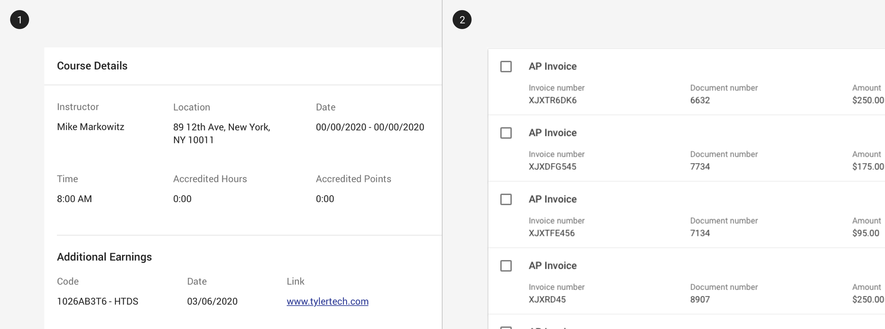
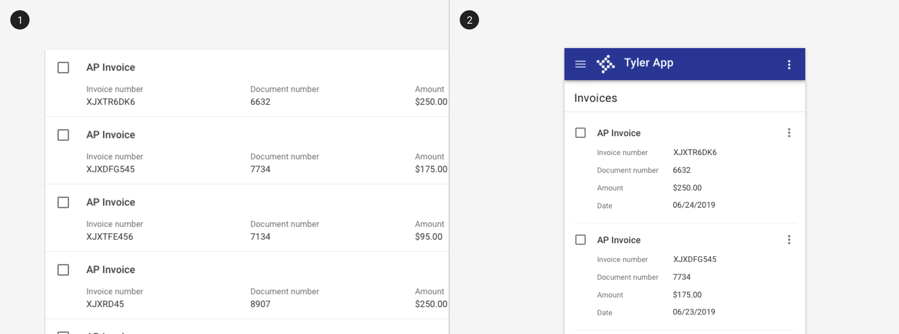

---
sidebar_custom_props:
  shortDescription: The label value component displays read only label-value pairs.
---

# Label value

<ComponentVisual
  figmaUrl=""
  storybookUrl="https://forge.tylerdev.io/main/?path=/story/components-label-value--default" />

## Overview

The label value component is used to display readonly data that has a label and data element. They may be used with a task card or within a form that has already been submitted. 

The label value component does not contain any interactive indicators such as hover states, but it is read by a screen reader. 

<ImageBlock padded={false} caption="1. Label value components may used in a card.  2. Label values used in task card search results.">

</ImageBlock>

<ImageBlock padded={false} caption="Vertical label value pairs may be translated to horizontal pairs on mobile to improve scannability.">

</ImageBlock>

### Use when

- Displaying form fields in readonly mode. 
- Displaying succinct data with labels. 

### Don't use when

- Displaying data with long titles. Use a [list](/components/lists/list) instead.
- Displaying paragraphs or text-heavy data. Use a [list](/components/lists/list) instead.

---

## Readonly states 

A readonly state may be used when: 

- A component is active, but not editable; generally relates to a text field
- The content is still relevant or important for task completion but cannot be changed

:::info
Be sure to communicate if editing is available, and how to enable it.
:::

---

<DoDontGrid>
  <DoDontTextSection>
    <DoDontText type="do">Use the label value component for values that are displayed but non interactive.</DoDontText>
  </DoDontTextSection>
  <DoDontTextSection>
    <DoDontText type="dont">Avoid large numbers of disabled text fields on a screen - consider using the label value instead to improve readability.</DoDontText>
  </DoDontTextSection>
</DoDontGrid>

---

## Related 

### Components

- Label value pairs are used most frequently with [cards](/components/cards/card).

### Patterns

- Label value pairs frequently display data from forms. (Coming soon!)
