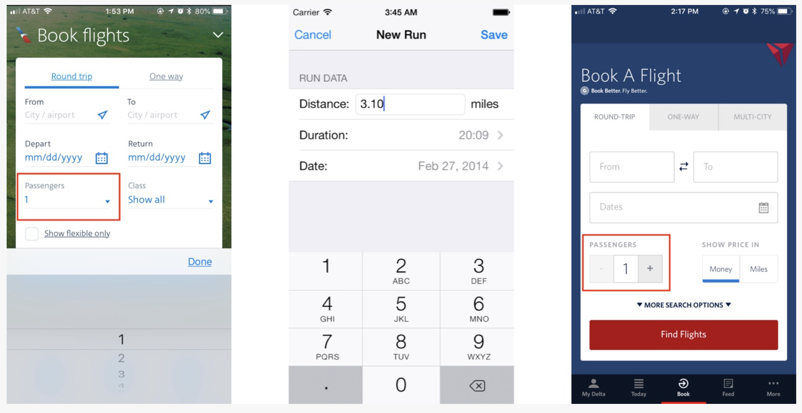

---
sidebar_custom_props:
  badge: deprecated
  shortDescription: Quantity fields allow for incremental adjustments to a default numeric value.
---

# Quantity field

<ComponentVisual
  figmaUrl=""
  storybookUrl="https://forge.tylerdev.io/main/?path=/story/components-quantity-field--default" />

:::caution
This component is **deprecated** and will be removed in a future version.
:::

## Overview

Quantity controls allow a user to adjust numeric data from a logical default. They can be suited for mobile or desktop layouts.

### Use when

- Designing for small adjustments for default values. 
- Designing for mobile experiences with a logical numeric default. 
- Designing for contexts with no keyboard (ie, kiosk apps).
- Designing for relative controls when users don't know exact values (ie, allowing users to adjust volume or font sizing on the fly, experimenting until they achieve their desired value.)

### Don't use when

- Numeric input fields don't have a logical default.
- Numeric values can vary widely or require large adjustments to a default value.

<ImageBlock caption="These 3 mobile screenshots show 3 different approaches to numerical input. American Airlines (left) used a dropdown for selecting the number of passengers. This control required several gestures (select the field, scroll and select the number, then hit Done). Treadmill Run Tracker (center) used a text field for inputting distance; the user had to select the field, type the desired number, then hit the Save button or tap a different field. In contrast, the interaction cost for changing the number of passengers from 1 to 2 in Delta Airlines’ mobile app (right) consisted of a single tap. (However, the interaction cost of the stepper would be much higher if the user wanted to increase the number from 1 to 10; this increased cost for large deviations from default is a major disadvantage of using steppers.)" padded={false}>

</ImageBlock>

Source: [(NN Group)](https://www.nngroup.com/articles/input-steppers/)

---

<DoDontGrid>
  <DoDontTextSection>
    <DoDontText type="do">Alow users to type in input as well as use the incrementer buttons.</DoDontText>
    <DoDontText type="do">Ensure incrementer buttons can be accessed by keyboard only.</DoDontText>
  </DoDontTextSection>
</DoDontGrid>
