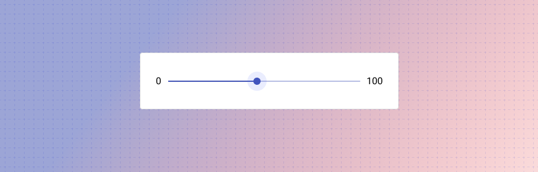

---
sidebar_custom_props:
  shortDescription: Sliders allow users to make selections from a range of values.
  thumbnail: ./img/all-components/slider-mini.png
---

# Slider

<ComponentVisual storybookUrl="https://forge.tylerdev.io/main/?path=/story/components-slider--default">

</ComponentVisual>

## Overview

Sliders reflect a range of values along a bar, from which users may select a single value. They are ideal for adjusting settings such as volume, brightness, or applying image filters.

Sliders can have icons on both ends of the bar that reflect a range of values.

Sliders allow users to select from discrete value ranges. Sliders can be somewhat difficult to manipulate, so they should be used when an approximate value is good enough. For known, specific value ranges, consider text inputs instead. When using sliders, consider the unit. If only whole numbers can be chosen, for example, default the slider to use whole values only.

### Use when

- An approximate value is good enough. Sliders can be somewhat difficult to manipulate making it somewhat cumbersome to get an exact value. 
- Changes will have an immediate impact (such as in filters or volume settings).

### Don't use when

- A user is selecting known, specific value ranges. Use [text fields](/components/fields/text-field) instead. 

---

## Types 

### Continuous sliders 

Continuous sliders allow users to select a value along a subjective range.

### Discrete sliders

Discrete sliders can be adjusted to a specific value by referencing its value indicator.

Possible selections may be organized through the use of tick marks, which a slider thumb will snap to (or to which an input will round up or down).

---

## Best practices 

<DoDontGrid>
  <DoDontTextSection>
    <DoDontText type="do">Ensure that sliders have a large enough touch target for mobile contexts.</DoDontText>
    <DoDontText type="do">Ensure that labels will stay visible on mobile; place them above or beside where a thumb interacts with the slider. </DoDontText>
    <DoDontText type="do">For single-point sliders, if the user clicks at an point along the slider, the handle should jump to the appropriate value.</DoDontText>
    <DoDontText type="do">Providing a text input option in addition to a slider provides a helpful alternative if users have a specific value in mind.</DoDontText>
    <DoDontText type="do">If using sliders with filters, live update results as the slider is dragged (ie, the result list updates while the user drags the handle).</DoDontText>
  </DoDontTextSection>
  <DoDontTextSection>
    <DoDontText type="dont">Don't use a slider for binary settings; use radio buttons instead.</DoDontText>
  </DoDontTextSection>
</DoDontGrid>

---

## Related

### Components

- Use [text fields](/components/fields/text-field) for known, specific values. 
- Use [radio buttons](/components/controls/radio-button) for binary options.

### Pattern

Sliders may be used with:

- Forms (coming soon!)
- Faceted search (coming soon!)

---

## Resources

- [Slider Controls](https://www.nngroup.com/articles/gui-slider-controls/) (NN Group)
- [Mobile UX Design: Sliders](http://babich.biz/mobile-ux-design-sliders/) (Babich.biz)
- [Form Usability: 5 Requirements for Slider Interfaces](https://baymard.com/blog/slider-interfaces) (Baymard Institute)
- [Designing The Perfect Slider](https://www.smashingmagazine.com/2017/07/designing-perfect-slider/) (Smashing Magazine)
