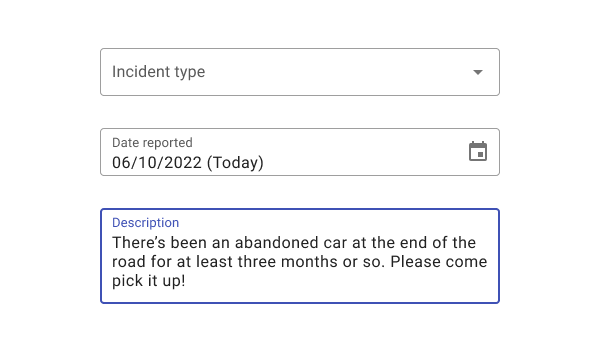
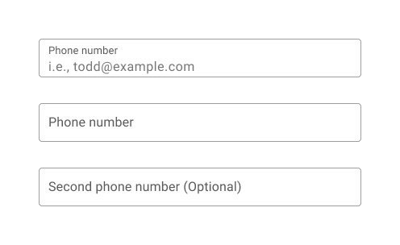
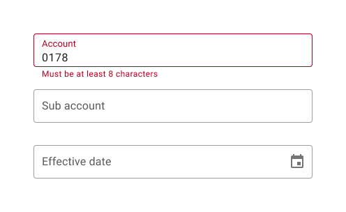
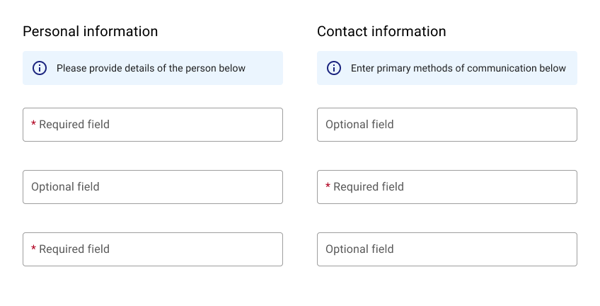

---
sidebar_custom_props:
  shortDescription: Text fields let users enter and edit text.
---

# Text field

<ComponentVisual storybookUrl="https://forge.tylerdev.io/main/?path=/story/components-text-field--default">

</ComponentVisual>

## Overview 

Text fields allow users to enter text into a UI. They typically appear in [forms](/patterns/forms)  and [dialogs](/components/notifications-and-messages/dialog).

---

## Parts 

Text fields are comprised of three parts: 1. Label (required) 2. Input (required) 3. Helper text (optional) 4. Character counter (optional).

<ImageBlock maxWidth="650px">

</ImageBlock>

### 1. Label

Label text is used to inform users as to what information is requested for a text field. Every text field should have a label.

Label text should be aligned with the input line, and always visible. Text fields may use a fixed label or a floating label. 

<DoDontGrid titleText=" ">
  <DoDontRow>
  <DoDontImage>

  </DoDontImage>
  <DoDontImage>

  </DoDontImage>

<DoDontImage>

</DoDontImage>

  </DoDontRow>
  <DoDontRow>
    <DoDont type="do">Use succinct, natural language and consistent capitalization.</DoDont>
    <DoDont type="do">If most fields are optional, indicate which are required using an asterisk.</DoDont>
    <DoDont type="do">If most fields are required, indicate which are optional with “(Optional).”</DoDont>
  </DoDontRow>
</DoDontGrid>

---

### 2. Input 

The input allows a user to enter text or data. Use format masking for date, email, and currency fields. 

<DoDontGrid titleText=" ">
  <DoDontRow>
  <DoDontImage>

  </DoDontImage>
  <DoDontImage>

  </DoDontImage>
  <DoDontImage>

  </DoDontImage>
  </DoDontRow>
  <DoDontRow>
    <DoDont type="do">The length of input fields should reflect their expected content.</DoDont>
    <DoDont type="do">Use auto-formatting for fields such as phone number and credit card number to reduce validation errors and format uncertainty. Constrain data inputs such as phone numbers and credit card numbers to numbers only.</DoDont>
    <DoDont type="do">Ensure that inputs grow with text as appropriate. Use a `textarea`  control to accommodate longer text entry.</DoDont>
  </DoDontRow>
  </DoDontGrid>

<DoDontGrid titleText=" ">
  <DoDontRow>

  <DoDontImage>

  </DoDontImage>
  <DoDontImage>

</DoDontImage>

</DoDontRow>
<DoDontRow>
  <DoDont type="do">Use caption text above a text input to display longer labels, such as survey questions or application prompts.</DoDont>
  <DoDont type="dont">Don’t cut off text by using a field that’s too small for the intended input.</DoDont>
 

</DoDontRow>
</DoDontGrid>

**Defaults**

Defaults can save users time and effort. Use defaults whenever reasonable predictions about users’ goals can be made.  When using radio buttons, provide a default selected option if possible.

<DoDontGrid titleText=" ">
  <DoDontRow>
  <DoDontImage>

  </DoDontImage>
  

  

  </DoDontRow>
  <DoDontRow>
    <DoDont type="do">Default in today’s date when applicable.</DoDont>
    

    

  </DoDontRow>
</DoDontGrid>

**Placeholder text**

Where possible, use helper text below a field instead of placeholder text. According to Norman Nielsen, placeholder text can pose issues because of its transitory nature and can make it difficult for users to remember what information belongs in a field. 

<DoDontGrid titleText=" ">
  <DoDontRow>
  <DoDontImage>

  </DoDontImage>
  <DoDontImage>

  </DoDontImage>
  <DoDontImage>

  </DoDontImage>

  </DoDontRow>
  <DoDontRow>
    <DoDont type="do">When using placeholder text, ensure that the label floats persistently.</DoDont>
    <DoDont type="caution">If you need to provide additional information to users, consider using helper text instead of placeholder text where possible. In the above example, “ie, todd@example.com” could displayed as helper text instead. When using placeholder text, ensure that the label floats persistently. </DoDont>
    <DoDont type="dont">Don’t use placeholder text as a label. Since placeholder text disappears on user input, use a label element to ensure that the field label persists.</DoDont>
  </DoDontRow>
</DoDontGrid>

---

### 3. Helper text (optional)

Helper text conveys additional guidance about the input field, such as how it will be used. It should only take up a single line, being persistently visible or visible only on focus.

**Validation**

 Error text ensures the data submitted by the user conforms to acceptable parameters.

<DoDontGrid titleText=" ">
  <DoDontRow>
  <DoDontImage>

  </DoDontImage>
  <DoDontImage>

  </DoDontImage>
  

  </DoDontRow>
  <DoDontRow>
    <DoDont type="do">Provide actionable remedies that will help users enter correct information ("Enter a valid email, using the format: address@domain.com.") If only one error is possible, error text describes how to avoid the error. If multiple errors are possible, error text describes how to avoid the most likely error.</DoDont>
    <DoDont type="dont">Validate information before a user has entered information. Validate when a user leaves a field.</DoDont>
      

  </DoDontRow>
</DoDontGrid>

---

### 4. Character counter (optional)

Character or word counters should be used if there is a character or word limit. They display the ratio of characters used and the total character limit. They should only be used when a strict character count is enforced.

### 5. Required fields 

To indicate that a field is required, display an asterisk (*) next to the label text and mention near the form that asterisks indicate required fields.

- If some fields are required, indicate all required ones
- If most fields are required, indicate optional fields by displaying the word “optional” in parentheses next to the label text
- If required text is colored, that color should also be used for the asterisk

<ImageBlock padded={false} maxWidth="600px">

</ImageBlock>

---

## Types 

Text fields can display user input in the following ways: 1. Single line text fields 2.Multi-line text 3. Text-areas 4. Read only fields.

### 1. Single-line text fields

Singe-line fields display one line of text.

As the cursor reaches the right field edge, text longer than the input line automatically scrolls left.
Single-line fields are not suitable for collecting long responses. For those, use a multi-line text field or text area instead.

### 2. Multi-line text fields

Multi-line text fields show all user input at once. Overflow text causes the text field to expand (shifting screen elements downward), and text wraps onto a new line
These fields initially appear as single-line fields, which is useful for compact layouts that need to be able to accomodate large amounts of text.

### 3. Textareas

Text areas are taller than text fields and wrap overflow text onto a new line. They are a fixed height and scroll vertically when the cursor reaches the bottom of the field.
The large initial size indicates that longer responses are possible and encouraged.
These should be used instead of multi-line fields on the web. Ensure the height of a text area fits within mobile screen sizes.

### 4. Readonly data

Use a label-value pairs to show text fields that currently aren't editable. 
Avoid using disabled fields when possible, as their light color can cause legibility issues.

### 5. Questionnaire text

For text fields with a question-like label, display text above the input and use the `body2` class to improve legibility. 

<ImageBlock padded={false} max-width="600px">

</ImageBlock>

---

## States 

Text fields may have the following states: 1. Inactive 2. Focused 3. Activated 4. Hover 5. Error 6. Disabled.

<ImageBlock padded={false} max-width="600px">

</ImageBlock>

---

<DoDontGrid>
  <DoDontTextSection>
    <DoDontText type="do">Swap helper text with error text.</DoDontText>
    <DoDontText type="do">Group required fields together. </DoDontText>
    <DoDontText type="do">Limit the number of tabs on mobile. </DoDontText>
    <DoDontText type="do">Text field length should match the expected input length. Otherwise, use a consistent length that provides enough room for appropriate inputs.</DoDontText>
  </DoDontTextSection>
  <DoDontTextSection>
    <DoDontText type="dont">Don’t truncate long label text.</DoDontText>
    <DoDontText type="dont">Label text shouldn’t wrap to two lines.</DoDontText>
    <DoDontText type="dont">Don’t place error text under helper text, as their appearance will shift content.</DoDontText>
  </DoDontTextSection>
</DoDontGrid>

---

## Related

### Components

Text fields can be used in:

- [Dialogs](/components/notifications-and-messages/dialog)
- [Cards](/components/cards/card)

Instead of disabled text fields, consider 

- [Label value](/components/fields/label-value)

### Patterns

Coming soon!
