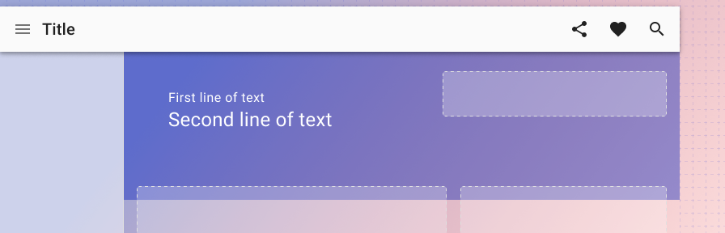
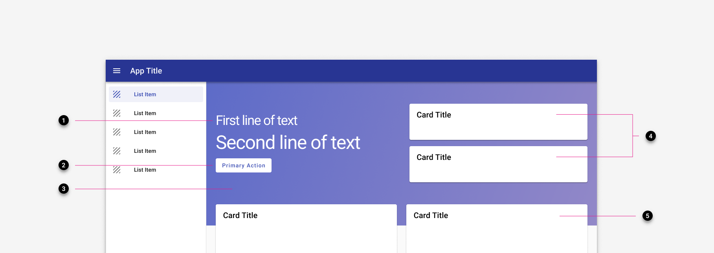
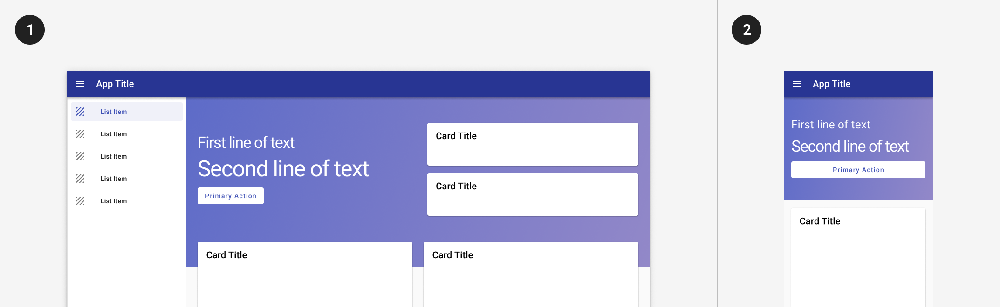

---
sidebar_custom_props:
  shortDescription: Used to create consistent landing pages in community apps.
  thumbnail: ./img/all-components/landing-page-layout-mini.png
---

# Landing page layout

<ComponentVisual storybookUrl="https://forge.tylerdev.io/main/?path=/story/components-badge--default">

</ComponentVisual>

## Overview 

The landing page component is a layout component with slots for header and body content to create consistent landing pages across community apps. It takes care of positioning and spacing and facilitates responsive design. 

### Use when

- Building community apps. 
- Designing a starting point for unauthenticated (not logged in) users.
- Designing a a starting point for authenticated (logged in) users. 

### Don't use when

- Designing workforce apps. 

### Examples

- See it in use in the [Resident Access case study](/case-studies/resident-access)!

---

## Parts 

<ImageBlock padded={false}>

</ImageBlock>

1. **Primary text. (Required)** Up to two lines of primary text, such as a welcome message or a call to action. ("Welcome back, Dylan!" "Hey there Dylan, your current balance is $120.00").
2. **Actions. (Optional)** Up to two actions, such as "Pay balance," "Start a bid," etc. The first action uses a raised button, the second uses an outlined button. 
3. **Banner image. (Required)** A default image is provided, but can be customized by the client. The template provides an overlay by default. Clients should provide a desktop and mobile image. 
4. **Announcements. (Optional)** Up to two announcements may be displayed, configured by the app team. 
5. **Primary content. (Required)** Primary content may be displayed in a single, double, or triple column. The template takes care of the column spacing. 

---

## Variants 

<ImageBlock padded={false}>

</ImageBlock>

1. **With navigation drawer** Content is left aligned on desktop, centered on mobile. 
2. **Without navigation drawer** Content is centered, on both desktop and mobile.

---

## Responsive 

<ImageBlock padded={false}>

</ImageBlock>

<ImageBlock padded={false}>

</ImageBlock>

:::info
Layout collapses to a single column layout on mobile.
:::

---

## Related 

### Components

- [Cards](/components/cards/card), [Buttons](/components/buttons/button), and [illustrations](/core-components/illustrations/guidance).

### Patterns

- Landing pages are part of community [branding](/core-patterns/branding/community).
- Understand key principles of [layout](/core-patterns/layout/intro) in order to create a landing page that works.

### Examples

- See it in the [Resident Access case study](/case-studies/resident-access).
