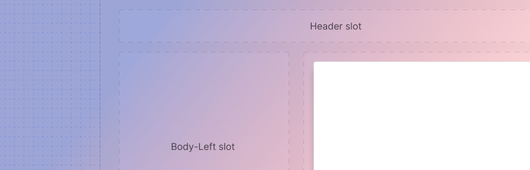

---
sidebar_custom_props:
  shortDescription: The scaffold is used to create common page and component layouts with a header, scrollable body, and footer.
---

# Scaffold

<ComponentVisual storybookUrl="https://forge.tylerdev.io/main/?path=/story/components-scaffold--default">

</ComponentVisual>

## Overview 

The scaffold is a layout component with slots for a header, body, and footer. It takes care of positioning and facilitates responsive design. CSS grid or flexbox can be used within the body of the scaffold to create more complex layouts. 

<ImageBlock padded={false}>

</ImageBlock>

### Examples

- See a scaffold in action in the [Employee Access Calendar case study](/core/other/case-studies/ess-calendar).

### Using the scaffold with other components

Use the scaffold to lay out a full page, with a left hand nav and / or sidesheet, or use it to structure a dialog or card with a header, scrollable body, and footer. 

<ImageBlock padded={false} caption="1. The scaffold may be used to structure a traditional page layout with lefthand nav. 2. The scaffold may be used to structure a page layout with a side sheet.">

</ImageBlock>

<ImageBlock padded={false} caption="1. The scaffold may be used to structure a dialog. 2. The scaffold may be used to structure a card.">

</ImageBlock>

---

## Related 

### Components

The scaffold is the foundation of layout in Forge apps. The scaffold places the main content of the page:

- [Omnibar](/components/omni/omnibar) (required)
- [Lefthand navigation](/components/navigation/navigation-drawer) (optional)
- Page title (required)
- Footer (optional): [workforce apps](/core/branding/workforce#3-footer-optional), [community apps](/core/branding/community#4-footer-optional)

The scaffold may also be used to structure:

- [Cards](/components/cards/card)
- [Dialogs](/components/notifications-and-messages/dialog)
- [Navigation drawer](/components/navigation/navigation-drawer)
- Side sheets (Coming soon!)

### Patterns

- The scaffold facilitates page [layout](/patterns/layout/introduction).

