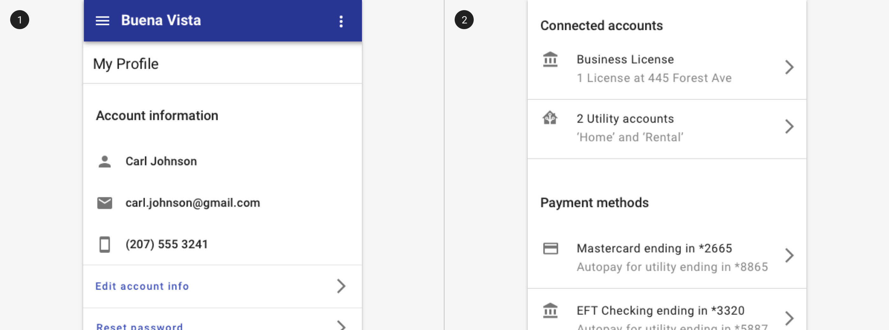

---
sidebar_custom_props:
  shortDescription: Lists are a continuous vertical group of text or images that may contain primary and supplemental actions.
  thumbnail: ./img/all-components/list-mini.png
---

# List

<ComponentVisual storybookUrl="https://forge.tylerdev.io/main/?path=/docs/components-list--docs">

</ComponentVisual>

## Overview

Lists should be sorted in logical ways that make content easy to scan.

They should make content actionable by making specific items easy to identify and act on. 

List items may be spaced using dividers or spacing. 

<ImageBlock padded={false} caption="List items may be separated by white space or dividers.">

</ImageBlock>

<ImageBlock padded={false} caption="1. List items may contain selection controls.  2. List items may contain icons and actions.">

</ImageBlock>

### Use when 

- Displaying groups of related items that are primarily textual.

### Don't use when 

- Displaying content that is not primarily text.
- Displaying content with three or more well-defined dimensions that users might sort on. Instead, use a [table](/components/table/table).

---

## Types 

There are three types of lists: 1. Single-line lists, 2. Two-line lists, 3. Three-line lists. 

### 1. Single-line list

Single-line list items contain a maximum of one line of text.

### 2. Two-line list

Two-line list items contain a maximum of two lines of text.

### 3. Three-line list

Three-line list items contains a maximum of three lines of text.

---

## Related 

### Components

List items may contain

- [Icon buttons](/components/buttons/icon-button)
- [Buttons](/components/buttons/button)
- [Checkboxes](/components/controls/checkbox)
- [Radio buttons](/components/controls/radio-button)
- [Switches](/components/controls/switch)

Use instead of a list

- Use a [table](/components/table/table) when displaying content with three or more well-defined dimensions that users might sort on.
- Use [cards](/components/cards/card) when displaying content that has images or that contains non homogenous data. 

### Patterns

Coming soon!
