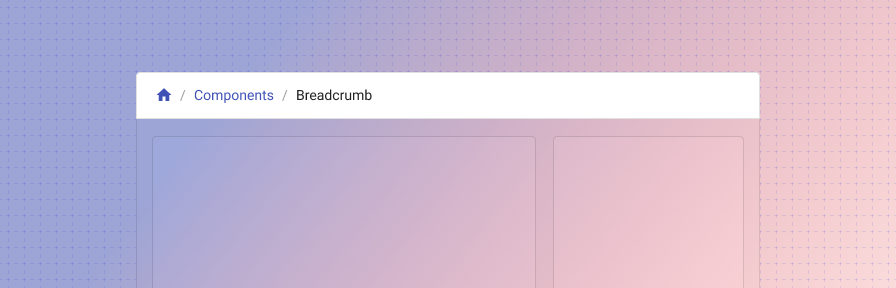
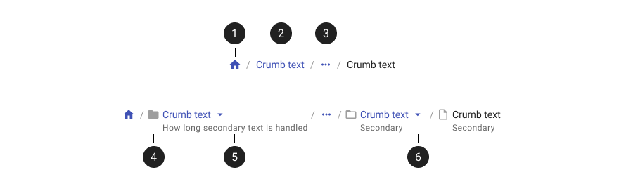
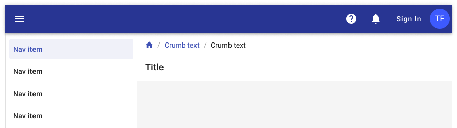
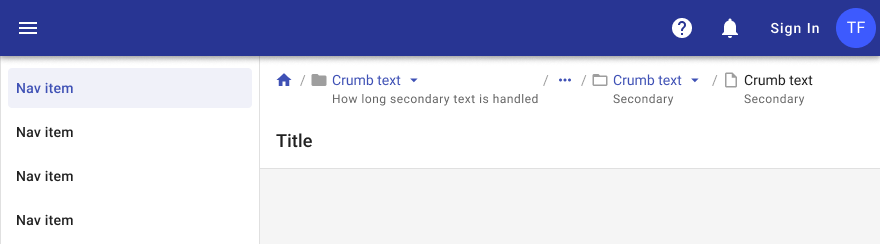

---
sidebar_custom_props:
  badge: new
  shortDescription: Breadcrumbs display the hierarchy of an application and provide secondary navigation.
  thumbnail: ./img/all-components/breadcrumb-mini.png
---

# Breadcrumb

<ComponentVisual storybookUrl="https://forge.tylerdev.io/main/?path=/docs/components-breadcrumb--docs">

</ComponentVisual>

## Overview

Breadcrumbs are a secondary navigation item that show the current location of the user in the information architecture, or site hierarchy, of the application they are in. They quickly allow the user to see where they are in an application, and navigate to a previous page or to a parent level page.

### Use when

- An application has a large amount of content organized in a hierarchy of more than two levels.

### Don’t use when

- An application has only one or two levels of hierarchy.

## Parts

<ImageBlock padded={false}>

</ImageBlock>

1. **Home (Optional):** A home icon can be used as the start of the breadcrumb. This takes the user back to the homepage of an application.
2. **Crumb text:** The crumb text mimics the content the page title it refers to, and will take the user back to that page. The crumbs are based on the hierarchy of the application layout. 
3. **Overflow menu:** When a layout becomes condensed due to screen size or content amount, the crumbs can collapse down into an overflow menu. The user can then click to open the overflow, which will show the hidden crumbs. 
4. **Leading icon (Optional):** Leading icons can be used to help indicate what a crumb level represents, if needed. 
5. **Secondary text (Optional):** Secondary text can be used to help further explain what a crumb represents or what is contained in that area of the application.
6. **Crumb overflow (Optional):** This overflow differs from the default. This menu is tied to a specific crumb, and can be used to navigate to sibling pages at the same hierarchical level. For example, if you're viewing "Products > Laptops," the overflow on "Laptops" would show other product categories like "Desktops," "Tablets," and "Monitors," allowing quick lateral navigation without going back up the hierarchy.

---

## Examples

<ImageBlock padded={false} caption="An example of a simple breadcrumb trail. The breadcrumbs for an application should live in the upper left of the content area."> 

</ImageBlock>

<ImageBlock padded={false} caption="When the content area is too small for the full breadcrumb list, it can collapse into an overflow menu.">

</ImageBlock>

<ImageBlock padded={false} caption="An example of a more complex breadcrumb structure.">

</ImageBlock>

<ImageBlock padded={false} caption="On mobile, the breadcrumbs will collapse down to fit to the screen. For trails that will be too long, horizontal scrolling can be used to view the breadcrumbs.">

</ImageBlock>

---

## Best practices 

<DoDontGrid>
  <DoDontTextSection>
    <DoDontText type="do">The breadcrumb component should sit in the upper left of the content area, below the app bar and above the page title.</DoDontText>
    <DoDontText type="do">The breadcrumbs collapse into an overflow menu when a layout is constrained by size, often seen when a user is deep into an application hierarchy or while viewing on mobile devices.</DoDontText>
  </DoDontTextSection>
  <DoDontTextSection>
    <DoDontText type="dont">Don't use breadcrumbs for your primary navigation between parts of an application.</DoDontText>
    <DoDontText type="dont">Breadcrumbs should never wrap onto a second line.</DoDontText>
    <DoDontText type="dont">Do not use breadcrumbs as a path-based history showing the steps the user took to get to the current page. They are specifically used to illustrate the site's hierarchy.  </DoDontText>
  </DoDontTextSection>
</DoDontGrid>