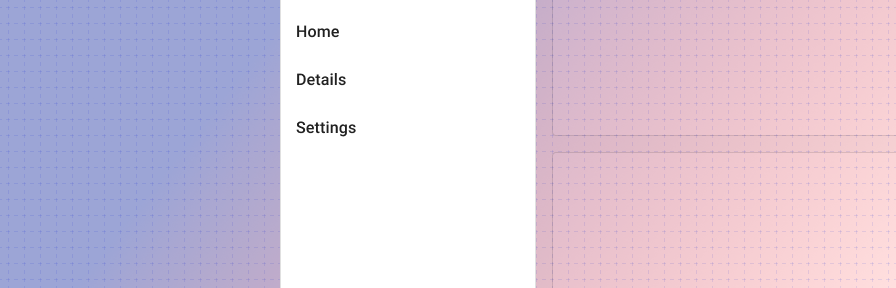
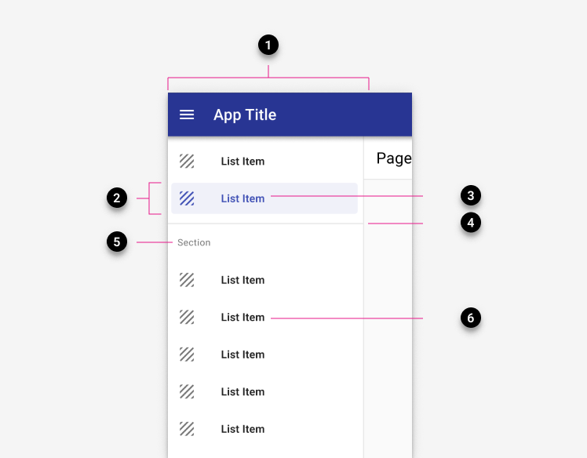
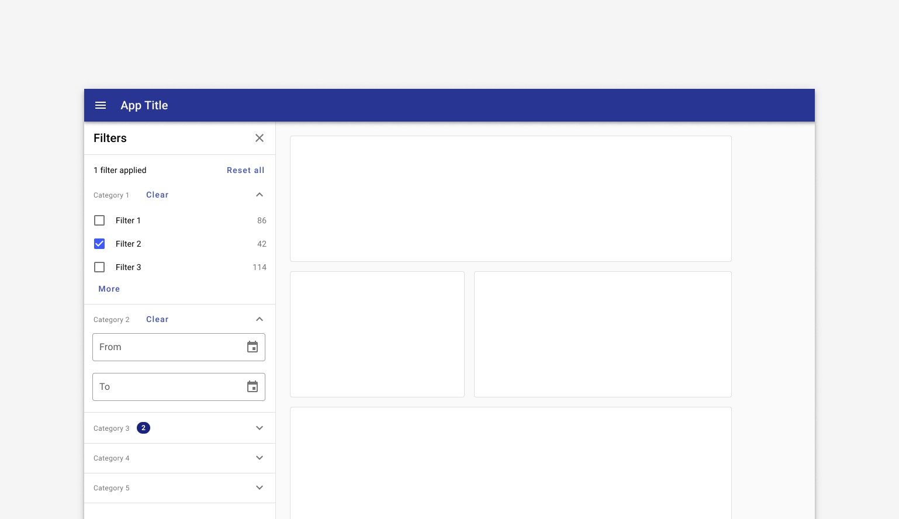
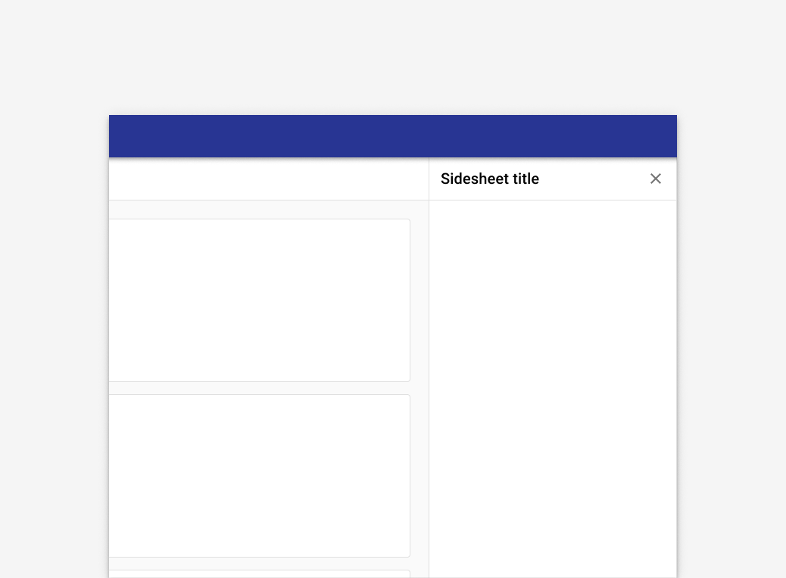

---
sidebar_custom_props:
  shortDescription: Drawers are used to support supplementary information on the left and right side of a screen.
  thumbnail: ./img/all-components/drawer-mini.png
---

# Drawer

<ComponentVisual storybookUrl="https://forge.tylerdev.io/main/?path=/docs/components-drawer--docs">

</ComponentVisual>

## Overview

Drawers are used to support supplementary information on the left and right side of a screen. 

---

## Drawer types 

There are four types of drawers: permanent, dismissible, modal, and mini.

### 1. Permanent

Recommended for desktop. Persistently visible and pinned to the edge, at the same elevation as the content or background.

### 2. Dismissible

Recommended for desktop. Visible by default and pinned to the edge, at the same elevation as the content or background.

### 3. Modal 

Recommended to be used in combination with a dismissible drawer, where the dismissible drawer is used at desktop sizes and the modal drawer is used at tablet and mobile sizes.

### 4. Mini

Recommended for desktop when the main content is extra wide. 

--- 

## Variations

Drawers can be used to support different types of content: 1. Navigation drawers 2. Filter sidesheets 3. Detail panels

### 1. Navigation drawer

Display on the left by default. Learn more about [navigation drawers](/components/navigation/navigation-drawer).

<ImageBlock padded={false}>

</ImageBlock>

### 2. Filter sidesheet

May display on the left or right. Learn more about [filter sidesheets](/components/drawer#2-filter-sidesheet).

<ImageBlock padded={false}>

</ImageBlock>

### 3. Detail panel

A detail panel may show addiitonal information about a record or section. Detail panels generally display to the right on desktop and display as an overlay from the right on mobile devices. 

<ImageBlock padded={false}>

</ImageBlock>

---

## Related

### Components

The navigation drawer is used with:

- [Omnibar](/components/omnibar)
- [Scaffold](/components/layouts/scaffold)

For apps with fewer than five primary destinations, use:
- [Tabs](/components/navigation/tabs) instead.

### Recipes

- [Navigation drawer recipes](/recipes/navigation-drawer/backoffice)
- [Toolbar recipes](/recipes/toolbar/secondary)

### Patterns

- [Navigation](/patterns/navigation/primary)
