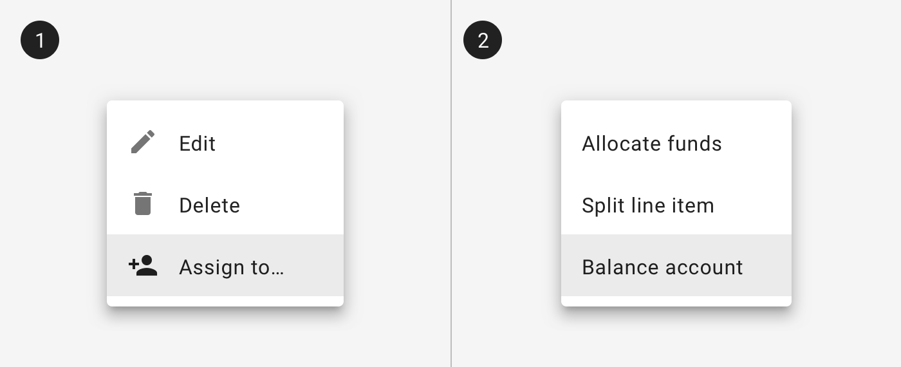
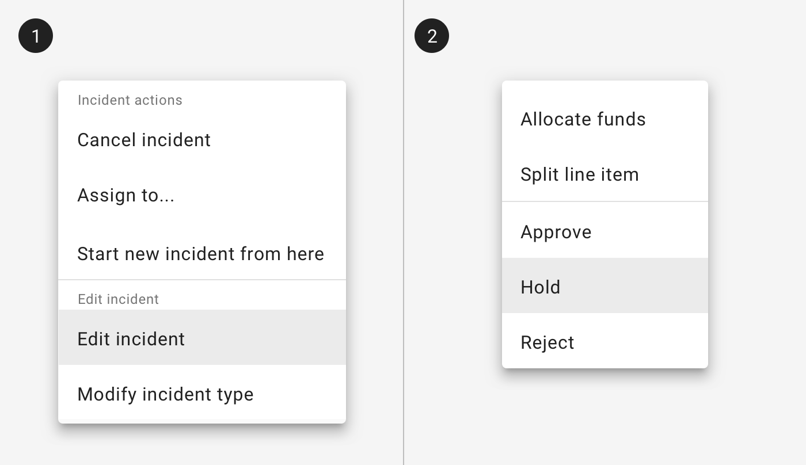

---
sidebar_custom_props:
  shortDescription: Menus display a list of contextual choices in a pop-up. They appear when users interact with a button, action, or other control.
---

# Menu

<ComponentVisual
  figmaUrl=""
  storybookUrl="https://forge.tylerdev.io/main/?path=/story/components-menu--default" />

## Overview 

Menus appear in front of all other permanent UI elements. Menus are triggered by an icon, button, or action. Menus should be positioned relative to the edge of the screen or browser. They typically appear next to (or in front of) the element that generates them. If they are in a position to be cut off by the browser or screen’s edge, the menu can instead appear to the left, right, or above the element that generates it.

---

## Parts 

Menus display lists of related options (which can be grouped together) as well as unrelated options. Menus appear when a user taps an interactive UI element such as an icon, button, action, or content, such as selected items or text.

### 1. Menu 

Menu items may use text only or may include icons. In general, choose consistency - either use icons for all or icons for none.

<ImageBlock padded={false} caption="1. A dropdown may use icons for familiar actions.  2. A dropdown may use text only options for domain specific items.">

</ImageBlock>

## 2. Displaying categories

Menus may include multiple categories of information. Like information should be grouped together and separated by a divider or a section title.

<ImageBlock padded={false} caption="1. A menu may be divided into sections using section titles.  2. A menu may be divided into sections using dividers.">

</ImageBlock>

---

## Related 

### Components 

- For an input with selectable options, use a [select](/components/fields/select).

### Patterns 

Coming soon!
