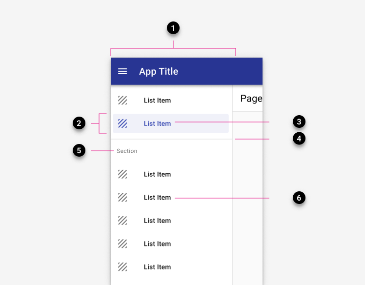
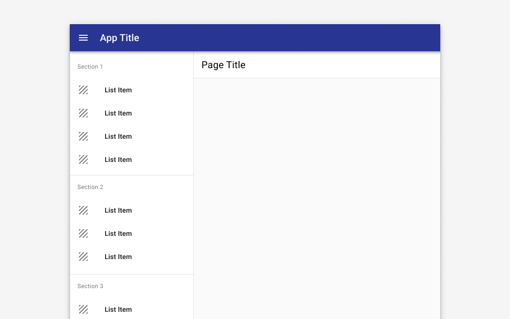
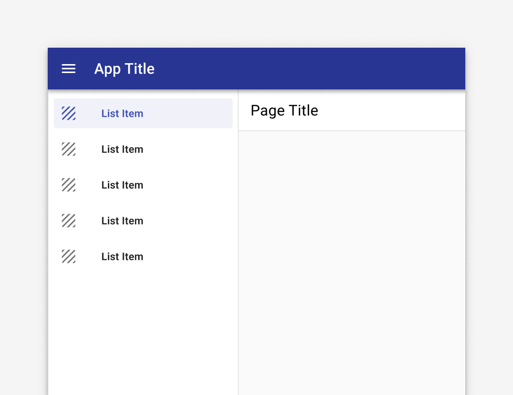
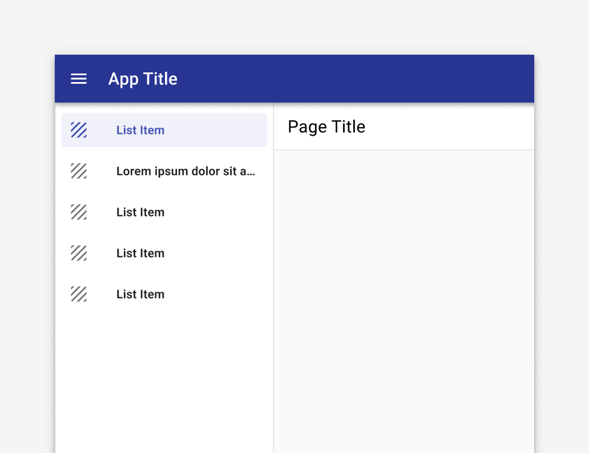
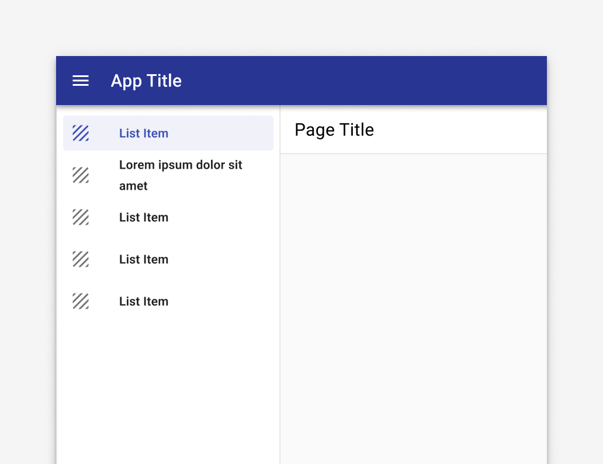
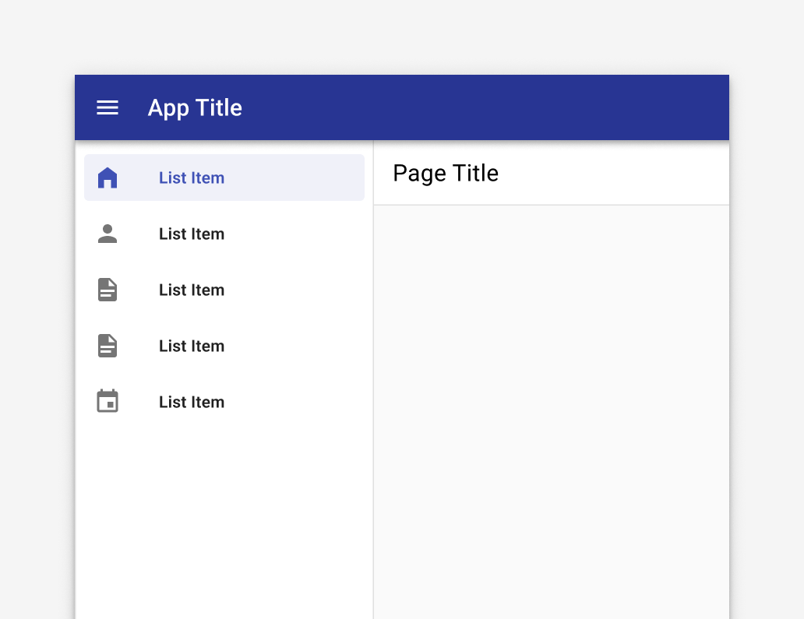

---
sidebar_custom_props:
  badge: recipe
  shortDescription: The drawer component contains supplementary content that are anchored to the left or right edge of the screen.
  thumbnail: ./img/all-components/nav-drawer-mini.png
---

# Navigation drawer

<ComponentVisual storybookUrl="https://forge.tylerdev.io/main/?path=/docs/components-drawer--docs">

</ComponentVisual>

## Overview

Navigation drawers provide access to destinations and app functionality, such as switching accounts. They can either be permanently on-screen or controlled by a navigation menu icon.

Navigation drawers are recommended for:

- Apps with five or more top-level destinations
- Apps with two or more levels of navigation hierarchy
- Quick navigation between unrelated destinations

:::note
Navigation is tightly related to Information Architecture (IA). An intuitive IA is key to the success of any app, but can be difficult to get right.
:::

---

## Parts 

Navigation drawers contain a list embedded within a sheet. They can be enhanced with headers and dividers to organize longer lists.

<ImageBlock padded={false}>

</ImageBlock>

1. **Container** 256 or 320px by default.

2. **Active text overlay**

3. **Active text**

4. **Divider** (optional)

5. **Section label** (optional)
Subtitles use –body2 (text at 13px) and –mdc-theme-text-secondary-on-background (black at 54%).

6. **Inactive text**

7. **Scrim** (modal only)
A scrim should not be used for permanent drawers.

---

## Drawer types 

Tyler uses 3 navigation drawer types: 1. Standard, 2. Modal 3. Mini 

### 1. Standard

A standard navigation drawer is the recommended default for desktop. It isn't suitable for mobile due to limited screen size.

The standard navigation drawer is visible by default and is pinned to the left edge, at the same elevation as the content or background.

A standard navigation drawer may be dismissible. If dismissed, the navigation drawer slides off screen and can be reopened with a hamburger menu in the app bar. If the drawer is not dismissible, no hamburger menu is needed. 

<ImageBlock padded={false} caption="1. The standard drawer is open by default. 2. A dismissible drawer may be dismissed by tapping the menu icon in the app bar. Content shifts left to fill the extra space. It may be accessed again from the hamburger menu icon button."> 

</ImageBlock>

### 2. Modal

In a responsive layout grid, at a defined minimum breakpoint of at least 600dp width, a standard drawer should be replaced with a modal drawer.

A modal navigation drawer blocks interaction with the rest of an app’s content with a scrim. It is elevated above most of the app’s UI and doesn’t affect the screen’s layout grid.

Modal navigation drawers are primarily for use on mobile where screen space is limited, and can be replaced by standard drawers on tablet and desktop.

<ImageBlock padded={false} caption="1. The modal drawer is closed by default. 2. The modal drawer may be opened by tapping the menu icon button in the app bar. A scrim blocks interaction with the rest of the application.">

</ImageBlock>

### 3. Mini

A mini navigation drawer may be used when the main content of an desktop application is extra wide. It provides an icon preview of available navigation options and may be opened on hover or on click. 

<ImageBlock padded={false} caption="1. The mini nav is collapsed by default.  2. Tapping the chevron allows a user to expand the menu to its full width.">

</ImageBlock>

--- 

## Long navigation lists

If your app navigation contains a large number of items or logical groups, consider grouping your items into sections. 

<ImageBlock padded={false} maxWidth="500px">

</ImageBlock>

---

## Multi-level navigation

For apps that that have more than two levels of navigation, **expanders** or **tabs** may be used to display third level items. For deeper navigation structures, a **nested navigation** structure may be used and **breadcrumbs** may improve findability. 

### Expanders and tabs

If your app contains more than one level of navigation, use **expanders** in the left hand navigation to display child items or **tabs** within a detail page to show an extra level of navigation.

Expanders should be used in most cases as they optimize discoverability for child items. Parent items should only expand to reveal child items; they should not navigate to separate pages. 

Tabs may be used in cases where they display relevant content that are related and at the same level of hierarchy, such as in some detail pages. Generally, they’re not optimal for landing pages. 

Tabs may be used as the top level of navigation if there are fewer than three main destinations in the app. 

<ImageBlock padded={false} caption="1. Expanders may be used to display pages at a second level of hierarchy.   2. Tabs may be used to show closely related content.">

</ImageBlock>

### Nested navigation

Consider using the following example of a left-hand navigation with three or more levels of hierarchy for more complex navigation structures. 

### Breadcrumbs 

For more complex navigation structures, breadcrumbs may also be used to provide context for where users are in the app. Breadcrumbs should reflect the site hierarchy, not the session history. Include the current page as the last item in the breadcrumb trail. Don’t use breadcrumbs for apps that have a flat navigation with only one or two levels of hierarchy. 

<ImageBlock padded={false} caption="1. Breadcrumbs display underneath the title bar on desktop. 2. On mobile, a horizontal ellipse may be used to show additional levels of hierarchy.">

</ImageBlock>

---

## Best practices 

<DoDontGrid>
  <DoDontRow>
  <DoDontImage>

  </DoDontImage>
  <DoDontImage>

  </DoDontImage>
  <DoDontImage>

  </DoDontImage>
  </DoDontRow>
  <DoDontRow>
    <DoDont type="do">Navigation drawers can use text labels without icons.</DoDont>
    <DoDont type="do">Keep text labels concise, but truncate them if they extend beyond the container width.</DoDont>
    <DoDont type="dont">Don’t wrap label text.</DoDont>
  </DoDontRow>
</DoDontGrid>

<DoDontGrid>
  <DoDontRow>
  <DoDontImage>

  </DoDontImage>
  <DoDontImage>

  </DoDontImage>
  <DoDontImage>

  </DoDontImage>
  </DoDontRow>
  <DoDontRow>
    <DoDont type="dont">Don’t shrink text size in order to fit a text label on a single line.</DoDont>
    <DoDont type="dont">Don’t use the same icon to represent different primary destinations.</DoDont>
    <DoDont type="dont">Don’t apply icons to some destinations and not others. Icons should be used for all destinations, or none.</DoDont>
  </DoDontRow>
</DoDontGrid>

---

## Resources

- [Breadcrumbs: 11 Design Guidelines for Desktop and Mobile](https://www.nngroup.com/articles/breadcrumbs/) (NN Group)

---

## Related

### Components

The navigation drawer is used with:

- [App bar](/components/app-bar/app-bar)
- [Scaffold](/components/layouts/scaffold)

For apps with fewer than five primary destinations, use:

- [Tabs](/components/navigation/tabs) instead.

### Recipes

- [Navigation drawer recipes](/recipes/navigation-drawer/backoffice)
- [Toolbar recipes](/recipes/toolbar/secondary)

### Patterns

- [Navigation](/patterns/navigation/primary)
