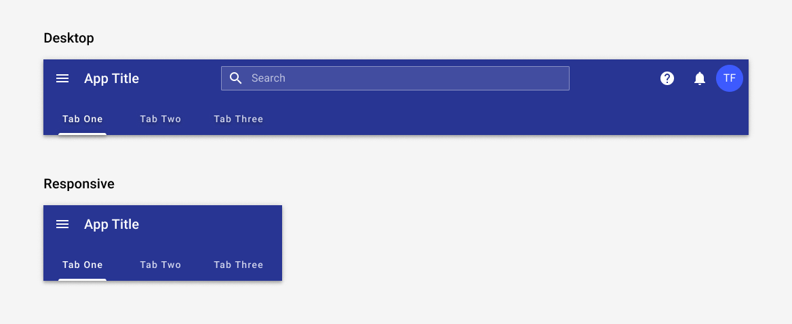
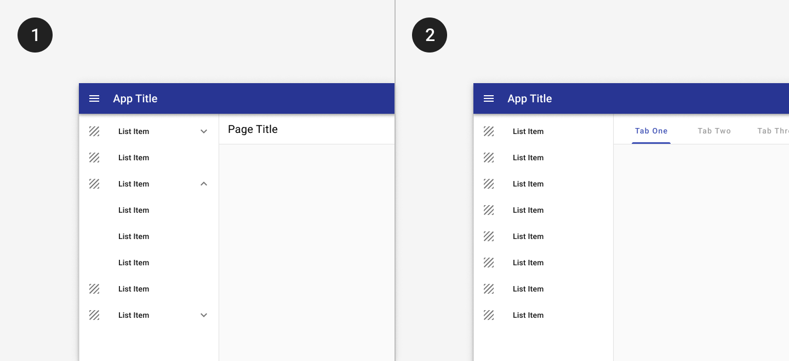
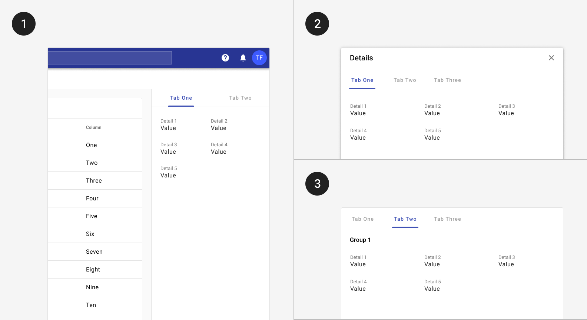
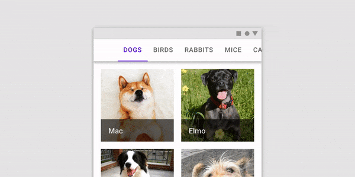
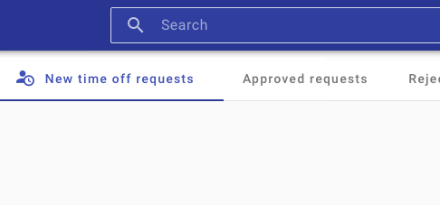
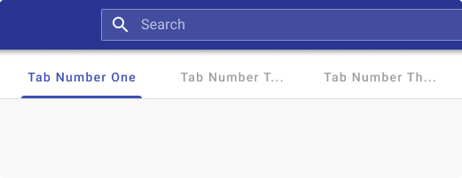
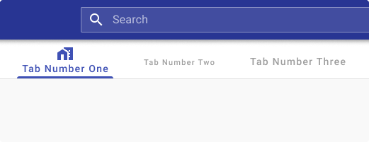

---
sidebar_custom_props:
  shortDescription: Tabs organize and allow navigation between groups of content that are related and at the same level of hierarchy.
---

# Tabs

<ComponentVisual
  figmaUrl="https://www.figma.com/embed?embed_host=share&url=https%3A%2F%2Fwww.figma.com%2Fproto%2F2kTQflBGIuihG9w6KCDww2%2FTab-Bar%3Fscaling%3Dmin-zoom%26page-id%3D0%253A1%26node-id%3D1%253A790"
  storybookUrl="https://forge.tylerdev.io/main/?path=/story/components-tab-bar--default" />

## Overview 

Tabs may be used to group related pieces of content at any level of hierarchy. They may be used as primary or secondary navigation. If your app has more than five primary destinations, use a [navigation drawer](/components/navigation/navigation-drawer). Otherwise, tabs may be used in the omnibar. 

<ImageBlock max-width="600px" padded={false} caption="1. Tabs in the omnibar may be used as primary navigation when there are fewer than five primary destinations.">

</ImageBlock>

Tabs may be used as secondary navigation within a page or record. Secondary navigation may use tabs or expanders within a navigation drawer. Expanders can be a bit more discoverable as they’re accessible from the drawer, while a user must navigate to a detail page in order to view tabs.

<ImageBlock padded={false} caption="1. Expanders may be used to display pages at a second level of hierarchy.   2. Tabs may be used to show closely related content.">

</ImageBlock>

Tabs may be paired with components like the omnibar, or nested in components like cards and dialogs.
Tab label text should clearly and succinctly describe the content it represents. Tab content should contain a cohesive set of items that share a common characteristic.

<ImageBlock padded={false} caption="1. Tabs may be placed inside components like cards and dialogs.">

</ImageBlock>

---

## Responsive

Tabs may scroll horizontally on mobile. The tab bar should be fixed but should allow for scrolling or swiping within it.  

<ImageBlock padded={false} max-width="500px" caption="On mobile, tabs may continue offscreen and may be accessed by swiping. When tapped, a scrollable tab should reposition itself to become fully visible on screen.   Taken from Material.io.">

</ImageBlock>

---

<DoDontGrid>
  <DoDontTextSection>
    <DoDontText type="do">Tab labels may include text only, text and icons, or icons only. </DoDontText>
    <DoDontText type="do">Tab labels should be succinct but clear.</DoDontText>
    <DoDontText type="do">Limit the number of tabs on mobile.</DoDontText>
    <DoDontText type="do">Tabs should be placed directly above content they control. </DoDontText>
  </DoDontTextSection>
  <DoDontTextSection>
    <DoDontText type="dont">Use caution when only representing tab content with icons, as an icon’s meaning may not be clear on every topic.</DoDontText>
    <DoDontText type="dont">Don’t use tabs to move through sequential content that needs to be read in a particular order.</DoDontText>
    <DoDontText type="dont">Avoid using tabs for comparing content across multiple tabs, such as different sizes of the same item.</DoDontText>
    <DoDontText type="dont">Don’t nest tabs within tabs.</DoDontText>
    <DoDontText type="dont">Avoid placing swipeable items in the content area of a UI that has tabs, as the user may mistakenly swipe the wrong component.</DoDontText>
  </DoDontTextSection>
</DoDontGrid>

<DoDontGrid>
  <DoDontRow>
  <DoDontImage>

  </DoDontImage>
  <DoDontImage>

  </DoDontImage>
  </DoDontRow>
  <DoDontRow>
    <DoDont type="dont">Don’t mix tabs that contain only text with tabs that contain only icons. Use either all text labels, all icon labels, or both across all labels.</DoDont>
    <DoDont type="dont">Don’t truncate labels unless required, as truncated text can impede comprehension.</DoDont>
  </DoDontRow>

  <DoDontRow>
    <DoDontImage>

  </DoDontImage>
    <DoDontImage>

  </DoDontImage>
  </DoDontRow>

  <DoDontRow>
    <DoDont type="dont">Don’t resize text labels to fit them onto a single line. If labels are too long, wrap text to a second line or use scrollable tabs.</DoDont>
    <DoDont type="dont">Don't use the default tab height for tabs with icon and text. Use the `stacked` attribute to ensure the correct height.</DoDont>
  </DoDontRow>
</DoDontGrid>

--- 

## Related 

### Components 

- Use [expansion panels](/components/page/expansion-panel) to group content that needs to be compared between groups.
- Tabs may be used inside the [omnibar](/components/omni/omnibar).
- Tabs may be used with [dialogs](/components/notifications-and-messages/dialog), [cards](/components/cards/card), or sidesheets(coming soon!). 
- Page level tabs may be placed with the [scaffold](/components/layouts/scaffold).

### Patterns

- [Navigation](/core-patterns/navigation/primary)
