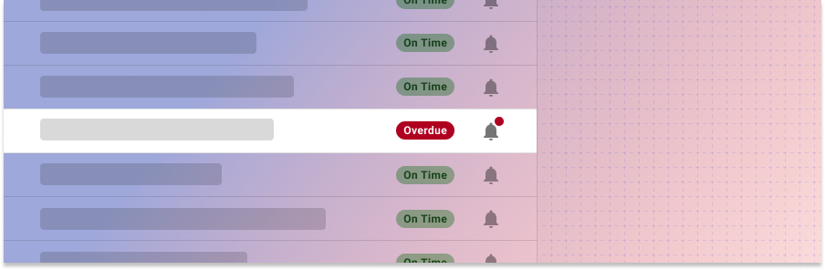
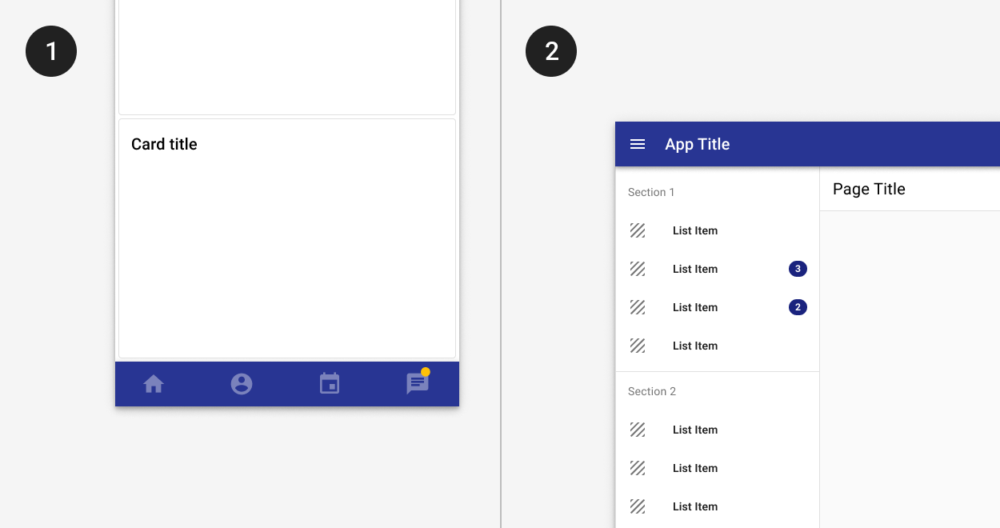
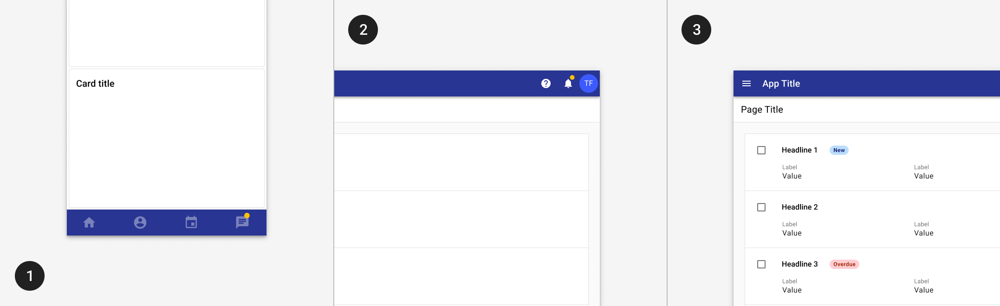
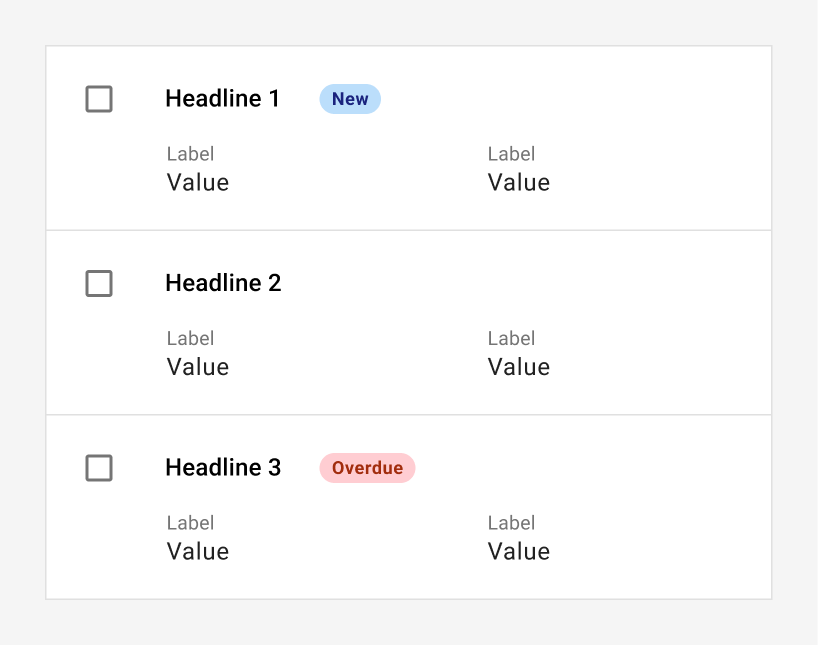

---
sidebar_custom_props:
  shortDescription: Badges are used to indicate an item’s status. They may display a count, descriptive label, or status.
---

# Badge

<ComponentVisual storybookUrl="https://forge.tylerdev.io/main/?path=/story/components-badge--default">

</ComponentVisual>

## Overview

Badges are non-interactive components used to inform status, counts, or as a descriptive label.

<ImageBlock padded={false} caption="1. Use an amber background for dot or numeric badges against an indigo background. 
2. Use the tertiary color for badges against a white background. ">

</ImageBlock>

---

## Types 

There are three types of badges: 1. dot badges, 2. numeric badges, 3. text badges. 

- Use a dot badge to indicate new or unread content exists.
- Use a numeric badge for numeric counts.
- Use a text status badge to communicate status or description.
- Use a [chip](/components/utilities/chips) instead for interaction, selection, or filtering. 

<ImageBlock padded={false} caption="1. Use a dot badge to indicate new content exists, such as an “unread messages” indicator in a bottom app bar. 2. Use a numeric badge for specific counts, such as the number of new notifications. 3. Use text status badges to communicate statuses, such as “New” or “Overdue.”">

</ImageBlock>

### Dot badge

Dot badges are used to indicated that unread content exists. They are used most frequently on navigation items or tabs to indicate content inside, but may also be used with lists and tables. Dot badges don't contain text or numbers.

:::info
Dot badges should use the secondary color when placed on an indigo background and the tertiary color when placed on a white background. See [color guidance](/core-components/color/guidance).
:::

### Numeric badges 

Numeric badges are used for counts, such as a number of unread messages, new records, or total records in a category. 

:::info
Numeric badges should use the secondary color when placed on an indigo background and the tertiary color when placed on a white background. See [color guidance](/core-components/color/guidance).
:::

Numeric badges should be used to highlight new items, such as notifications or new tasks. **Don't use** numeric badges to indicate static counts, such as search results or total records in a table. 

### Text badge 

Text badges are used to communicate a status or description. Badges may be used to add visual prominence to an important attribute of a specific record. At most, one badge should be used per record.

- See an example of badges used in a list the [TCP Manager Apps case study](/case-studies/tcp-manager-apps)!

#### Palettes

Text badges are either **muted** or **bold** and use color to indicate meanings that users can learn and recognize across products. Use muted badges by default. In cases where more visual emphasis is needed, use bold badges instead. In general, only pages where just a few badges are used should use the bold style.

| Muted             | Strong             | Description       | Uses             
| :-----------------| :----------------- | :---------------- | :----------------
| <tcw-badge theme="info-primary">Info primary</tcw-badge> | <tcw-badge strong theme="info-primary">Info primary</tcw-badge> | Use for a general status or state. | New, moved, information, help
| <tcw-badge theme="info-secondary">Info secondary</tcw-badge> | <tcw-badge strong theme="info-secondary">Info secondary</tcw-badge> | Use for a general status or state. | New, moved, information, help
| <tcw-badge theme="danger">Danger</tcw-badge> | <tcw-badge strong theme="danger">Danger</tcw-badge> | Use to indicate errors or items that are problematic | Errors, declined, removed, failed, critical 
| <tcw-badge theme="warning">Warning</tcw-badge> | <tcw-badge strong theme="warning">Warning</tcw-badge> | Use to indicate items that are coming due or require attention. | Coming due, missing, warning, blocked
| <tcw-badge theme="success">Success</tcw-badge> | <tcw-badge strong theme="success">Success</tcw-badge> | Use to celebrate a success. | Available, done, approved, resolved, added

---

<DoDontGrid>
  <DoDontRow>
  <DoDontImage>

  </DoDontImage>
  <DoDontImage>

  </DoDontImage>
  <DoDontImage>

  </DoDontImage>
  </DoDontRow>
  <DoDontRow>
    <DoDont type="do">Use muted badges when they may dominate the screen, such as in long tables with a lot of badges.</DoDont>
    <DoDont type="do">Use badges to draw attention to specific cases. This list uses badges to indicate incidents coming due, but doesn’t use a badge on every list item. </DoDont>
    <DoDont type="dont">Don’t use badges for long phrases or sentences.</DoDont>
  </DoDontRow>
</DoDontGrid>

--- 

## Related

### Components

- Use a [chip](/components/chip) instead of a badge for interaction, selection, or filtering. 

Badges may be used with:

- [Lists](/components/lists/list)
- [Table](/components/table-data/table)
- [Tabs](/components/navigation/tabs)

### Examples 

- See an example of a complex list in the [TCP Manager Apps case study](/case-studies/tcp-manager-apps)!

