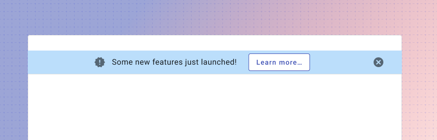
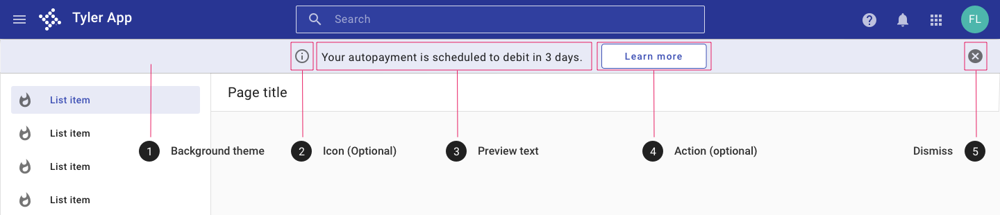
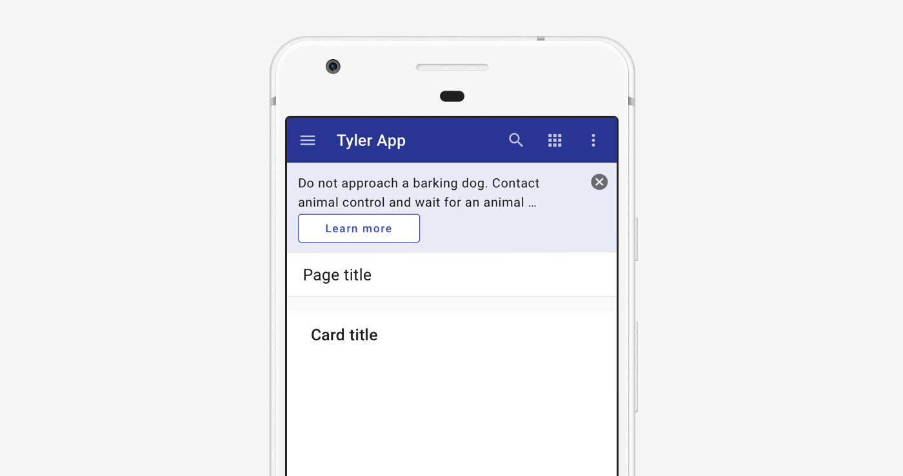

---
sidebar_custom_props:
  shortDescription: A banner is intended to be used as a way to deliver a short but important message to the user.
---

# Banner

<ComponentVisual storybookUrl="https://forge.tylerdev.io/main/?path=/story/components-banner--default">

</ComponentVisual>

## Overview

A banner displays an important, succinct message, and provides actions for users to address (or dismiss the banner). It requires a user action to be dismissed.

Banners should be displayed at the top of the screen, below the omnibar. The banner displays a short amount of information, but may be clicked to launch a dialog with rich text information including text, illustrations, or media.

The banner is dismissed by a dismiss icon or once a user opens it to view a dialog. 

### Use when

- Displaying information that will be used once and dismissed, such as announcements or new features. 
- Displaying information that pertains to the full page. 

### Don't use when

- Displaying information that could be referenced multiple times, such as a helper information. Consider an [inline message](/components/inline-message) instead.
- Displaying information that refers to a single component. Consider an [inline message](/components/inline-message) instead. 
- Displaying an interactive tour of multiple new features. Use a rich tooltip (coming soon!) or WalkMe (guidance coming soon!) instead. 
- Displaying high priority information where action is needed from a user, such as a server error or submission failure. Use a [dialog](/components/notifications-and-messages/dialog) instead. 
- Displaying reactive or confirming information such as a confirmation of a save, delete, or add. Use a [toast](/components/notifications-and-messages/toast) instead. 
- Don't use to confirm whether a user would like to proceed. Use a [dialog](/components/notifications-and-messages/dialog) instead. 

---

## Parts 

A banner consists of four parts. 

<ImageBlock>

</ImageBlock>

1. **Background theme.** The banner selects from provided themes (default, danger, success, warning, info). If needed, the background color may be customized, but we recommend against a custom background in most cases to ensure consistency with other Tyler products. 
2. **Icon**  (Optional). An icon may be used to indicate the nature of the announcement. 
3. **Preview text.** Preview text should be succinct, especially if shown on a mobile-first app. (Learn more about [adaptive design](/patterns/other/adaptive-design/).) 
4. **Action.** (Optional) "Learn more" by default; text may be customized depending on the message or business requirements. By default, the action is intended to launch a simple or complex [dialog](/components/notifications-and-messages/dialog) with additional information, but the action may link to a new page instead if appropriate. 
5. **Dismiss** The dismiss icon displays a tooltip by default. Once dismissed the banner does not display again for that user.

---

## Behavior 

<ImageBlock>

</ImageBlock>

The banner displays preview text; users may click the banner for additional information. The action may launch a [dialog](/components/notifications-and-messages/dialog) that can include text, illustrations, or media. The banner may be dismissed via the dismiss icon or by interacting with and closing the dialog. Once the banner has been interacted with, it is not shown again for the same user. 

---

## Responsive

The page banner resizes to display on mobile. Preview text is limited to two lines and the action displays beneath the text. 

<ImageBlock>

</ImageBlock>

---

## Related 

### Components

- Use a [dialog](/components/notifications-and-messages/dialog) for high priority alerts that require user action.
- Use a [toast](/components/notifications-and-messages/toast) for low priority notifications in response to user action.
- Use an [inline message](/components/inline-message) to display helper information for a specific component.

### Patterns

- [System communication](/patterns/other/system-communication)
