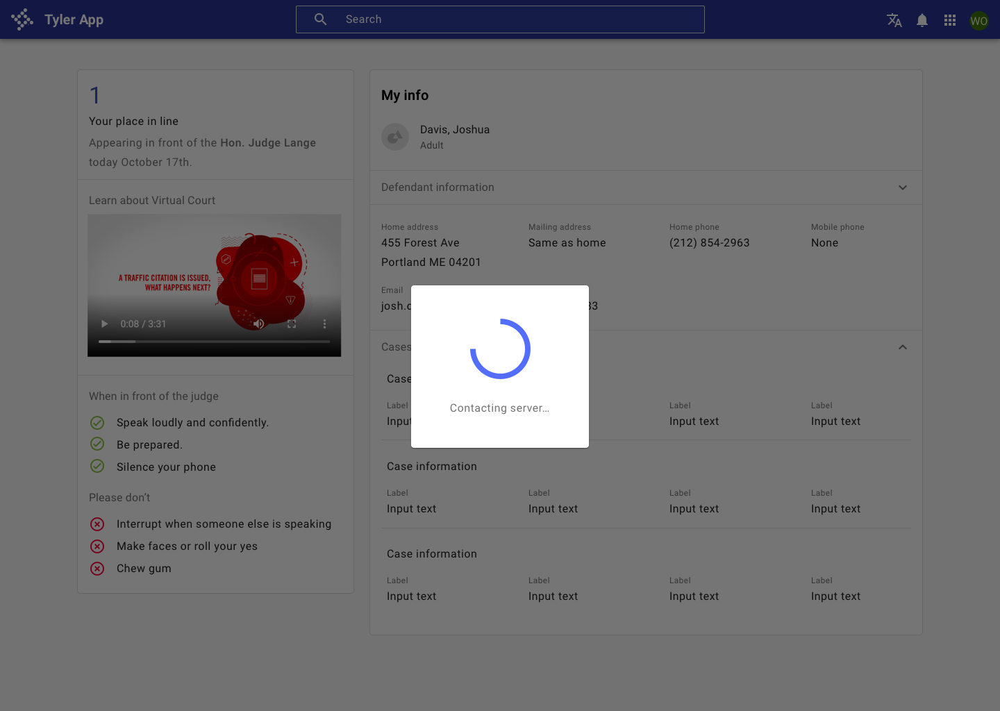

---
sidebar_custom_props:
  shortDescription: A busy indicator is used when a component or page is loading or changing and prevents users from interacting with content.
---

# Busy indicator

<ComponentVisual storybookUrl="https://forge.tylerdev.io/main/?path=/story/components-busy-indicator--default">

</ComponentVisual>

## Overview: Progress indicators

Progress indicators inform users about the status of ongoing processes, such as loading an app, submitting a form, or saving updates. They communicate an app’s state and indicate available actions, such as whether users can navigate away from the current screen. Use a progress indicator for operations that take more than 1 second.

Progress indicators are used to:

- Assure the user that the system is working.
- Provide operational transparency.
- Communicate progress made vs progress pending.
- Reduce users perception of time elapsed.

### Types of progress indicators

| Context                        | Component                               | Guidance
| :------------------------------| :-------------------------------------- | :----------------
| Initial page load              | [Skeleton + progressive loading](#)     | Use skeleton loading when content size/shape is known. Load skeleton components, then fade in components as they become available.
| Initial page load              | Linear page progress                    | Use when the content to be loaded is of unknown or variable size or quantity. Display a description of the process with a linear progress bar (see pattern below).
| Full page load or change       | Full page busy indicator                | Use an overlay to prevent users from interacting with content on a page due to a change, server error, or form submission.
| Multiple components            | [Skeleton + progressive loading](#)     | Load skeleton components, then fade in components as they become available.
| Single component within a page | [Inline circular progress indicator](#) | Use a contextual circular progress indicator to communicate that either a component's state or data is changing.

---

## Overview: Busy indicator

Use a busy indicator when the entire page is loading or changing and users should be prevented from interacting with any content on the page. 

<ImageBlock padded={false} maxWidth="600px">

</ImageBlock>

Busy indicator text may use the following formats.

- ` [Object] ` is being [operation name], or
- ` [Object] ` is being [operation name] to [destination name] or
- ` [Object] ` is being [operation name] from to [destination name]

Real-world examples include copying files to a storage location, saving edits to a file, and more.

---

## Resources

- [Wait Wait... Tell Me!](https://99percentinvisible.org/episode/wait-wait-tell-me/transcript/) (99% Invisible)
- [Everything you need to know about skeleton screens](https://uxdesign.cc/what-you-should-know-about-skeleton-screens-a820c45a571a) (Medium)
- [Progressive Loading](https://developer.mozilla.org/en-US/docs/Web/Progressive_web_apps/Loading) (MDN Web Docs)
- [Improving the UX of Progress Indicators and Feedback Notifications](https://usersnap.com/blog/progress-indicators/) (Usersnap)
- [Mobile Design Details: Avoid The Spinner](https://www.lukew.com/ff/entry.asp?1797) (LukeW)
- [How to Improve Perceived Waiting Time in HCI: A Psychological Approach](http://www.guillaumegronier.com/cv/resources/Articles/2013_WorkshopHCI_Gronier.pdf) (Study)
- [The Illusion of Time](https://medium.com/swlh/the-illusion-of-time-8f321fa2f191) (Medium)

---

## Research

Have you done usability testing on progress and loading? We’d love to hear from you! 

---

## Related 

### Components

- Use [linear progress](/components/linear-progress) and [circular progress](/components/progress-and-loading/circular-progress) components to indicate that individual elements are loading.
- Use [skeleton](/components/skeleton loading) to initially load content when size and shape is known. 
- Use a [backdrop](/components/backdrop) behind the busy indicator.
- A busy indicator is used with a [dialog](/components/notifications-and-messages/dialog).

### Patterns

- [Progress and loading](#) (coming soon!)
    