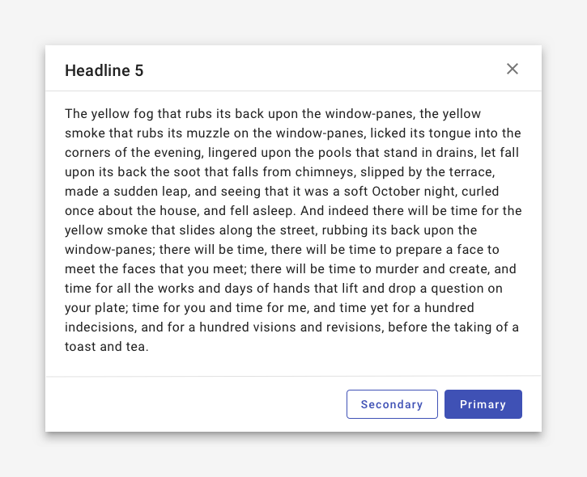
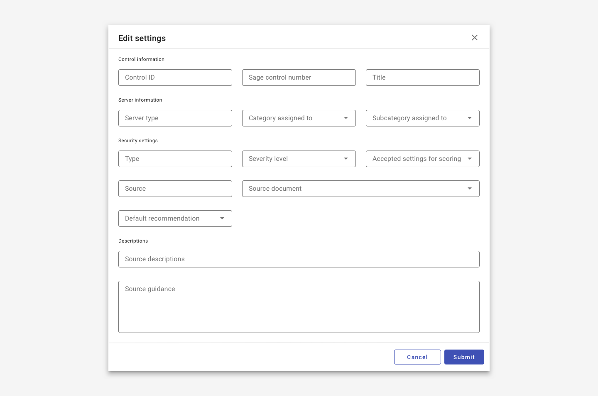
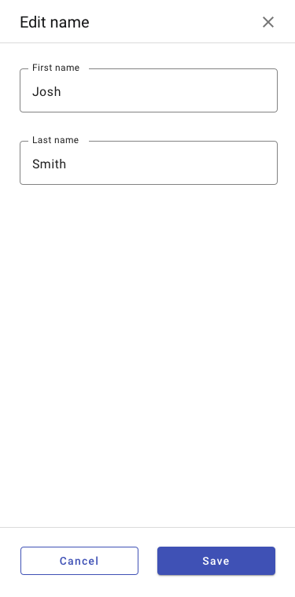
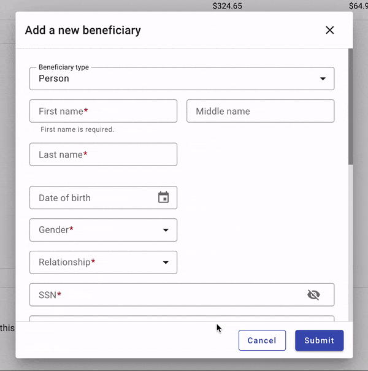
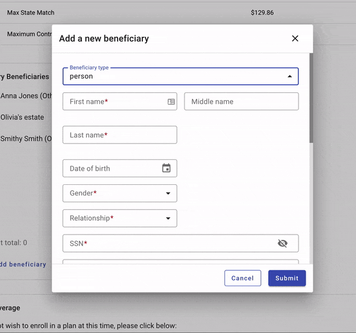

---
sidebar_custom_props:
  shortDescription: Dialogs inform users about a task and can contain critical information, require decisions, or involve multiple tasks.
  thumbnail: ./img/all-components/dialog-mini.png
---

# Dialog

<ComponentVisual storybookUrl="https://forge.tylerdev.io/main/?path=/docs/components-dialog--docs">

</ComponentVisual>

## Overview

A dialog is a type of modal window that appears in front of app content to provide critical information or ask for a decision. Dialogs disable all app functionality when they appear, and remain on screen until confirmed, dismissed, or a required action has been taken. To express that the rest of the app is inaccessible, and to focus attention on the dialog, surfaces behind the dialog are scrimmed. 

A backdrop (scrim) is a temporary treatment that can be applied to Material surfaces for the purpose of making content on the surface less prominent.

### Use when

- Displaying errors that block an app's normal operation. 
- Critical information that requires a specific user task, decision, or acknowledgement.
- Indicating a change of [mode](/patterns/other/modality), such as an edit, stepper, or offline mode. 

### Don't use when

- Displaying information that should be referenced while using the app. Use an [inline message](/components/notifications-and-messages/inline-message) instead. 
- Displaying information that refers to a single component. Consider an [inline message](/components/notifications-and-messages/inline-message) instead. 
- Displaying an interactive tour of multiple new features. Use a rich tooltip (coming soon!) or WalkMe (guidance coming soon!) instead. 
- Confirming a user action such as a confirmation of a save, delete, or add; that doesn't require additional user input. Use a [toast](/components/notifications-and-messages/toast) instead. 
- Displaying information that will be used once and dismissed, such as announcements or new features. Use a [banner](/components/notifications-and-messages/banner) instead. 
- Displaying information that pertains to the full page. Use a [banner](/components/notifications-and-messages/banner) instead. 

:::info
Dialogs are purposefully interruptive, so they should be used sparingly.

To learn about other components that display messages, such as toasts and banners, check out the [System Communication](/patterns/other/system-communication/) guidance.
:::

---

## Types 

There are three types of dialogs: 1. Simple, 2. Complex, 3. Full screen (mobile only).

### 1. Simple 

Simple dialogs **convey a brief message or alert.** For alerts that are one sentence or less, the dialog header is excluded.

Simple dialogs may be closed by clicking outside of the dialog, or by clicking a dismissive action.  

Simple dialogs display the same in mobile and desktop contexts. 

<ImageBlock maxWidth="500px" padded={false}> 

</ImageBlock>

### 2. Complex

Complex dialogs **display content that includes: more than three text fields, lists with more than three options, long messages, or multimedia messages.** Use dividers to visually separate title and actions from the content itself.

By default, dialogs should have a width less than 50% of the user’s viewport and a height no more than 2/3 of the viewport. If the content requires more content, a dialog may take up to 90% of the viewport on desktop; use a full screen dialog on mobile. Specify a minimum and maximum width to avoid going to narrow or too large. If the content is longer than the length of the dialog, allow the user to scroll within the dialog. 

On mobile, complex dialogs should display as full width dialogs (see below).

<ImageBlock maxWidth="500px" padded={false}>

</ImageBlock>

Complex dialogs contain two actions, but may also display a third action, if necessary ("Save," "Cancel," "Previous"). The primary action is indicated with a raised button, while other actions are displayed as outlined buttons.

<ImageBlock padded={false} caption="A complex dialog may display three actions if necessary.">

</ImageBlock>

Well organized forms may be contained in complex dialogs. Group related content and use columns and section titles to organize content and improve readability. Longer forms that require extensive scrolling in a dialog should be displayed in a new page instead.

When creating forms in dialogs, consider scalability. If additional fields may be added to a form over time or if additional custom fields may be added by clients, consider a new page to house a form instead. 

<ImageBlock padded={false}>

</ImageBlock>

### 3. Full page

Full-screen dialogs fill the entire screen, containing actions that require a series of tasks to complete. They may be used for content or tasks that meet any of these criteria:

- Dialogs that include components which require keyboard input, such as form fields.
- When changes aren’t saved instantly.
- When components within the dialog open additional dialogs.
- Complex dialogs. (See above.)

They should be used on mobile only.

<ImageBlock maxWidth="300px">

</ImageBlock>

---

## States

### Scrolling

Most dialog content should avoid scrolling. When scrolling is required, the dialog title is pinned at the top, with buttons pinned at the bottom. This ensures selected content remains visible alongside the title and buttons, even upon scroll. Dialogs don’t scroll with elements outside of the dialog, such as the background.

<ImageBlock padded={false} maxWidth="500px">

</ImageBlock>

### Dismissing

Dialogs may be dismissed by:

- Tapping outside of the dialog (for non form dialogs only).
- Tapping the “Cancel” button.
- Tapping the close icon (complex dialogs only).
- Tapping the system back button (Android only).

:::note
Tapping outside a dialog to close it should not be used with dialogs that contain forms as it may cause accidental loss of user data.
:::

If the user must choose an action to proceed, the close icon may be hidden and the ability to tap outside the dialog to close it may be disabled. 

<ImageBlock padded={false} maxWidth="500px" caption="Complex dialogs may be closed by a 'Cancel' action or by tapping the X icon.">

</ImageBlock>

### Editing & saving

Dialogs can be a good option for adding new records or editing new information. Use a dialog to provide a dedicated space for editing in the larger context of an application. Dialogs are best used for shorter forms; longer forms should use a dedicated page. 

To save data in a dialog, the user taps “Save.” To discard all changes and exit, the user taps the X icon or Back button.

The confirming action is disabled until all mandatory fields are filled. Use descriptive verbs such as “Save,” “Send,” “Share,” “Update,” or “Create.” Don’t use vague terms such as “Done,” “OK” or “Close.”

If no changes have been made, the dialog closes and no discard confirmation is required.
If the user has made changes, the user is prompted to confirm the discard action.

---

## Best practices 

<DoDontGrid>
  <DoDontTextSection>
    <DoDontText type="do">Dialog titles should contain a brief, clear statement or question.</DoDontText>
    <DoDontText type="do">If a dialog contains a form or user input and a user closes the dialog without submitting data, prompt the user with a confirmation dialog to avoid data loss.</DoDontText>
    <DoDontText type="do">Avoid apologies (“Sorry for the interruption”), alarm (“Warning!”), or ambiguity (“Are you sure?”) in dialog titles.</DoDontText>
    <DoDontText type="do">Display dialog buttons side by side if space allows.</DoDontText>
    <DoDontText type="do">Use a raised button to indicate the confirming action. A confirming action resolves what triggered the dialog by confirming a proposed action. They can be either positive, such as “Save,” “Add,” “Confirm” – or negative, such as “Delete” or “Remove.”</DoDontText>
    <DoDontText type="do">In general, confirming actions should be placed on the right, unless a business case dictates otherwise.</DoDontText>
    <DoDontText type="do">Use an outlined button to indicate the dismissive action. Dismissive actions dismiss a proposed action, and return the user to the originating screen or step. They are placed directly to the left of a confirming action. (If both actions are equally important, use two outlined buttons.)</DoDontText>
    <DoDontText type="do">A single action may be provided only if it’s an acknowledgement.</DoDontText>
  </DoDontTextSection>
  <DoDontTextSection>
    <DoDontText type="dont">Don't stack dialogs on dialogs.</DoDontText>
    <DoDontText type="dont">Don't use two raised buttons next to each other in a dialog.</DoDontText>
    <DoDontText type="dont">Don't allow users to click outside to close a dialog when it contains a form or user input. This is to avoid accidental missclicks and unnecessary loss of data.</DoDontText>
    <DoDontText type="dont">Don't display an X icon in simple dialogs - allow users hit a cancel button or click outside the dialog to close it instead.</DoDontText>
   </DoDontTextSection>
</DoDontGrid>

---

## Related components 

### Components

- Use a [toast](/components/notifications-and-messages/toast) to display low priority messages that disappear automatically. 
- Use a [banner](/components/notifications-and-messages/banner) to display high priority messages that disappear after user interaction.
- Use [inline messages](/components/notifications-and-messages/inline-message) to display persistent information related to a specific component. 
- Use [buttons](/components/buttons/button) inside of dialogs. 
- [Steppers](/components/steppers/stepper) may be used with dialogs. 

### Recipes

- [Dialog recipes](/recipes/dialog/generic)
- [Toolbar recipes](/recipes/toolbar/secondary)

### Patterns

- [System communication](/patterns/other/system-communication)
- [Modality](/patterns/other/modality)
- Forms (Coming soon!)
