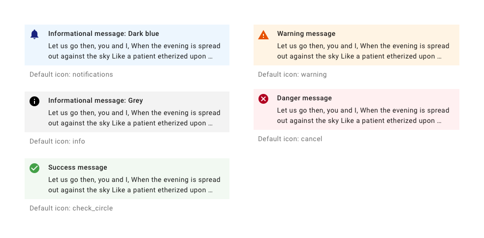

---
sidebar_custom_props:
  shortDescription: An inline message communicates information to a user inside of another component, such as a form.
  thumbnail: ./img/all-components/inline-message-mini.png
---

# Inline message

<ComponentVisual storybookUrl="https://forge.tylerdev.io/main/?path=/docs/components-inline-message--docs">

</ComponentVisual>

## Overview

Inline messages are persistent and appear inside a component, such as a [card](/components/cards/card), [dialog](/components/notifications-and-messages/dialog), or [form](/components/cards/card). In forms, inline notifications may be placed at the top of the form for informational content that users should read first, above or below an text field for field specific information, or at the end of the form for error information. 

### Use when 

- Displaying reference or helper information for a component, such as directions, notes, or warnings.
- Displaying information about a single component, such as a form.

### Don't use when

- Displaying an interactive tour of multiple new features. Use a rich tooltip (coming soon!) or WalkMe (guidance coming soon!) instead.
- Displaying high priority information where action is needed from a user, such as a server error or submission failure. Use a [dialog](/components/notifications-and-messages/dialog) instead. 
- Confirming whether a user would like to proceed. Use a [dialog](/components/notifications-and-messages/dialog) instead. 
- Displaying reactive or confirming information such as a confirmation of a save, delete, or add. Use a [toast](/components/notifications-and-messages/toast) instead. 
- Displaying information that will be used once and dismissed, such as announcements or new features. Use a [banner](/components/notifications-and-messages/banner) instead.
- Displaying information that pertains to the full page. Use a [banner](/components/notifications-and-messages/banner) instead.

### Examples

- See an example of an inlined message in the [TCP Manager Apps case study](/get-started/other/case-studies/manager-apps)!

---

## Parts 

The inline message consists of four parts. 

<ImageBlock>

</ImageBlock>

1. **Background theme.** Select from provided themes (default, danger, success, warning, info). If needed, the background color may be customized, but we recommend against a custom background in most cases to ensure consistency with other Tyler products. 
2. **Icon.** The icon should correspond to the notification content. Select from the following common icons, or choose a custom icon as appropriate: `info` (informational), `bell_outline` (notification), `warning` (warning), `cancel` (danger), `check_circle` (success).
3. **Title.** A title may be used along with the notification text if necessary. 
4. **Message.** The message body should be succinct. Limit to two lines of text if possible.

---

## Types 

The inline notification supports four modes: informational, warning, success, danger. 

<ImageBlock>

</ImageBlock>

---

## Related 

### Components

- Use a [dialog](/components/notifications-and-messages/dialog) for high priority alerts that require user action.
- Use a [toast](/components/notifications-and-messages/toast) for low priority notifications in response to user action.
- Use an [banner](/components/notifications-and-messages/banner) to display one time notifications that pertain to the full page.
- Use a rich tooltip (coming soon!) for information about a specific component.

### Patterns

- [System communication](/patterns/other/system-communication)

### Examples 
- See an example of an inlined message in the [TCP Manager Apps case study](/get-started/other/case-studies/manager-apps)!
