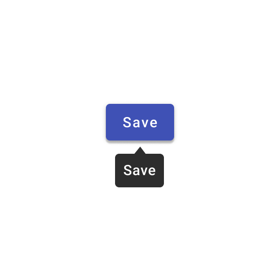
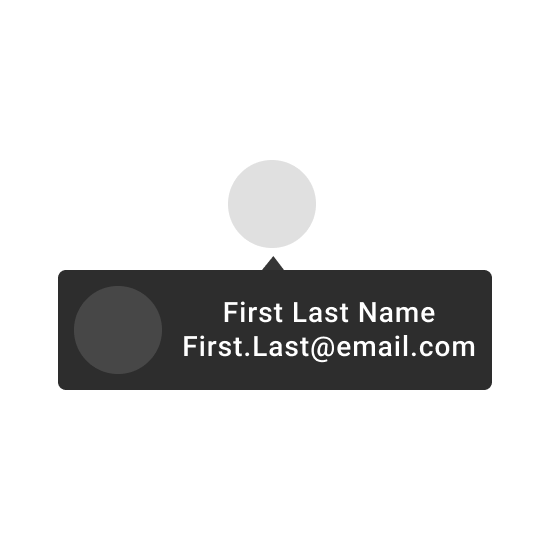

---
sidebar_custom_props:
  shortDescription: A tooltip displays informative text when users hover over, focus on, or tap an element.
  thumbnail: ./img/all-components/tooltip-mini.png
---

# Tooltip

<ComponentVisual storybookUrl="https://forge.tylerdev.io/main/?path=/story/components-tooltip--default">

</ComponentVisual>

## Overview

When activated, tooltips display a text label identifying an element, such as a description of its function.

### Use when

- An icon button is displayed without a label. 
- An icon or function needs additional explanation. 

### Don't use when

- Mobile is a primary context of use. Hover affordances won't work; a long press might work instead. 
- The description is more than a few words. Use a rich text tooltip instead. (Coming soon!)

---

## Best practices 

<DoDontGrid>
  <DoDontTextSection>
    <DoDontText type="do">A tooltip is continuously displayed for as long as a user hovers over the element (desktop) or holds the element (mobile).</DoDontText>
    <DoDontText type="do">On desktop, tooltips appear in the center of click targets and stay in place while cursor moves within the target.</DoDontText>
  </DoDontTextSection>
</DoDontGrid>

<DoDontGrid>
  <DoDontRow>
  <DoDontImage>

  </DoDontImage>
  <DoDontImage>

  </DoDontImage>
  </DoDontRow>
  <DoDontRow>
    <DoDont type="do">Keep the position of the tooltip visible.</DoDont>
    <DoDont type="dont">Don’t crop tooltips.</DoDont>
  </DoDontRow>
</DoDontGrid>

<DoDontGrid titleText=" ">
  <DoDontRow>
  <DoDontImage>

  </DoDontImage>
    <DoDontImage>

  </DoDontImage>
  </DoDontRow>
  <DoDontRow>
    <DoDont type="dont">Don’t use tooltips to restate visible UI text.</DoDont>
    <DoDont type="dont">Don’t display rich information and imagery on tooltips.</DoDont>
  </DoDontRow>
</DoDontGrid>

---

## Related 

### Components
- [Icon buttons](/components/buttons/icon-button) should be accompanied by a tooltip.
