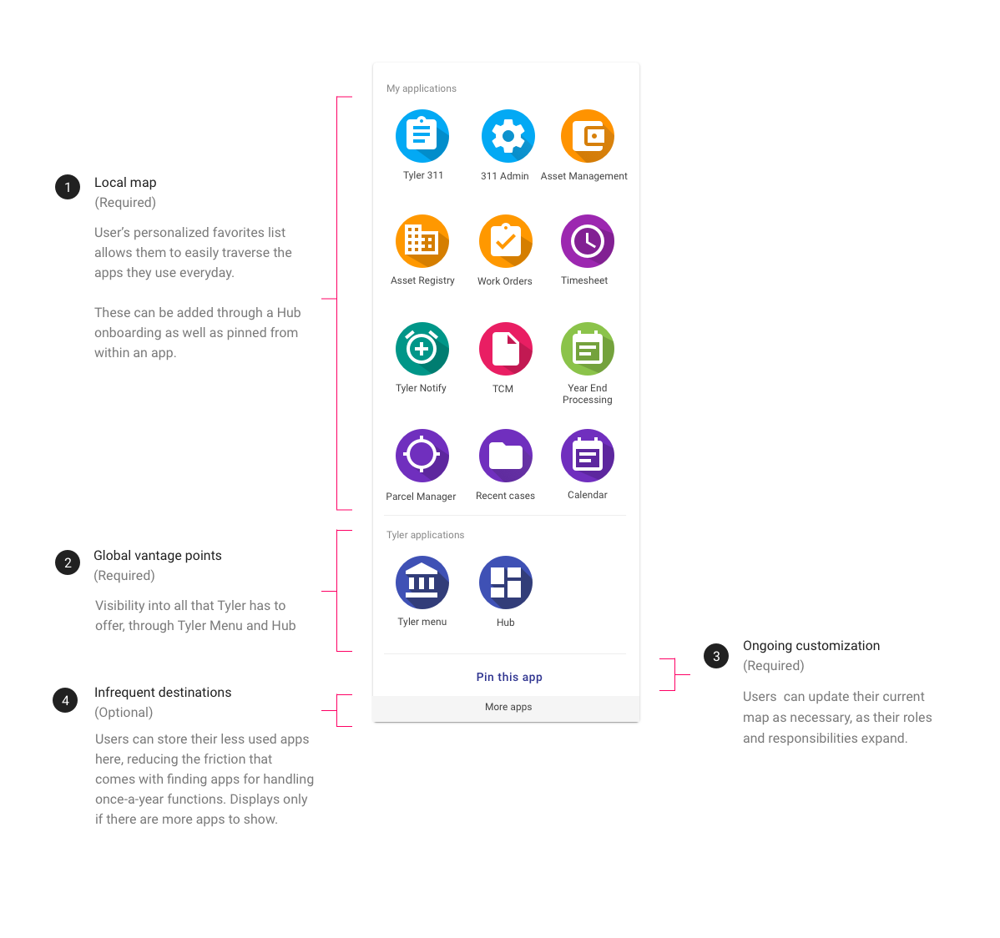
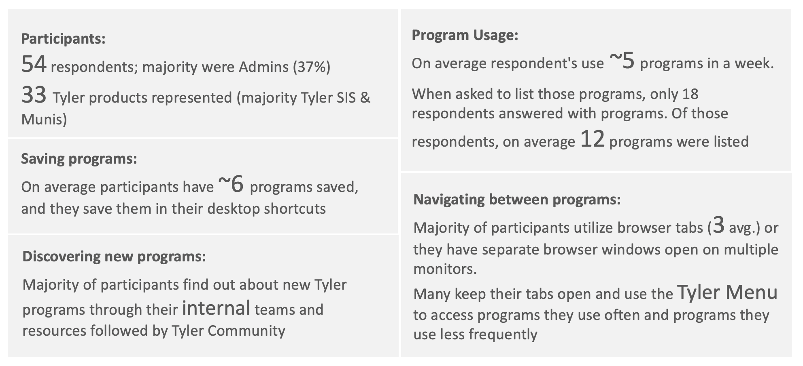

---
sidebar_custom_props:
  shortDescription: App launcher is a persistent navigation component for users to view and launch programs.
---

# App launcher

<ComponentVisual storybookUrl="https://forge.tylerdev.io/main/?path=/story/components-app-launcher--default">

</ComponentVisual>

## Overview

App launcher is a persistent navigation component for users to switch context. It is a personal local map to navigate the Tyler ecosystem. It lives in the  user information section of omnibar and is represented by the Apps icon.

Apps opened by the app launcher replace the current app in the same tab. Apps should not open in a new window.

See an example of the app launcher in use in the [TCP Manager Apps case study](/case-studies/tcp-manager-apps)!

---

## Parts 

The app launcher consists of 3 parts: 1. Local map, 2. Global vantage points, 3. Ongoing customization, 4. Infrequent destinations.

<ImageBlock>

</ImageBlock>

### 1. Local map

Users can add up to twelve additional apps that will be persistently displayed in their app launcher and make up a user’s local neighborhood – the apps they visit on a daily basis. An additional nine apps be may be added to the launcher to be displayed in the “More apps” section; these apps make up the user’s infrequent destinations.

Applications are represented by a product icon using an icon from our Tyler icon set, and a short application title of less than 30 characters (two lines) or 29 characters with an ellipse. Avoid repeating product names or descriptive terms.

Apps that are part of a suite or logical group have a consistent background color and are grouped together visually. Do not use titles for app groups. Apps are considered related if they rely on each other for functionality, for example:

- Tyler 311, 311 Admin
- Asset Management, Asset Registry, Work Orders

### 2. Global vantage points

[Functionality pending] The app launcher always displays links to global vantage points including the Tyler menu (future concept) and dashboards such as Hub. Their product icons have a background color of Indigo 500.

### 3. Ongoing customization

[Functionality pending] The app launcher allows users to add additional apps with a “pin this app” option.

### 4. Infrequent destinations

[Functionality pending] “More apps” brings users to a full listing of Tyler apps. They can add apps to their app launcher from here, or request permissions to licensed apps they may not have access to. 

---

## Responsive
The app launcher displays on responsive mobile web apps. Native apps should not use app launcher (internal app navigation should occur in the navigation drawer; external app navigation will be handled by the user’s phone). 
On responsive web apps, the app launcher displays full screen at mobile sizes. 

---

## Research

### December 2020: Current navigational behaviors, survey

Primary Researcher: Emma Walsh

<!-- <a href="/media/app-launcher-survey-results.pptx" download>
  <tcw-button type="outlined" style="margin-bottom: 24px">
    <button type="button">
      Download the study findings
      <i class="tyler-icons">file_download</i>
    </button>
  </tcw-button>
</a> -->

Goal: Better understand how Tyler clients are traversing the Tyler ecosystem in order to inform the components of the app launcher UI.

Participants: 54 respondents;  33 Tyler products represented (majority Tyler SIS & Munis)

### Survey results

<ImageBlock>

</ImageBlock>

---

## Project timeline

This feature is currently in flight. Check out our project [timeline](#) to get a better sense of when this work will be completed. 

---

## Related

### Components

- The app launcher is comprised of [product icons](/components/product-icon)
- The app launcher is part of the [omnibar](/components/omni/omnibar)
- Use a [navigation drawer](/components/navigation/drawer) to display internal destinations

### Patterns

- [Navigation](/core-patterns/navigation/primary)

--- 

## Related 

### Components

- [Omnibar](/components/omni/omnibar)

### Examples

- See an example of the app launcher in use in the [TCP Manager Apps case study](/case-studies/tcp-manager-apps)!

