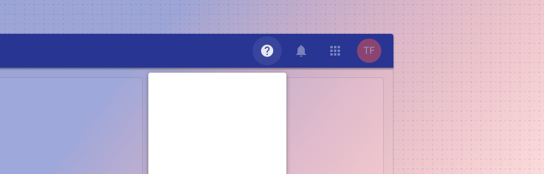
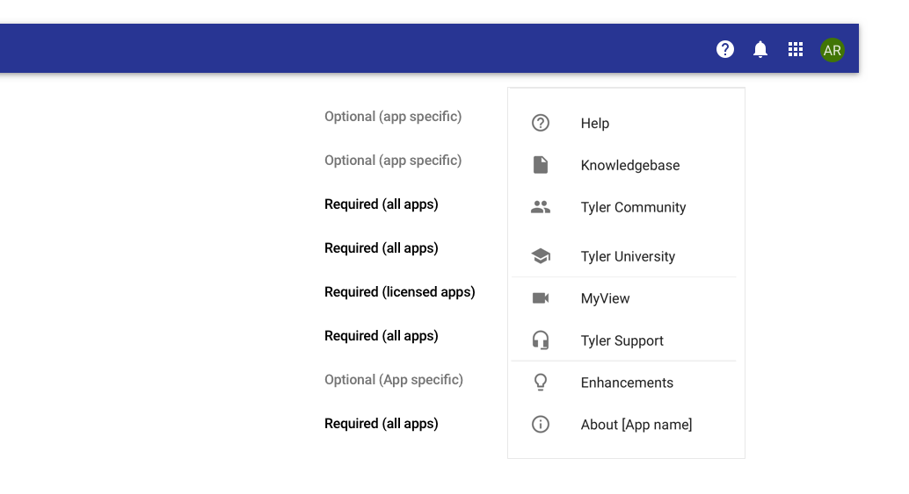

# Omnibar help button

<ComponentVisual storybookUrl="https://forge.tylerdev.io/main/?path=/story/components-app-bar-help-button--default">

</ComponentVisual>

## Overview

The help menu is standard across apps and consists of a variety of resources, ranging from help specific to the user’s current app to the broad range of resources available on Tyler Community. 

<ImageBlock maxWidth="600px" padded={false}>

</ImageBlock>

**Apps should provide an “About” section** consisting of (but not limited to) versioning, system information, user information, and terms & conditions. The About section may use a simple dialog or a tabbed dialog with the appropriate sections. 

In order to help clients accurately report the version number of the application when submitting support tickets, be sure the version number is easily accessible from your app’s help dialog. See more examples in our gallery examples. 

See the [recipes](/recipes/omni-about) for the "About" section. 

--- 

## Related 

### Components

- [Omnibar](/components/omni/omnibar)

### Recipes

- [Omnibar: about recipes](/recipes/omni-about)
