---
sidebar_custom_props:
  shortDescription: The omnibar is the header for applications. It houses navigation items and tools related to the app.
  thumbnail: ./img/all-components/app-bar-mini.png
---

# Omnibar

<ComponentVisual storybookUrl="https://forge.tylerdev.io/main/?path=/docs/components-app-bar--docs">

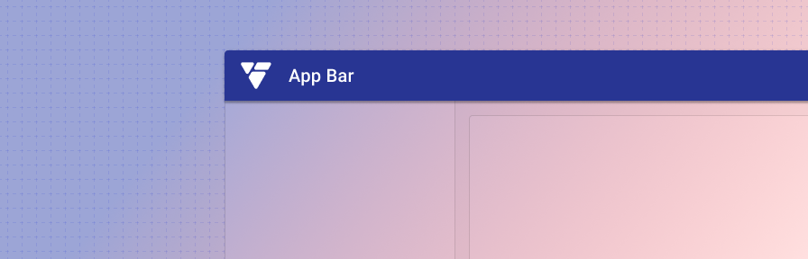

</ComponentVisual>

## Overview

The omnibar is a user's personal navigation kit. It holds everything a user needs to navigate the app they're currently in, apps they typically go to, and apps they might need, as well tools to customize their navigation experience through notifications, language options, and help resources.

The omnibar is included in all applications and serves as a strong visual cue for the Tyler brand. 

---

## Parts 

The omnibar is composed of five sections.

<ImageBlock padded={false} maxWidth="650px">

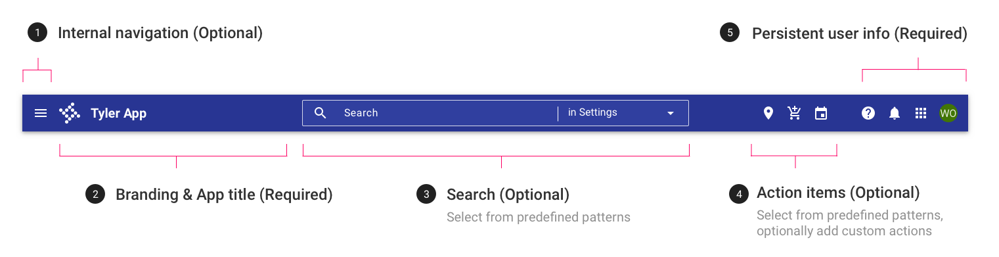

</ImageBlock>

## 1. Internal navigation (optional)

Apps using a dismissible [navigation drawer](/components/navigation/navigation-drawer) display a hamburger menu to open and close the menu. For these apps, the menu icon should always be visible, even as the screen scales to fit different device contexts. 

## 2. Branding and app title

The omnibar in workforce apps features the Tyler Talking T's logo and the app name, in title case (“General Ledger,” not “General ledger”). Branding guidance for public facing apps is pending.

<ImageBlock max-width="450px">

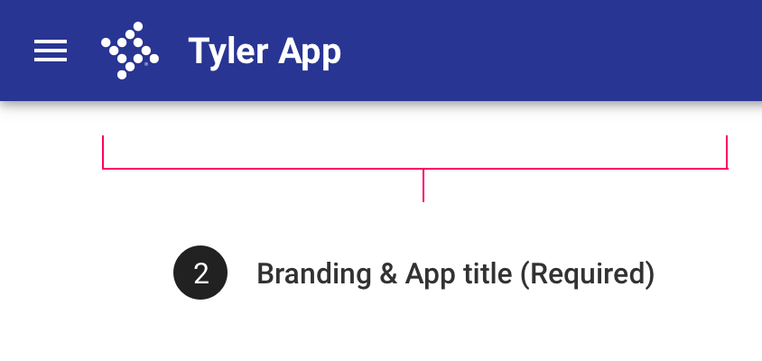

</ImageBlock>

## 3. Search (optional)

Omnibar search is optional, but should be used for apps that are primarily search driven (case management apps, mapping apps, etc). In cases where the search may be local to a single component on the page, place the search closest to the component it’s performed on. For more information, check out our search gallery examples.

The omnibar provides a number of options for search depending on the scope needed, input type, and autocomplete suggestions.

<ImageBlock>

Interactive demo coming soon... 

</ImageBlock>

For more information, check out the [omnibar: search](/components/omni/search) guidance. 

---

## 4. Action items 

Up to three global actions maybe be placed in the “Action items” section. Actions belong to the app omnibar if they affect the application or record as a whole. Actions that affect a single item or a piece of the application should be placed in context, close to the part they affect. 

Select from the following common actions such as “Shopping cart” and “Export all.” Additionally teams can create custom actions to meet specific business needs such as “Print package,” etc.

If your applications has more than three action items, place the two primary actions in the omnibar and the additional actions in an overflow menu. 

For examples of action items used in live applications, check out our gallery examples. 

<ImageBlock>

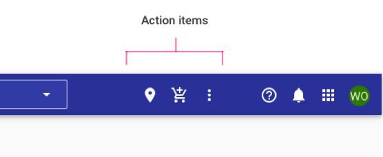

</ImageBlock>

<ImageBlock caption="Additional action items may be placed in an overflow menu.">

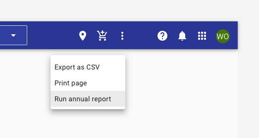

</ImageBlock>

## 5. User information

The final section of the omnibar contains information and actions pertinent to a specific user. User information consists of sections: 1. Help & About 2. Notifications, 3.App launcher, 4. Avatar & profile card.

<ImageBlock maxWidth="350px">

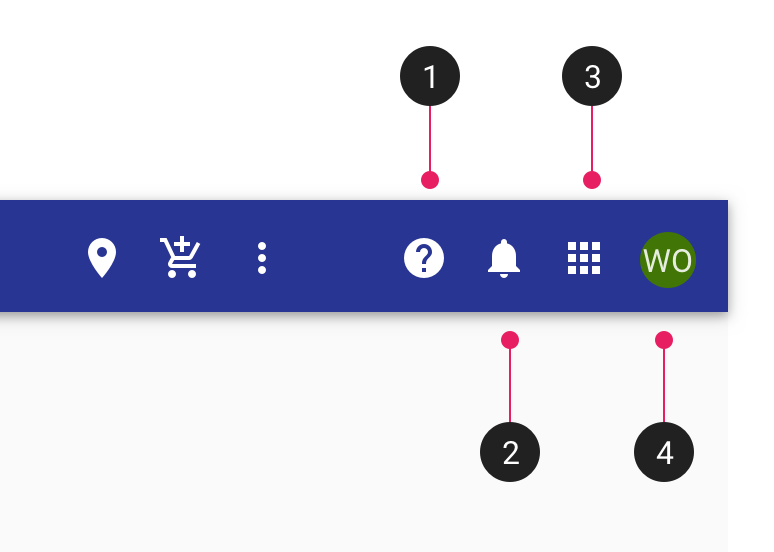

</ImageBlock>

### 1. Help (required)

The help menu is standard across apps and consists of a variety of resources, ranging from help specific to the user’s current app to the broad range of resources available on Tyler Community. 

<ImageBlock maxWidth="600px" padded={false}>

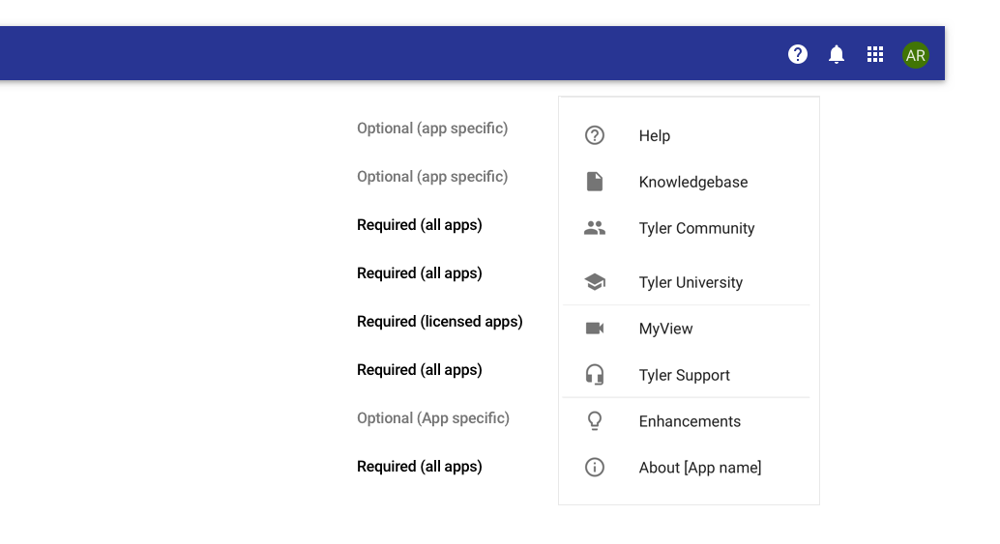

</ImageBlock>

**Apps should provide an “About” section** consisting of (but not limited to) versioning, system information, user information, and terms & conditions. The About section may use a simple dialog or a tabbed dialog with the appropriate sections. 

In order to help clients accurately report the version number of the application when submitting support tickets, be sure the version number is easily accessible from your app’s help dialog. See more examples in our gallery examples. 

<ImageBlock>

Interactive demo coming soon...

</ImageBlock>

### 2. Notifications (optional)

Notifications are standard across apps, and use tabs to display notifications from the current app as well as a summary of notifications from all apps. 

Example notifications include: “New time off request to approve,” “New package rejected,” “Time off request approved,” “Your bill is due in 5 days.”

A badge displays the total number of unread notifications individual to the user. Notifications are considered “read” when they have been clicked.  

Notifications may be clickable. Clickable notifications may deep link within an app or may link to an external resource such as a Tyler Community article. Read notifications should persist only for 14 days unless otherwise specified by a business requirement. 

Check out notifications in action in our gallery examples.

<ImageBlock>

Interactive demo coming soon...

</ImageBlock>

### 3. App launcher (required)

App launcher is required for workforce guidance. See our guidance on the [app launcher page](/components/omni/app-launcher).

### 4. Avatar and profile card 

The profile card features a user's personalized avatar if they've set one, their full name, and the email used to sign up with the app. Additionally, the card features a “Sign out” option as well as a link to their profile, if applicable.
For information about public facing profile patterns, check out this guidance. 

<ImageBlock maxWidth="600px">

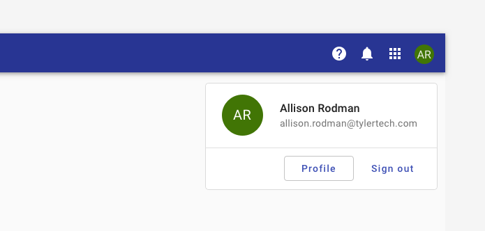

</ImageBlock>

For **unauthenticated users,** the avatar is replaced by a “sign in” button. Notifications are hidden; the help menu and app launcher remain.

<ImageBlock maxWidth="600px">

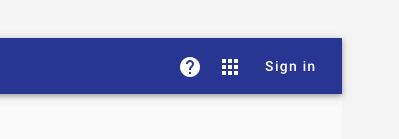

</ImageBlock>

---

## Variations 

Top tabs can be placed within the omnibar as primary navigation when the navigation drawer is not being used. Use 128px height app bar, with tabs placed along the bottom edge.

<ImageBlock>

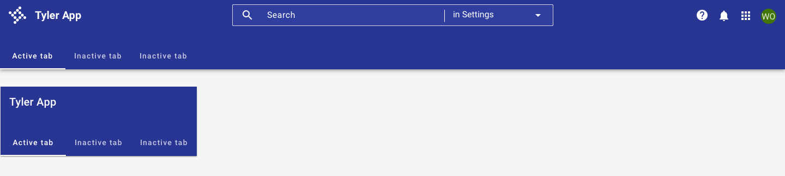

</ImageBlock>

---

## Responsive

The omnibar is not responsive by default, instead will need to be configured to meet app needs. 

In mobile contexts, the omnibar displays the internal menu (optional) and app title. Search, actions, and user information are condensed into a section in the trailing slot of the omnibar. Display up to three actions or two actions and an overflow menu in this space. 

<ImageBlock maxWidth="600px">

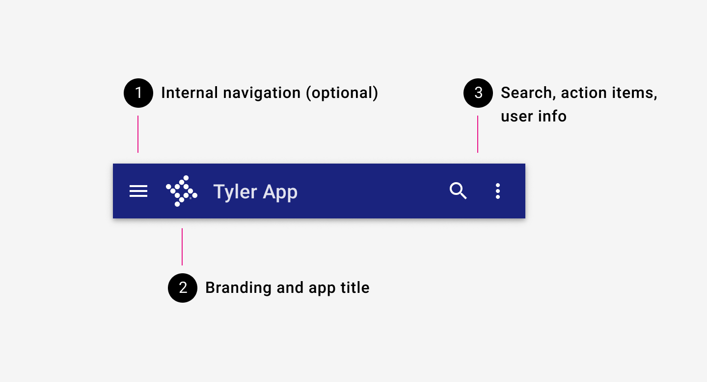

</ImageBlock>

**Extended**

For apps with a long title, use an extended omnibar by default, with the full title displayed. On scroll, omnibar collapses to its default height. Use a shorter name for your app; don't truncate the name or use smaller a smaller font size. 

<ImageBlock maxWidth="600px">

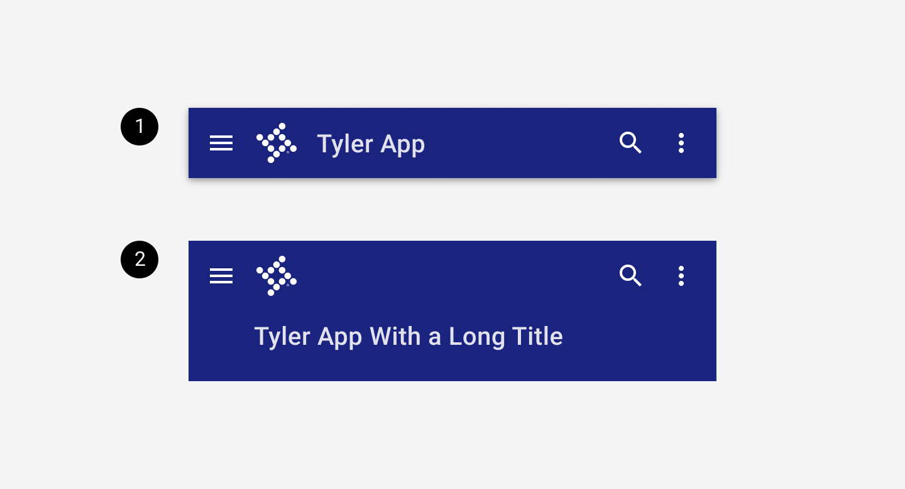

</ImageBlock>

<ImageBlock maxWidth="350px" caption="Apps with long titles may use an extended omnibar.  When scrolling up, the omnibar transforms and condenses to its default height and the app name is shortened. The omnibar should not return to extended mode until the user scrolls back to the top of the page.">

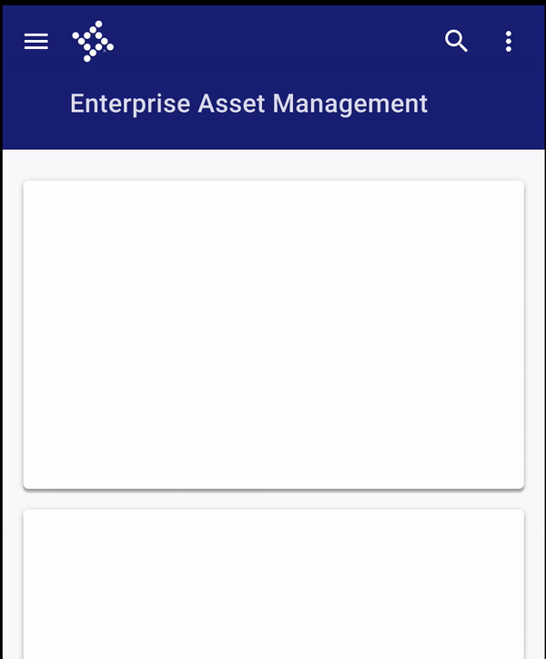

</ImageBlock>

**Overflow actions**

Up to three actions or two actions and an overflow manu are displayed at the end of omni. An overflow menu displays a full page dropdown that displays actions and user information. 

<ImageBlock padded={false} maxWidth="600px" caption="App actions and user information are tucked into the overflow menu. When tapped, it displays a full width card.">

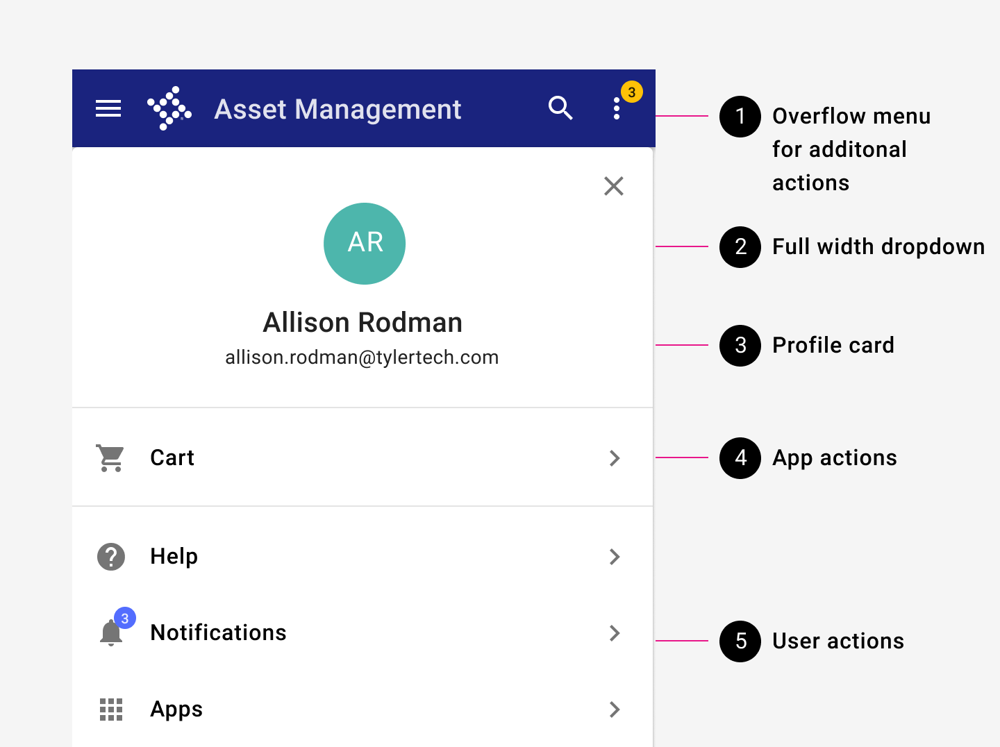

</ImageBlock>

<ImageBlock maxWidth="350px" caption="Tapping an item in the overflow menu reveals its children.">

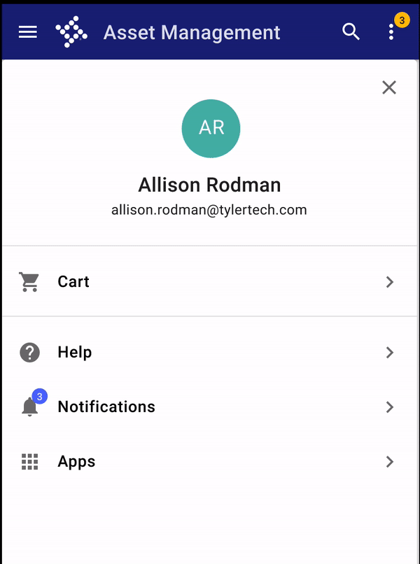

</ImageBlock>

:::info
If the internal navigation drawer is opened while the overflow dropdown is open, the navigation drawer displays on top, with a scrim behind. The overflow menu stays open unless a user navigates to a new page.
:::

**Search**

On mobile, search is accessed by tapping the search icon. Search takes over the omnibar.

- The "arrow_back" icon closes the search and restores the default omnibar.
- If the search field is empty and users tap outside of it, the search is closed and default omnibar is restored.
- Once input has been entered into the search field, the X icon appears. Tapping the X icon clears the search, but doesn't close the search. 
- Once input has been entered into the search, it persists until it is closed by the X icon or a user taps the "arrow_back" icon.

<ImageBlock maxWidth="350px">

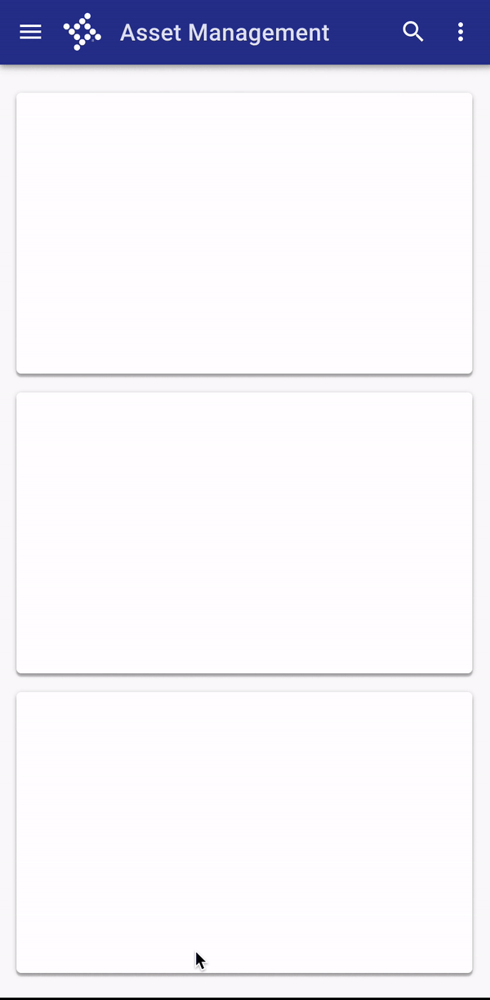

</ImageBlock>

---

## Best practices 

<DoDontGrid>
  <DoDontTextSection>
    <DoDontText type="dont">Don't place links in the omnibar.</DoDontText>
    <DoDontText type="dont">Don't place tabs in a standard height omnibar - use the tabs variation instead.</DoDontText>
    <DoDontText type="dont">On mobile, don't truncate app title text. Use an extended omnibar instead.</DoDontText>
    <DoDontText type="dont">On mobile, don't shrink the fontsize of an app title or wrap title text. Use an extended omnibar instead.</DoDontText>
  </DoDontTextSection>
</DoDontGrid>

---

## Related

### Components

The omnibar is used with

- The [app launcher](/components/omni/app-launcher)
- [Navigation drawer](/components/navigation/navigation-drawer)
- The [scaffold](/components/layouts/scaffold) for page layout

### Patterns

- The omnibar should resize based on the device context in which it's displayed; check out examples in our [Page layouts](/patterns/layout/introduction)

