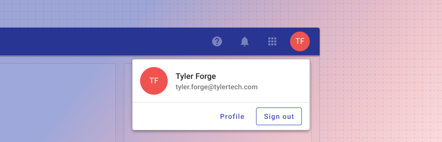
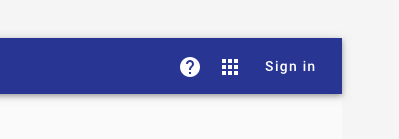

# Omnibar profile

<ComponentVisual storybookUrl="https://forge.tylerdev.io/main/?path=/docs/components-app-bar-profile--docs">

</ComponentVisual>

## Overview

The profile card features a user's personalized avatar if they've set one, their full name, and the email used to sign up with the app. Additionally, the card features a “Sign out” option as well as a link to their profile, if applicable.
For information about public facing profile patterns, check out this guidance. 

<ImageBlock maxWidth="600px">

</ImageBlock>

For **unauthenticated users,** the avatar is replaced by a “sign in” button. Notifications are hidden; the help menu and app launcher remain.

<ImageBlock maxWidth="600px">

</ImageBlock>

---

## Related 

### Components

- [Omnibar](/components/omni/omnibar)

