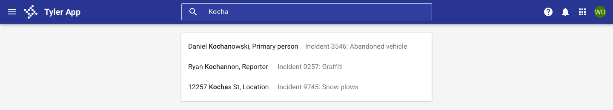
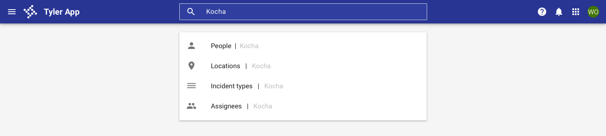

# Omnibar search

<ComponentVisual
  figmaUrl=""
  storybookUrl="https://forge.tylerdev.io/main/?path=/story/components-app-bar-search--default" />

## Overview

Omnibar search is optional, but should be used for apps that are primarily search driven (case management apps, mapping apps, etc). In cases where the search may be local to a single component on the page, place the search closest to the component it's performed on. For more information, check out our search gallery examples.

The omnibar provides a number of options for search depending on the scope needed, input type, and autocomplete suggestions.

---

## Search scope

**No search:** Use when an app doesn't have a use case to search for data and global search doesn't need to be supported.

<ImageBlock>

</ImageBlock>

**Global search:** Use when there's no use case to search for data within the app, but users may need to search for something within the Tyler ecosystem. Include the “global icon” at the end of the search.

<ImageBlock>

</ImageBlock>

**Internal app search:** Use when searches within a page, app or product suite are needed. Common examples include: searching for a user, record, incident, case, or setting. Use placeholder text to indicate that the search is contextual within the app.

<ImageBlock>

</ImageBlock>

**Combined search:** Use this to allow searches at multiple levels - within a page, app, product suite, OR within the Tyler Ecosystem. Use placeholder text to indicate where the search will occur.

<ImageBlock>

</ImageBlock>

---

## Search input type

**One search input:** Default search state for the omnibar. Use in most cases.

<ImageBlock>

</ImageBlock>

**Multi-search input:** Use where multiple fields are required to run a single search.

<ImageBlock>

</ImageBlock>

**Advanced search:** Use when a more advanced search is required for more than 30% of searches.

<ImageBlock>

</ImageBlock>

---

## Pre-filtering and autocomplete
**Autocomplete:** Use to suggest exact results or suggested search queries.

<ImageBlock>

</ImageBlock>

**Prefilter:** Use to help users search on specific categories or to improve performance time for global searches.

<ImageBlock>

</ImageBlock>

--- 

## Related 

### Components

- [Omnibar](/components/omni/omnibar)
