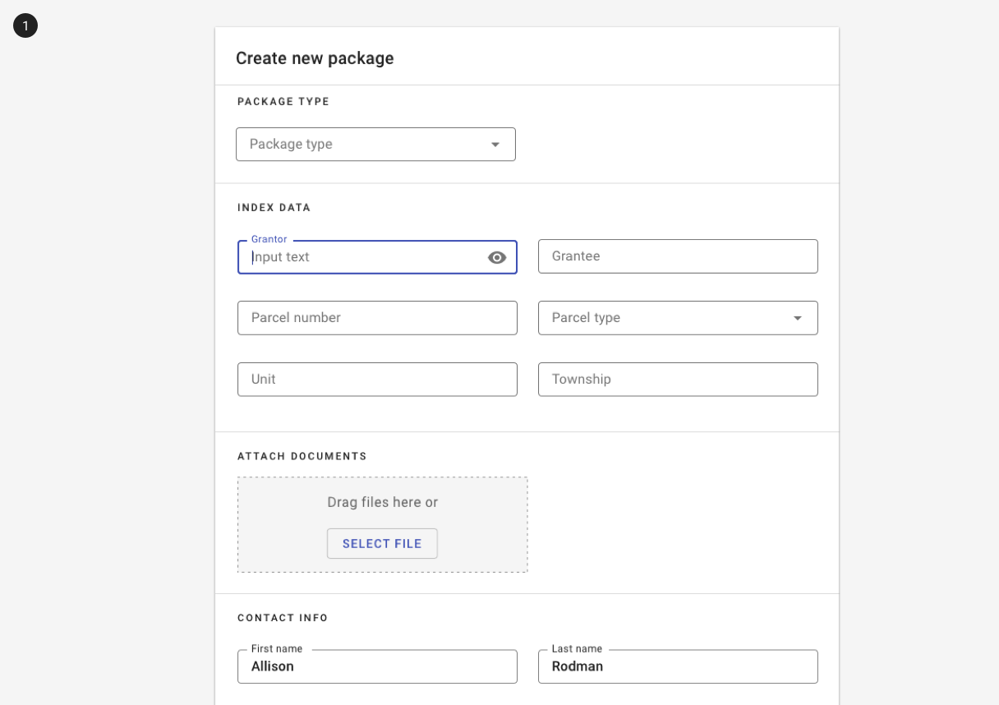
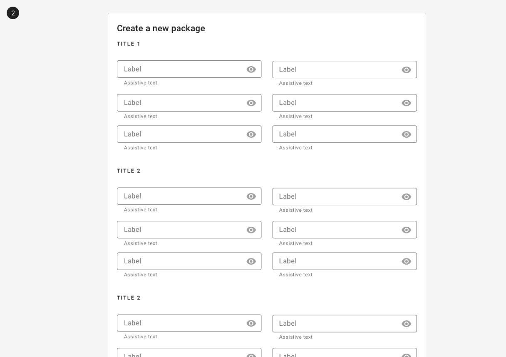
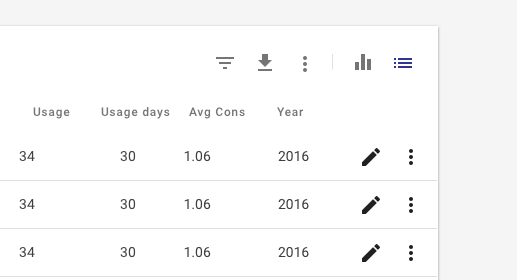

---
sidebar_custom_props:
  shortDescription: The divider is used to visually separate groups of content within a section.
---

# Divider

<ComponentVisual
  figmaUrl=""
  storybookUrl="https://forge.tylerdev.io/main/?path=/story/components-divider--default" />

## Overview

Dividers can be vertical or horizontal to separate related content. Related content may either be visually separated by dividers or by white space. In general, using white space (consider 24px, 32px, or 48px to separate sections) feels cleaner and allows the design to breathe. 

<ImageBlock padded={false} caption="1. Complex content is visually separated with dividers." >

</ImageBlock>

<ImageBlock padded={false} caption="2. Simpler content - groups of form fields - are visually separated with white space.">

</ImageBlock>

Vertical dividers may also be used inside of toolbars to separate sections of icons. (Functionality to support this behavior is currently in the Forge backlog.)

<ImageBlock padded={false}>

</ImageBlock>

---

## Related

### Components

Dividers may be used in:

- [Lists](/components/lists/list)
- [Cards](/components/cards/card)

### Patterns

- [Layout](/core-patterns/layout/intro)
- Forms (Coming soon!)
