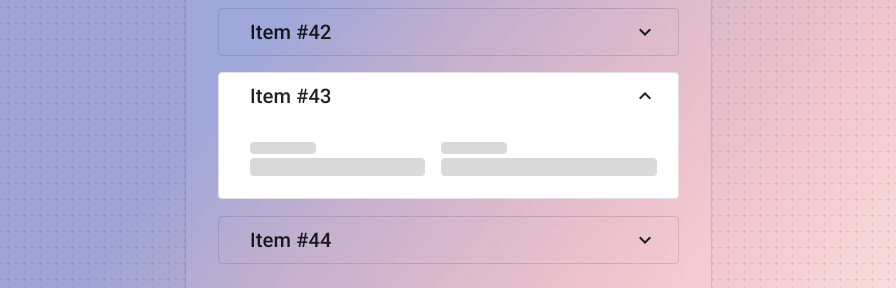
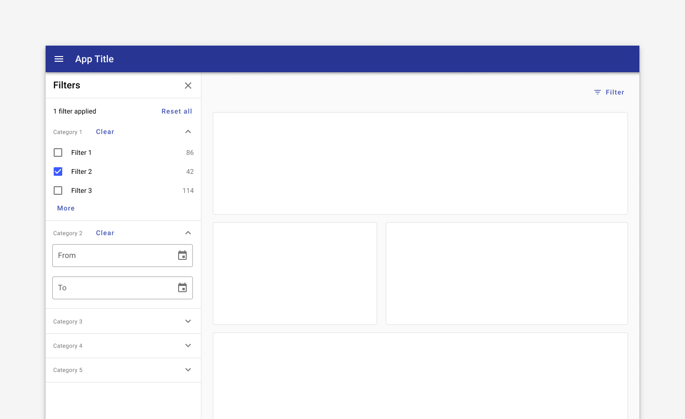
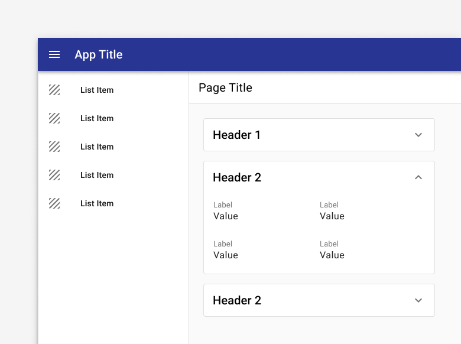
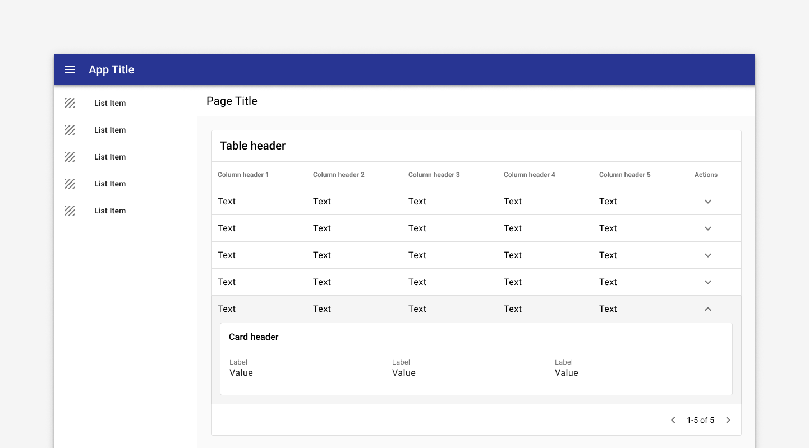
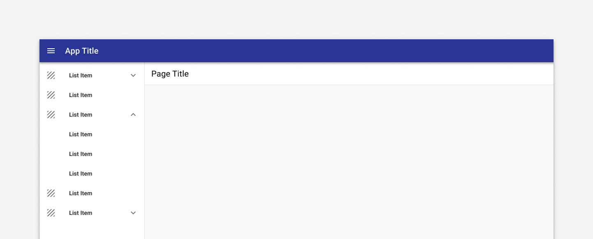

---
sidebar_custom_props:
  shortDescription: The expansion panel displays summary information and reveals additional details on tap or click.
  thumbnail: ./img/all-components/expansion-panel-mini.png
---

# Expansion panel

<ComponentVisual storybookUrl="https://forge.tylerdev.io/main/?path=/docs/components-expansion-panel--docs">

</ComponentVisual>

## Overview

Expansion panels are very useful for progressive disclosure - highlighting important details for a section and revealing additional detail as needed. Expansion panels can help focus a design and display critical information first.

An expansion panel is a lightweight container that may either stand alone or be used in a number of components including cards, navigation items, lists, and tables.

---

## States

### Collapsed

Display summary data and an expansion icon to indicate that the user may tap for more information.

The expansion panel should include a focus and hover state to indicate that it can be interacted with. In its collapsed state, the full line item should be clickable in order to expand the content, not just the expand icon. Ensure that you're using using appropriate touch target spacing (at least 48 x 48px).

The expand icon-button may be placed either before the panel text or after it.

### Open

Display additional information within the expanded section. Persist the summary top level data when the element has been expanded.

If one section is expanded and another section is open, we recommend leaving multiple panels open unless there's a compelling case to only allow for one open panel at a time (in the case of editing, for example).

---

## Types

### In a list
<ImageBlock> 

</ImageBlock>

### In a card
<ImageBlock> 

</ImageBlock>

Use a an expansion panel to display additional info in a [card](/components/cards/card).

### In a table
<ImageBlock> 

</ImageBlock>

Tables may use expandable rows to display additional content.

### In a navigation drawer
<ImageBlock> 

</ImageBlock>

Use an expansion panel to display parent and children items in a nav drawer.

### As a task card

<DoDontGrid>
  <DoDontTextSection>
    <DoDontText type="do">Ensure that the expansion icon remains persistent to facilitate easy toggling for opening and closing.</DoDontText>
    <DoDontText type="do">Ensure that the full panel is clickable, not just the expansion icon, to facilitate tap interactions. Ensure that the panel has the appropriate focus and hover states.</DoDontText>
  </DoDontTextSection>
  <DoDontTextSection>
    <DoDontText type="dont">Be careful when using editing with expansion panels. In general a dialog or full detail page are better for editing, but if you must use editing within an expansion panel, ensure that only one panel can stay open at a time and that the user is prompted to save their changes if they move away from the active panel. </DoDontText>
  </DoDontTextSection>
</DoDontGrid>

---

## Related

### Components

Expansion panels may be used with:
- [Card](/components/cards/card)
- [List](/components/lists/list)
- [Table](/components/table/table)
- [Accordion](/components/page/accordion)
- [Navigation drawer](/components/navigation/navigation-drawer)

### Patterns

Coming soon!
