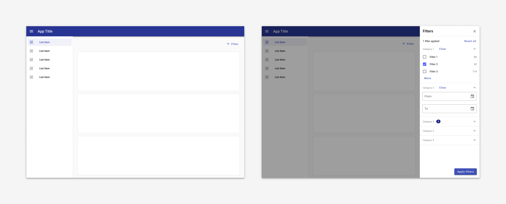

---
sidebar_custom_props:
  badge: recipe
  shortDescription: The filter sidesheet offers a standard filtering experience that can be used in any application.
---

# Filter sidesheet

<ImageBlock padded={false}>

</ImageBlock>

---

## Overview 

A filter sidesheet is used with the [Search & filter pattern](/patterns/search-filter). The sidesheet is comprised of categories, called filters, with specific options, called facets, inside. 

In general, filters are applied after an initial search has been conducted.

### Use when

- Users are likely to run a broad search and filter down to a smaller set of records. 
- Users are browsing a set of records. 
- Users are creating a set of related records. 
- Users might be unfamiliar with a domain space and could use filters to learn about the structure of the space itself.

### Don't use when

- Users are searching a specific, known, record with specific existing criteria such as an address or ID. Use a simple or advanced search instead.
- There are fewer than five total filter options. Use [chips](/components/utilities/chips) instead.
- Users are likely to filter on only a single dimension. Use a table and [column filters](/components/table-data/table#column-filters) instead.

### Examples

- See a filter sidesheet in action in the [Employee Access Calendar case study](/case-studies/ess-calendar).

---

## Parts

<ImageBlock padded={false} max-width="700px">

</ImageBlock>

### 1. Title (required)

### 2. Subtitle (required)

### 3. Filters (container is 320px by default)

Filters are categories that comprised of individual facets. 

<ImageBlock max-width="350px">

</ImageBlock>

Facets are comprised of 5 parts:

1. **Facet title (Required)** 
2. **Clear (Required)**
3. **Expansion (Required)** 
3. **Body (Required)** Facets may be displayed as radio buttons, checkboxes, date pickers, or sliders. 
3. **More (Optional)** Facets containing more than five filters hide extra options under a “more” expansion. 

<ImageBlock padded={false} caption="Individual facets may be collapsible if they contain a large number of options.">

</ImageBlock>

Facets may be displayed as [radio buttons](/components/controls/radio-button), [checkboxes](/components/controls/checkbox), [date pickers](/components/date-picker), or [sliders](/components/slider).

<ImageBlock padded={false}>

</ImageBlock>

1. **[Checkboxes](/components/controls/checkbox):** Categories (dynamic counts are optional.) 
2. **[Radio buttons](/components/controls/radio-button):** Exclusive categories (dynamic counts are optional.)
3. **[Sliders](/components/slider):** Approximate ranges. 
4. **Range:** Specific, discrete ranges. 
5. **[Date range](/components/date-range-picker):** Specific date ranges. 
6. **[Date picker](/components/date-picker):** A single date. 

:::note
If dynamic counts are used, a numeric badge with white text and tertiary background color should be used. See [numeric badge guidance](/components/badge#numeric-badges) for more information.
:::

### 4. Chips 

Use [chips](/components/utilities/chips) to indicate which filters have been applied. 

<ImageBlock padded={false} caption="1. Filter chips indicate active filters and are placed above the search results.  2. Filter chips are limited to a two lines with an option to expans for more.">

</ImageBlock>

<ImageBlock padded={false} caption="Chips use a horizontal overflow on mobile. Users may swipe left to view more.">

</ImageBlock>

---

## Variants 

By default, filters should be applied in real time. 

:::note
When referencing the example below, use the filter sidesheet component and the [page state](/components/page-state) error for "no results" instead.
:::

<ImageBlock caption="Filters are applied to the search results as they're applied.">

</ImageBlock>

If filters cannot be applied in real time due to performance concerns, an "Apply filter" may be used. 

<ImageBlock max-width="650px" caption="When performance may be an issue, an app may use a filter sidesheet with a scrim. Users select the filters they'd like, then hit Apply to filter down the dataset with just one data call.">

</ImageBlock>

---

## Responsive 

By default, the filter sidesheet displays on the right.

### 1. Default

**Desktop**

In desktop, filter sidesheet displays on the left by default. Filters are updated in real time. 

<ImageBlock padded={false} caption="Desktop layout for an app with filters on the left.">

</ImageBlock>

**Tablet**

Filter sidesheet displays by default in landscape mode. In portrait mode, it's closed by default and accessed by tapping a "Filter" button. 

When filters are displayed as sidesheet with scrim, filters are applied on tapping an "Apply filters" button, which also closes the sidesheet. The "Apply filters" button is positioned at the bottom of the viewport so it's always visible; content scrolls behind it as necessary.

<ImageBlock padded={false} caption="On tablet landscape, the filter sidesheet is open by default.">

</ImageBlock>

<ImageBlock padded={false} caption="On tablet landscape, the filter sidesheet is closed by default, accessed by a Filter button. The sidesheet displays from the left with a scrim behind it and an explicit option to apply filters. The Apply button closes the drawer and applies filters.">

</ImageBlock>

**Mobile**

**Mobile**

On mobile, a filter sidesheet may be displayed as a sidesheet with scrim or it may be displayed as a row of filters with dropdowns. 

<ImageBlock padded={false} caption="<b>Best for web responsive.</b> At mobile portrait sizes, both navigation drawer and filter sidesheet are closed by default. The filter sidesheet opens from the right with a scrim behind it when the Filter button is tapped. Filters are applied with an explicit Apply button that closes the drawers.">

</ImageBlock>

<ImageBlock padded={false} caption="<b>Best for native mobile.</b> Filters display as a row of dropdowns. On tap, the dropdown opens to reveal filters. Applied filters are indicated by a numeric badge within the dropdown.">

</ImageBlock>

---

### 2. Lefthand drawer and sidesheet

When a navigation drawer is present, the filter sidesheet displays on the right.  If dismissible, the sidesheet is toggled by an icon (use 'filter' for filters or an appropriate icon for detail information).

**Desktop**

<ImageBlock padded={false} max-width="650px" caption="On desktop, both the navigation drawer and filter display by default.">

</ImageBlock>

**Tablet**

Filter sidesheet displays by default in landscape mode. In portrait mode, it's closed by default and accessed by tapping a "Filter" button. 

When filters are displayed as sidesheet with scrim, filters are applied on tapping an "Apply filters" button, which also closes the sidesheet. The "Apply filters" button is positioned at the bottom of the viewport so it's always visible; content scrolls behind it as necessary.

<ImageBlock padded={false} caption="On tablet landscape, the navigation drawer is open by default and the filter sidesheet opens from the right with a scrim behind it when the Filter button is tapped. Filters are applied with an explicit Apply button that closes the drawers.">

</ImageBlock>

<ImageBlock padded={false} caption="On tablet portrait, both navigation drawer and filter sidesheet are closed by default. The filter sidesheet opens from the right with a scrim behind it when the Filter button is tapped. Filters are applied with an explicit Apply button that closes the drawers.">

</ImageBlock>

**Mobile**

On mobile, a filter sidesheet may be displayed as a sidesheet with scrim or it may be displayed as a row of filters with dropdowns. 

<ImageBlock padded={false} caption="<b>Best for web responsive.</b> At mobile portrait sizes, both navigation drawer and filter sidesheet are closed by default. The filter sidesheet opens from the right with a scrim behind it when the Filter button is tapped. Filters are applied with an explicit Apply button that closes the drawers.">

</ImageBlock>

<ImageBlock padded={false} caption="<b>Best for native mobile.</b> Filters display as a row of dropdowns. On tap, the dropdown opens to reveal filters. Applied filters are indicated by a numeric badge within the dropdown.">

</ImageBlock>
