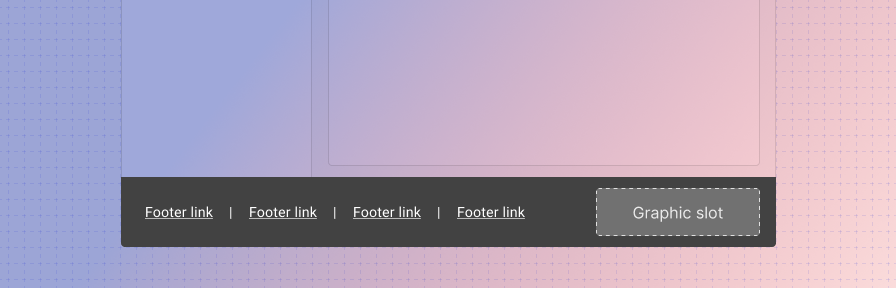
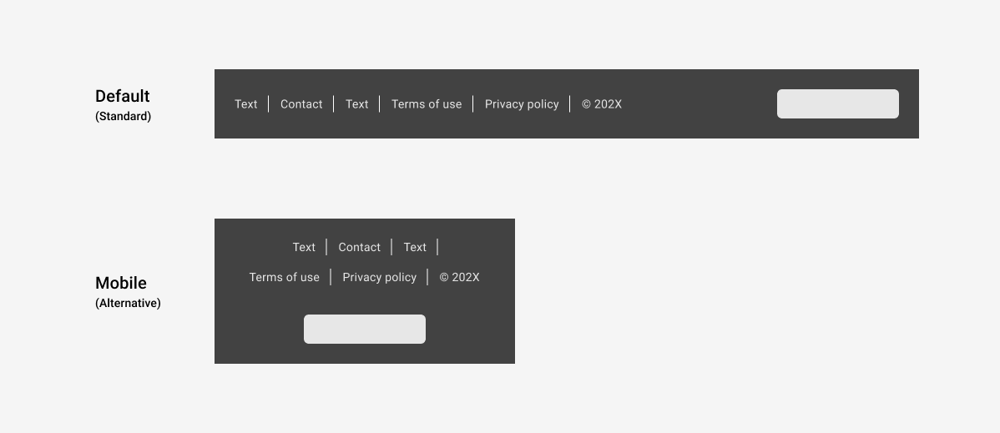
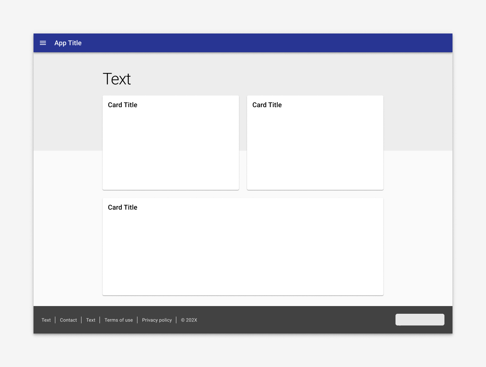

---
sidebar_custom_props:
  shortDescription: The footer is used in resident apps to display links pertaining to a specific municipality.
  thumbnail: ./img/all-components/footer-mini.png
---

# Footer

<ComponentVisual storybookUrl="https://animated-doodle-7c7696e9.pages.github.io/main/?path=/story/components-footer--default">

</ComponentVisual>

## Overview

Resident apps use a footer that refers to the client / municipality. The footer is used on landing pages only.

The footer is comprised of slotted text or hyperlinks that can be customized by the client / municipality, along with a dedicated slot for a small graphic, such as a logo. Links open in a new tab.

**Use when**

- Use on landing pages. 
- Use in resident apps. 

**Don't use when**

- Don't use on pages that have persistent controls at the bottom of a screen, such as forms. 
- Don't use in workforce apps. Footers are optional in workforce apps; refer to the [workforce branding guidance: footers](/get-started/branding-workforce) for styling and content.

---

## Responsive

On desktop, items are left aligned and logo is right aligned; on desktop, the items are centered and display vertically. The footer is responsive by default and will display in its mobile format at a breakpoint of 900px, but its breakpoint can be customized. 

Additionally, teams can set the footer to display in its default (standard) or mobile (alternative) mode using the layout attribute. 

<ImageBlock max-width="700px" caption="When switching to mobile view, the text and hyperlinks stack on top of the logo section vertically.">

</ImageBlock>

---

## Best practices 

<DoDontGrid>
  <DoDontTextSection>
    <DoDontText type="do">Footers should move as the page scrolls.</DoDontText>
    <DoDontText type="do">When body content is shorter than the visible viewport, place footer at the bottom of the viewport.</DoDontText>
      <DoDontText type="do">Footer links open in a new tab.</DoDontText>
  </DoDontTextSection>
  <DoDontTextSection>
    <DoDontText type="dont">Don't fix a footer to be peristently visible.</DoDontText>
  </DoDontTextSection>
</DoDontGrid>

<ImageBlock max-width="700px" caption="When body content is shorter than the visible viewport, place footer at the bottom of the viewport.">

</ImageBlock>

