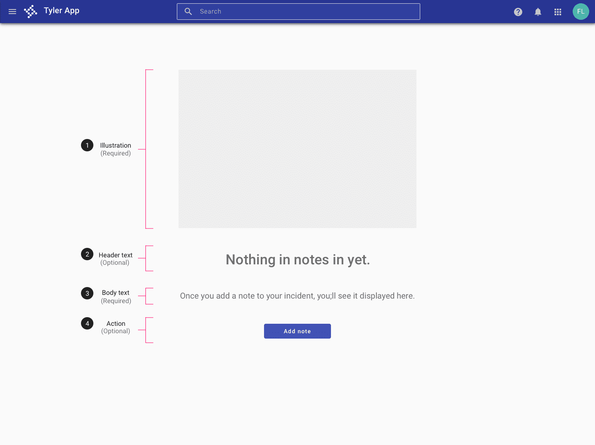
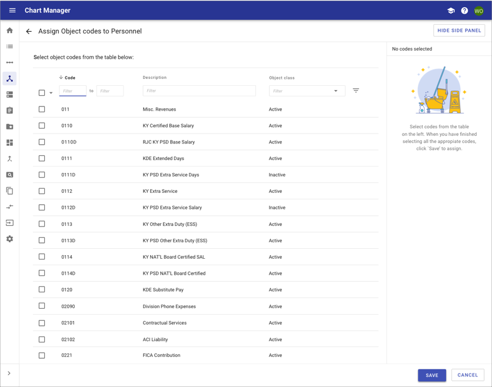
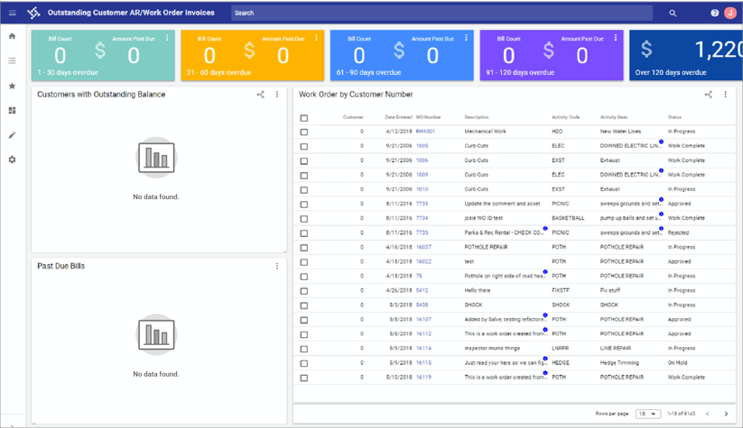
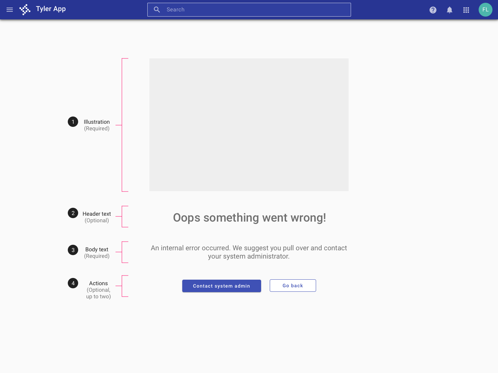

---
sidebar_custom_props:
  shortDescription: The page state component is a layout design component that facilitates full page states.
  thumbnail: ./img/all-components/page-state-mini.png
---

# Page state

<ComponentVisual storybookUrl="https://forge.tylerdev.io/main/?path=/story/components-page-state--default">

</ComponentVisual>

## Overview

The page state component is a wrapper component facilitates full page states such as empty search result pages, error pages, and landing pages.

---

## Empty state 

Use an empty state when an item's content can't be shown, or there's no data to show. Check out the empty state [recipes](/recipes/empty-state/no-search-result).

### Examples

- See an empty state in action in the [Employee Access Calendar case study](/get-started/other/case-studies/ess-calendar).

### Parts

<ImageBlock padded={false}>

</ImageBlock>

1. **Image (Required)** Select a spot hero image from the [Forge Illustration Library](/assets/illustration-library#SpotHero).

2. **Header text (Optional)** Convey the purpose of the screen, without appearing actionable. Style should be conversational. 

3. **Body text (Required)** Use an extra line of text to provide more information if needed (e.g., “Use links to group related incidents.”) In general, keep text concise and to the point.

4. **Action (Optional)** Include an action if a user can take a logical action from an empty state (ie, "Add attachment", "Add note", "New invoice").

### Mini empty state 

Mini empty states should be used when an empty state is needed inside of a card, a side sheet, or another area with limited space.

- If the mini empty state is a primary focal point on the screen or HIGH/MEDIUM emphasis, a full color illustration is recommended.
- If the mini empty state is NOT a primary focal point on the screen and LOW emphasis, a greyscale illustration is recommended.
- If multiple mini empty states are needed on a screen, a greyscale illustration is recommended.
- If a screen contains many colors, a greyscale illustration is recommended.
- In regards to size of the illustration, teams will need to use judgment depending on allocated space.
- Mini empty states within a card should use SPOT illustrations.
- Mini empty states within a side sheet/panel should use either SPOT or SPOT HERO [illustrations](/get-started/styles/illustrations). (Dealer's choice)

**Examples**

<ImageBlock padded={false}>

</ImageBlock>

<ImageBlock padded={false}>

</ImageBlock>

<ImageBlock padded={false}>

</ImageBlock>

---

## Full page error

When an error occurs on the server and the user is not able to interact with content on a page, use the following patterns to communicate server errors. Provide a header with some information about the error, an explanation of what might be causing the error and the primary action the user might take to resolve an error. (This action might simply be “Refresh”).

Don't see the pattern you need below? [Request a new illustration](https://tylerjira.tylertech.com/servicedesk/customer/portal/21/create/601) (specify the need for a spot-hero image in your description) or [request content writing](https://tylerjira.tylertech.com/servicedesk/customer/portal/21/create/602) (specify the need for error content in your description).

Check out the error page state [recipes](/recipes/error-pages/generic-400).

### Parts

Error pages are comprised of the following parts. 

<ImageBlock padded={false}>

</ImageBlock>

1. **Image (Required)** Select a spot hero image from the [Forge Illustration Library](/assets/illustration-library#SpotHero).

2. **Header text (Optional)** Provide a brief description of what went wrong. Style should be conversational. For common error types, use the provided default copy (see below). 

3. **Body text (Required)** Describe the error in plain language and any steps user can take to fix the error. For common error types, use the provided default copy (see below). 

4. **Up to two actions (Optional)** Provide up to two common actions users can take to recover or fix the error. For common error types, use the provided default actions (see below). 

---

## Related 

### Recipes 

The page state is used to enable...

- [Empty state page](/recipes/empty-state/no-search-result)
- [Error page](/recipes/error-pages/generic-400)
